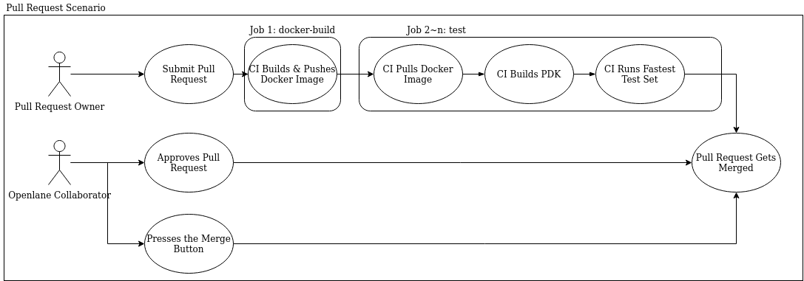
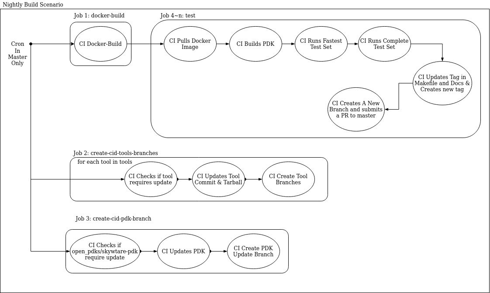
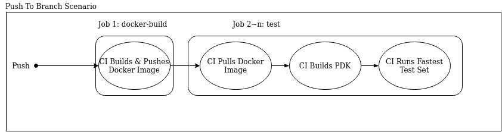
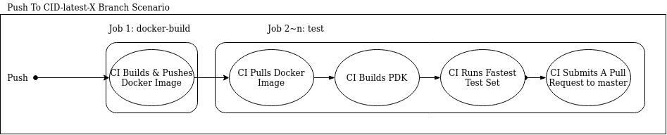
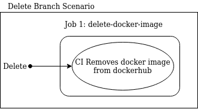

# OpenLane CI/CD

In this document we go through the big picture of the openlane CI by simplifying it into a group of smaller workflows and going through them one by one. We are explaining what's in these two files: [openlane_ci.yml](./workflows/openlane_ci.yml) and [delete_image.yml](./workflows/delete_image.yml).

# Table of contents

- [Required Tokens](#required-tokens)
- [Common Steps](#common-steps)
    - [Docker Image Build](#docker-image-build)
    - [Docker Image Pull](#docker-image-pull)
    - [PDK Build](#pdk-build)
    - [Running A Test Set](#running-a-test-set)
    - [Naming Conventions](#naming-conventions)
- [Pull Request Workflow](#pull-request-workflow)
- [Cron Workflow](#cron-workflow)
- [Push To Branch Workflow](#push-to-branch-workflow)
- [Push To CID Latest X Branch Workflow](#push-to-cid-latest-x-branch-workflow)
- [Delete Branch Or Tag Workflow](#delete-branch-or-tag-workflow)
- [Advised Practices](#advised-practices)

# Required Tokens

For internal builds the following tokens are required to be defined as secrets:

| Secret      | Description                                                   |
|---------------|---------------------------------------------------------------|
| `DOCKERHUB_USER`  | A Username for a user that has push access to the efabless organization on Dockerhub. |
| `DOCKERHUB_PASSWORD`  | The password for the given username that has push access to the efabless organization on Dockerhub. |
| `MY_TOKEN`  | A user Github with push access to the repository. Despite Github Actions internally providing GITHUB_TOKEN for the action to use. pushing/creating a branch with this token will prevent Github Actions from running on the created branch/pushed commit/submitted PR. This is a policy by Github Actions to prevent circular calls as a general rule while still providing a way for the user to do it if they know what they are doing. |

# Common Steps

In the small workflows some step definitions overlap and so to be more concise, we'll be defining those once here.

## Docker Image Build

When we say CI builds docker, we mean that the CI runs `make merge` inside `docker_build/`, assembling the docker tarballs that exist within this commit and building the complete openlane docker image. Then, it uses the given username and password for dockerhub to push the image. The image tag is defined by the triggering branch/tag. Check [Naming Conventions](#naming-conventions) for more details.

**Note:** If the workflow was triggered by an external pull request (a pull request submitted from a fork) the workflow won't have access to the secrets (the dockerhub username and password). Thus, it won't attempt to push the image to dockerhub, but it would still try to build it to make sure that the build process didn't get corrupted by the PR.

## Docker Image Pull

Pulling the docker image implies running `make openlane` which uses this branch/tag as the docker tag and pulling the docker image from dockerhub. Check [Naming Conventions](#naming-conventions) for more details. If the image doesn't exist then this workflow is invalid and it will stop.

## PDK Build

CI builds PDK implies that the CI runs `make pdk` from the main Makefile. It clones skywater-pdk, builds it, clones open_pdks, uses the openlane docker to install the pdk. Although this step alone takes around 6 minutes to complete, it's necessary to test that the pdk itself still builds. This uses the commit hashes that exist in the Makefile.

## Running A Test Set

CI mounts the pdk and the openlane directory into the pulled docker image and then it runs the `run_designs.py` script with the benchmark flag enabled pointing to one of the benchmarks under `regression_results/benchmarks/`. The designs run are defined by the environment variable `TEST_SET`. If the variable is set to file name inside [test_sets](./test_sets/) then all the designs in that file will be run in parallel. If a design name is given to that variable, then only that design will be run. After completion the script will parse the generated report by run_designs.py for any failures and exit with the proper exit code depending on the result. The user has access to a detailed report in the full CI log.

**Important Note:** The `test` job introduced here assumes the existence of a single runner and so runs all of the provided test set in parallel on the same machine. However, replicating this job and dividing the work on multiple runners is a very trivial task to do, if required.

## Naming Conventions

| Name      | Convention                                                   |
|---------------|---------------------------------------------------------------|
| `Docker Images`  | If the action is invoked by a branch or a tag then this branch or tag will be used as the docker image tag. If this is an external pull request then the base branch will be used as the tag. If this is an internal pull request, then the docker tag name will be: `base branch name`-pull_request-`pull request ID`-`first 5 symbols of the head commit hash`. |
| `CID-latest-tools-X- branches`  | The name would be CID-latest-tools-`tool name`-`commit hash`. This is done with the intention of allowing multiple pull requests for the same tool as long as the commit hash changed, maintaining a complete history of the success and failure of each tool commit. |
| `CID-latest-pdk- branches`  | The name would be CID-latest-pdk-`skywater-pdk commit hash`-`open_pdks commit hash`. This is done with the intention of allowing multiple pull requests as long as the commit hash changed, maintaining a complete history of the success and failure of each pdk commit. |

# Pull Request Workflow

<table>
  <tr>
    <td  align="center"></td>
  </tr>
</table>

As shown in the diagram above this workflow is invoked whenever a community member or an openlane developer submits a pull request. For a pull request to be merged two conditions need to be met:

- CI passes.
- An openlane collaborator approves the pull request.

Then an openlane collaborator can press the merge button to merge the pull request.

The workflow is quite simple, it starts with the [docker-build](#docker-image-build) job. Then, the `test` job starts with [pulling the docker image](#docker-image-pull), [building the pdk](#pdk-build), followed by [running the fastest test set](#running-a-test-set) which includes designs that run through the flow in less than 10 minutes each.

**Note:** If this is an internal pull request, then the docker image is deleted from dockerhub at the end of a successful run, to avoid storing potential stale images.

# Cron Workflow

<table>
  <tr>
    <td  align="center"></td>
  </tr>
</table>

This is the major part of the openlane CI as it invokes other parts of the CI as well as controls tagging the master branch. It exercises 4 jobs.

1. [docker-build](#docker-image-build). Same as discussed above.

2. `create-cid-tools-branches`: this runs for each tool in tools. It gets the latest commit hash available for this tool. It checks if the commit hash is already used in the master branch of OpenLane. If that's not the case, then it checks if there is already a branch created for that tool with that commit hash. if that's not the case, then it creates a CID-latest-tools-X-commit_hash branch after building the tool tarball and updating the commit hash in the dockerfile committing those to the new branch.

3. `create-cid-pdk-branch`: It gets the latest commit hash available for open_pdks and skywater-pdk. It checks if the commit hashes are already used in the master branch of OpenLane. If that's not the case, then it checks if there is already a branch created for those commit hashes pair. if that's not the case, then it creates a CID-latest-pdk-X-Y branch with the updated commits in the Makefile and the documentation committing those to the new branch.

4. `test`: the `test` job starts with [pulling the docker image](#docker-image-pull), [building the pdk](#pdk-build), followed by [running the fastest test set](#running-a-test-set) which includes designs that run through the flow in less than 10 minutes each. Then, it runs the completeTestSet containing all other designs that run in less than 3 hours each. If this is successful then the version tag in the documentation and the makefile is updated and it creates a new commit in a new branch called `create-pull-request/green-tag-update` and tags that commit and creates a PR to master.

# Push To Branch Workflow

<table>
  <tr>
    <td  align="center"></td>
  </tr>
</table>

Pushing to a non-CID-latest-X branch has it's own simple workflow, which is similar to that of the pull requests. This also extends to tag creations. The workflow is quite simple, it starts with the [docker-build](#docker-image-build) job. Then, the `test` job starts with [pulling the docker image](#docker-image-pull), [building the pdk](#pdk-build), followed by [running the fastest test set](#running-a-test-set) which includes designs that run through the flow in less than 10 minutes each.

# Push To CID Latest X Branch Workflow

<table>
  <tr>
    <td  align="center"></td>
  </tr>
</table>

Pushing to a CID-latest-X branch has the same workflow described in [the previous section](#push-to-branch-workflow). However, if the test passes, a PR is auto created to the master branch. That PR will also go through the Pull Request Workflow to increase the confidence in the work of the CI.

# Delete Branch Or Tag Workflow

<table>
  <tr>
    <td  align="center"></td>
  </tr>
</table>

Deleting a branch/tag will trigger this workflow to delete the relevant docker image tags from dockerhub.

# Advised Practices

1. Workflows cannot be updated with external pull requests. Those updates must be submitted through internal Pull Requests.
2. Submitting a Pull Request with a Docker update won't show the effect of this update on the flow because the built image won't be pushed to dockerhub. So, if an external PR contains a docker update it should be merged into an internal branch and then re-submitted as an internal Pull Request. For openlane developers, they should use internal branches only to make docker updates.
3. When merging an `Update Latest Green Tag` PR make sure to merge normally avoiding squash or rebase merging as this will result into losing the tagged commit from the history.
4. Make sure to delete branches after merging or closing a pull request.
