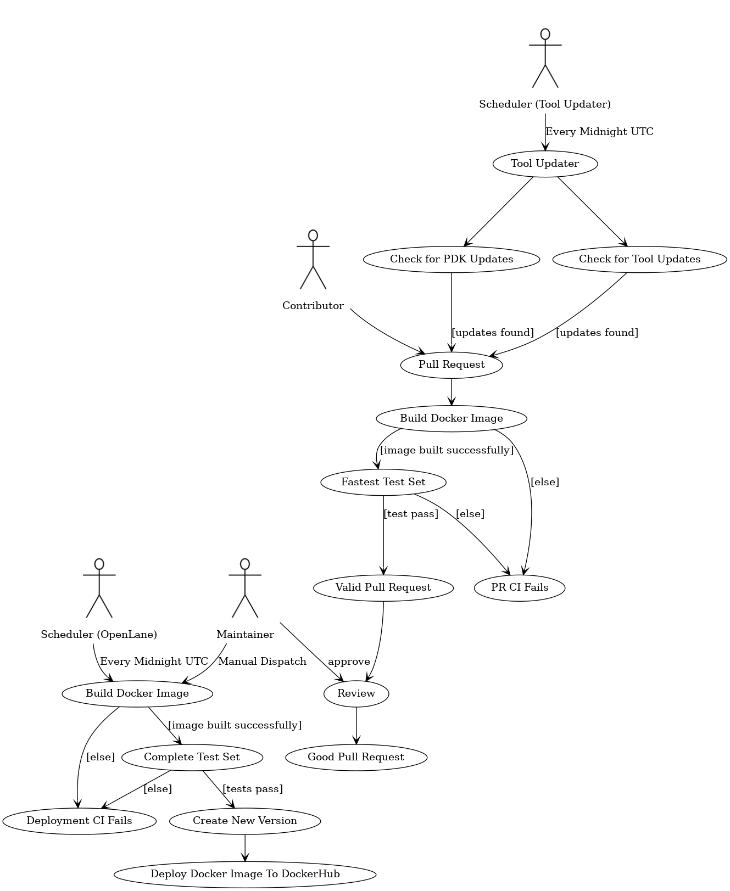

# Openlane CI/CD
There are two primary flows: the pull request flow and the deployment flow.

The deployment flow occurs on a daily basis. The PR flow happens whenever someone creates a new Pull Request. PRs can be created by contributors or by an automated tool updater that runs on a schedule.

* A maintainer cannot review their own code, but they can merge it after a review by another maintainer.

# Required Secrets
Repository secrets are used to protect certain credentials, but also as repository-dependent parameters for the CI.

## Common
| Secret      | Description                                                   |
|---------------|---------------------------------------------------------------|
| `MAIN_BRANCH`  | The main branch for OpenLane. Format: `main`|`master`|`etc` |

## CI

| Secret      | Description                                                   |
|---------------|---------------------------------------------------------------|
| `DOCKER_IMAGE` | The name of the resulting Docker image (minus the tag). |
| `DOCKERHUB_USER`  | A username for a user that has push access to the organization that owns `DOCKER_IMAGE` on Docker Hub. |
| `DOCKERHUB_PASSWORD`  | The password/token for the given username that has push access to the organization that owns `DOCKER_IMAGE` on Docker Hub. |

## Tool Updater

| Secret      | Description                                                   |
|---------------|---------------------------------------------------------------|
| `FORK_NAME` | A fork to push branches for tool updates to. Format `bot-account/OpenLane`  |
| `MY_TOKEN`  | A token for the bot account that owns the fork. |