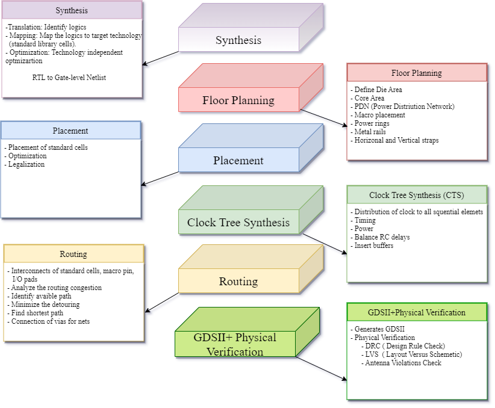

============
Quick Start
============

Overview of OpenLane flow
-------------------------
The OpenRoad OpenLane is a automated RTL to GDSII flow build around open source tool. The flow perform the auto place and route of an ASIC design -in 24 hours with no human in the loop.

Running OpenLane
----------------

OpenLane uses Docker to run a design. You need to start the Docker Container with proper path mounted.
To mount the proper directories into the Docker container would rely on Makefile:

.. code-block:: shell

    cd OpenLane
    make mount

The sample design configuration is available in the design directory. To run a simple design using the command:

.. code-block:: shell

    ./flow.tcl -design <design_name> -tag run1

The above command will run the complete flow RTL to GDS and the resulting GDS will be available ``design/design_name/run1/result/final/gds/design_name.gds``.

The ``flow.tcl`` script is used to run the complete flow, also in `interactive mode <Interactive_Mode.html>`_ 

Adding New design
-----------------
To add a new design, 

1. Generate a configuration file ``config.tcl`` for a design using the command in Docker

.. code-block:: shell

    ./flow.tcl -design <design_name> -init_design_config

After running the above command the output is:

.. code-block:: shell

    [INFO]: Creating design src directory /openlane/designs/design_name/src
    [INFO]: Populating /openlane/designs/design_name/config.tcl..
    [INFO]: Finished populating:
    /openlane/designs/caravel_upwl/config.tcl 
    Please modify CLOCK_PORT, CLOCK_PERIOD and add your advanced settings to /openlane/designs/design_name/config.tcl
    [SUCCESS]: Done...

2. Exit the Docker using the command:

.. code-block:: shell

    exit

3.  Go to your design directory and check if the config.tcl has been generated successfully. The global config.tcl file should end with:
    
.. code-block:: shell

        set filename $::env(DESIGN_DIR)/$::env(PDK)_$::env(STD_CELL_LIBRARY)_config.tcl
        if { [file exists $filename] == 1} {
        source $filename
        }

4. A directory with the name ``src`` should also has been created. Copy your verilog file in that directory.

This will create a design directory structure:

.. code-block:: shell

    design/design_name
    ├── config.tcl
    └── src
           ├── design.v

The ``config.tcl`` is a global configuration for all PDKs. In the ``config.tcl`` file edit the `required variables <OpenLane_Variable.html>`_ and `optional variables <OpenLane_Variable.html>`_ if needed.

OpenLane Structure
------------------

.. code-block:: shell

   designs/<design_name>
   ├── config.tcl
   ├── runs
   │── src
   │   ├── design.v
   configuration
   ├── cts.tcl
   ├── floorplan.tcl
   ├── general.tcl
   ├── lvs.tcl
   ├── placement.tcl
   ├── routing.tcl
   └── synthesis.tcl
   scripts
   ├── tcl_commands
      ├── cts.tcl
      ├── floorplan.tcl
      ├── lvs.tcl
      ├── magic.tcl
      ├── placement.tcl
      ├── routing.tcl
      └── synthesis.tcl

Run Structure
-------------

.. code-block:: shell

     designs/<design_name>
   ├── config.tcl
   ├── src
   ├── runs
   │   ├── run1
   │   │   ├── config.tcl
   │   │   ├── logs
   │   │   │   ├── cts
   │   │   │   ├── cvc
   │   │   │   ├── floorplan
   │   │   │   ├── klayout
   │   │   │   ├── magic
   │   │   │   ├── placement
   │   │   │   ├── routing
   │   │   │   └── synthesis
   │   │   ├── reports
   │   │   │   ├── cts
   │   │   │   ├── cvc
   │   │   │   ├── floorplan
   │   │   │   ├── klayout
   │   │   │   ├── magic
   │   │   │   ├── placement
   │   │   │   ├── routing
   │   │   │   └── synthesis
   │   │   ├── results
   │   │   │   ├── cts
   │   │   │   ├── cvc
   │   │   │   ├── floorplan
   │   │   │   ├── klayout
   │   │   │   ├── magic
   │   │   │   ├── placement
   │   │   │   ├── routing
   │   │   │   └── synthesis
   │   │   └── tmp
   │   │       ├── cts
   │   │       ├── cvc
   │   │       ├── floorplan
   │   │       ├── klayout
   │   │       ├── magic
   │   │       ├── placement
   │   │       ├── routing
   │   │       └── synthesis

   
   

    

