.. todo:: Add 5 todos
.. todo:: Add 5 todos
.. todo:: Add 5 todos
.. todo:: Add 5 todos
.. todo:: Add 5 todos

Full Guide
================================================================================

The end goal for OpenLane flow is to generate an `integrated circuit <https://en.wikipedia.org/wiki/Integrated_circuit>`_
that can be produced by the foundry.
OpenLane is one of the leading-edge Open-Source tools created exactly for this purpose.

.. note:: This guide assumes that you already have the `OpenLane installed using this guide <installation.html>`_ and you already successfully `completed the quickstart here <quickstart.html>`_.

.. figure:: https://upload.wikimedia.org/wikipedia/commons/thumb/e/ee/EPROM_Microchip_SuperMacro.jpg/1024px-EPROM_Microchip_SuperMacro.jpg  

    EPROM Integrated Circuit. Source: https://commons.wikimedia.org/wiki/File:EPROM_Microchip_SuperMacro.jpg

.. todo:: Follow the license of the image

.. todo:: Add links to the Wikipedia covering every word.

Multiple foundries exist and each of the foundries may have dozens of technologies supported.
Currently, OpenLane supports only sky130,
which was published by `Google in cooperation with Skywater <https://github.com/google/skywater-pdk>`_,
but there is active work to support `fictional technologies like ASAP7 <https://asap.asu.edu/>`_ and other PDKs. There is a guide on `porting new PDKs to OpenLane located here <pdk_structure.html>`_ .

The coolest part about sky130 is `Google funded Multi Project Wafer in partnership with Efabless <https://efabless.com/open_shuttle_program>`_.
Using OpenMPW you can produce your integrated circuit for free (some limitations apply).

This guide covers everything that you need to know in order to be able to create a final integrated circuit layout files, 
which if done correctly can be produced by the foundry. As part of this tutorial we will make a simple bottom-to-top design utilizing as many features of OpenLane as we can.

In this example we are going to create a simple memory macro, generate the layout files for it,
then use the generated memory to make a top level chip register file.
While the guide covers only digital blocks, the digital macro blocks can be replaced by analog macros.
Use `this guide to create the required files <custom_macros.html>`_.

Structure of integrated circuits
--------------------------------------------------------------------------------

Integrated circuits consist of three main components: die, connections between pin and die pads, pin itsalf, and package.
Two primary variants exist for packaging from standpoint of pads: Wire bond and Flip chip

.. todo:: Add the picture of an integrated circuits

The silicon die
--------------------------------------------------------------------------------

Inside the packaging is located the die.
The die is the heart of the integrated circuit.
It contains every transistor, capacitor, resistor, diode and many more things.
The metalic interconnect layer connects the separate components.

Dies are produced by foundries. Many foundries exist and each one of the foundries support specific technology.
For example company Skywater Technology owns the technology sky130 and the foundries for this technology.
But for foundry to be able to produce your chip, it has to follow a strict ruleset.
Usually this information is provided as part of `Process design kit <https://en.wikipedia.org/wiki/Process_design_kit>`_.

.. todo:: Add a picture of the die
.. todo:: replace PDK link with link to the local PDK section

Process design kit
--------------------------------------------------------------------------------

Process design kit is provided by foundry.
The PDK is specific to the technology and contains any combination of these files:

* Documentation
  
  * Design Rule Manual.

* Primitives
  
  * SPICE models. 
  * Symbols. 

* Verification decks for:
  
  * Design Rule Checking (:ref:`DRC`)
  * Layout Versus Schematic (:ref:`LVS`)
  * Parasitics Extraction (:ref:`PEX`)
  * Antenna and Electrical rule check

* Tool depended tech files
* LEF tech file
* Usually it also includes one or more standard cell library:
  
  * Documentation for it
  * LEF (or other) abstract representation
  * LIB file that contains timings and power information for synthesis
  * Symbols
  * Layout files (Also called GDSII files)

Keep in mind that in some cases multiple standard cell libraries can be used together.
For example, sky130 High-Density and sky130 High-Density Low leakage. OpenLane currently does not support multiple libraries.

Documentation
^^^^^^^^^^^^^^^
Documentation is the starting point for any technology.
Engineers read the documentation and experiment with different features. Documentation may have many pointers
For example, Documentation for `sky130 can be found here <https://skywater-pdk.readthedocs.io/en/main/>`_, meanwhile the `Design Rule Manual is scattered here <https://skywater-pdk.readthedocs.io/en/main/rules/periphery.html#x>`_

.. todo:: Add a picture visualizing

Primitives
^^^^^^^^^^^^^^^
Primitive library usually contains SPICE models for the transistors
and optionally the symbol representation for one or more schematic tool.
SPICE models were provided by skywater-pdk,
however `Open_PDKs modified the SPICE files <http://opencircuitdesign.com/open_pdks/>`_ for compatability with NGSPICE.

Original skywater-pdk did not contain any symbols, but thanks to the efforts of 
symbols for XSCHEM are included in Open_PDKs installation.
Also they are available as separate XSCHEM library here.

.. todo:: add the link to XSCHEM library

.. todo:: Add a picture visualizing

Verification decks
^^^^^^^^^^^^^^^
As part of PDK foundries provide ready to use verification decks for different tools.
Open_PDKs for sky130 provides following decks:
* DRC for Magic VLSI and KLayout.
* LVS/PEX extraction for Magic VLSI
* Ruleset for netgen

.. todo:: Add short description.
.. todo:: Add links to each tool and the tech files

The sky130 has additional checks called "precheck".
This prechecks is the way that the foundry verifies your files to match their requirements.
Everything from sanity checks to DRC is checked by the foundry to make sure that you are sending valid GDS.

If you send them a GDS with DRC or GDS that violates some of the requirements,
then precheck will error out.

.. todo:: Add a screenshot from the Efabless website with passed or failed prechecks.

Tech files
^^^^^^^^^^^^^^^

Tech files are a special files designed for specific software. 
One of the common file formats is the Tech LEF, however other variants of tech files are available too.
Tech LEF typically contains one or more of the following information:

* Metal
   * Metal spacing
   * Width
   * RC Parasitics
   * Antenna related infromation
   * Electromigration related information
* Sites for the specific standard cell libraries
* mapping between GDS and LEF formats, mapping between layers.

.. todo:: Add a screenshot of actual tech file

Standard Cell Libraries (SCLs)
^^^^^^^^^^^^^^^

Standard Cell Library contains a set of cells that can be used to build practically any digital circuit.

It contains following files and information:

* Documentation
* Integration guide for one or more tool
* SCL configuration files for one or more tool
* Abstract representation: the cells containing only layers required for placement and routing. Typically in LEF format.
* Timing Library containing the timing information, typically in .LIB format
* Layout of the cells.
* SPICE netlist.

Documentation contains everything the developer needs to know about the SCL.
This information includes anything related to the cells:

* the naming convention
* functionality
* working conditions
* integration guide for different tools
* implementation details,
* number of cells of each type
* target density
* cell site height/width
* cell grid
* planned NMOS and PMOS heights
* NMOS and PMOS types used

For example you can find `documentation for SCLs provided by Skywater for sky130 here <https://skywater-pdk.readthedocs.io/en/main/contents/libraries/foundry-provided.html>`_.

A snipet from the High-Density SCL for sky130:

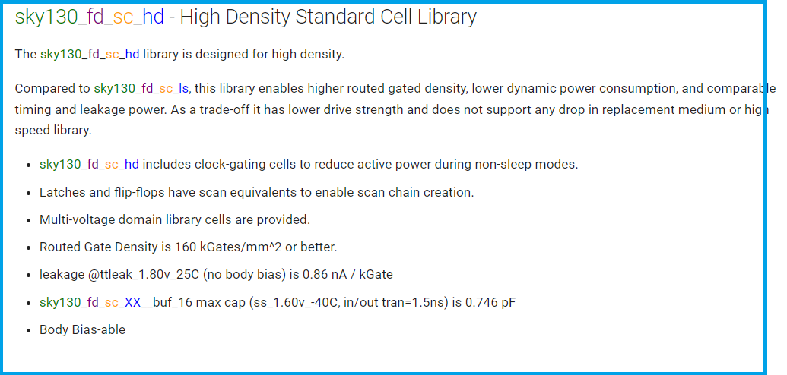

.. todo:: SCL config
.. todo:: LEF abstract
.. todo:: Timing information
.. todo:: Layout of the cells
.. todo:: Spice netlist
.. todo:: Tech LEF combined with Standard Cell Library related information

Die Manufacturing
--------------------------------------------------------------------------------

.. todo:: Add pictures epxplining the process

Multi Project Wafer
--------------------------------------------------------------------------------

Making masks is very expensive.
Typically. to keep the costs of prototypes low, foundries organize multi project wafers.
Multiple companies provide down payment for a specific tapeout date.

Then, regardless if every company provided their layout files or not, foundry produces the mask with all of the designs.
Then multiple wafers are produced, each containing all of the design.
Then each wafer is cut and designs are sent to customers.

.. todo:: Find a picture of a single wafer mask with multiple designs.

Analog design flow
--------------------------------------------------------------------------------

.. todo:: Add the picture for the flow

Analog design flow allows to design any integrated circuits. This flexibility comes with a big cost.

In order to be able to actually design an analog component experience is a must have.
Usually there is multiple issues related to the specific design.
For example, IO cells have to add ESD related testbenches, measure the Electromigration, account for IR drop and many more.
Standard Cell libraries have to verify the compatability of the cells when placed close to each other

Specification
^^^^^^^^^^^^^^^

Specification consitutes the requirements to the component.
This is typically a file containing a set of requirements and features.

This file is usually very flexible and the requirements and features can be modified as the project progresses,
adding additional features or removing them to meet the required deadlines or other marker related goals.

Components are usually divided into subcomponents.
Each subcomponents is distributed as task to the team members or sub-teams.
Subcomponents specification allows to define the responsibility between teams and avoids a lot of confusion.

Let's make an example specification for our project, so we will see what we are dealing with.

.. list-table:: Title
   :widths: 50 50
   :header-rows: 1

   * - Feature
     - Limit
   * - Technology
     - sky130B
   * - Function
     - NAND with 2 inputs
   * - Drive stregth
     - 1
   * - Rise and fall time maximum
     - 1ns
   * - Maximal delay for rising and falling edges
     - 1ns
   * - Placement site and Standard Cell compatability
     - Same as sky130 HD
   * - Temperature range
     - 0 Celcius to 85 Celcius
   * - Voltage range
     - 1.65V to 1.95V. Typical: 1.8 
   * - Test cases
     - SS, FF, TT
   * - Power consumption
     - Less than 5mW

Don't worry if something is not clear yet. We will disect each of the requirements one-by-one.

Schematics
^^^^^^^^^^^^^^^

Schematics is a representation of your circuit. It contains the transistors, their parameters and connections.

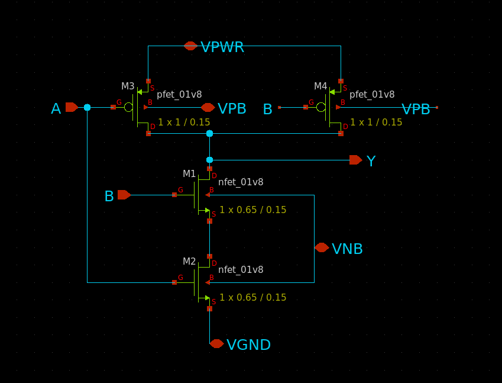

You can build multiple components and multiple levels of subcomponents.
Each circuit is hidden in the form of symbols.
This allows engineers to abstract away from the internal structure of each of the subcomponents.

Testbenches
^^^^^^^^^^^^^^^

Testbenches are similar to schematics,
but schematics are typically representations of the actual circuit that will be produced by foundry.
Meanwhile testbenches are used to produce power measurements, transition measurements, test functionality and other parameters.

Testbenches play a key role in ensuring that designed circuit does what it is supposed to do.
They need to cover every parameter from specification.

.. todo:: Add an example testbench schematic

Netlist
^^^^^^^^^^^^^^^
Netlist contains the transistors, their parameters and connections,
but it's usually either in Verilog netlist format, DEF netlist or spice netlist format.
Text representation is harder to read from user standpoint, but it's simple to parse for the automatic tools.

.. todo:: Add example netlist

Simulation
^^^^^^^^^^^^^^^
SPICE simulation is one of the most common tools used by designers.
It allows to simulate the behaviour of the circuit and characteristics of the circuit.

.. todo:: Add a simulation example

Layout
^^^^^^^^^^^^^^^
.. todo:: Layout
Signoff checks
^^^^^^^^^^^^^^^
.. todo:: Signoff
DRC
"""""""""""""""
.. todo:: DRC
LVS
"""""""""""""""
.. todo:: LVS
PEX and Simulation
"""""""""""""""
.. todo:: PEX
ESD
"""""""""""""""
.. todo:: ESD
EM
"""""""""""""""
.. todo:: EM
IR drop
"""""""""""""""
.. todo:: IR drop
Log review
"""""""""""""""
.. todo:: Log review

Tech Files
--------------------------------------------------------------------------------
.. todo:: tech files
DRC
^^^^^^^^^^^^^^^
Design Rule Checks is the step used to verify the layout to adhere the strict manufacturing rules.
If DRC fails then the layout cannot be manufactured.

.. todo:: add screenshot to DRC process

LVS
^^^^^^^^^^^^^^^
Layout versus schematic check extracts the primitives from the layout files,
after that the generated netlist is compared against the reference netlist.
Usually the netlist is generated by schematic tool
and the PDK contains configuration for the primitive extraction for some tool.

.. todo:: add link to the files
sky130 supports Magic VLSI and KLayout DRC checks, the rulesets are provided by Open_PDKs installation.

.. todo:: Add a screenshot of LVS process

First step is generating the netlists:

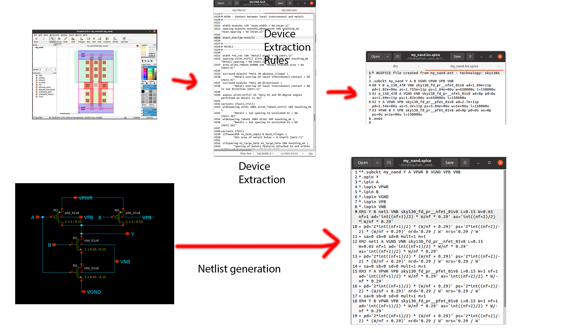

Second step is comparing two netlists. In OpenLane Netgen is used for comparison.
Netgen and other netlist comparison tools require a configuration that tells the tool specific details about the technology.

For example in sky130 most transistors have symetric drain/source.
Netgen does not know that this is the case.
To tell Netgen sky130 provides configuration file that contains information regarding this properties.
Netgen generates the LVS report containing instance-by-instance and pin-by-pin comparison.

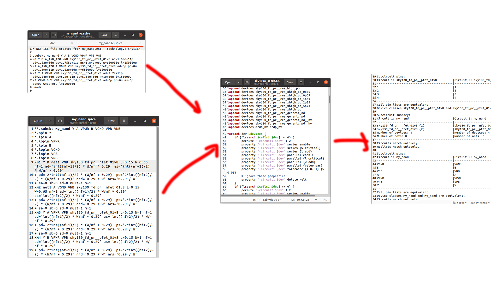

PEX
^^^^^^^^^^^^^^^
.. todo:: PEX
Tech LEF
^^^^^^^^^^^^^^^
.. todo:: Tech LEF

Standrad Cells Library
--------------------------------------------------------------------------------
.. todo:: SCL. Link to the other page

Missconception: OpenLane PDK vs Tech PDK vs Foundary PDK
--------------------------------------------------------------------------------
.. todo:: Explain

MOS transistors and switch level representation
--------------------------------------------------------------------------------
The NMOS and PMOS transistors consists of the conducting gate, an insulating layer of silicon oxide, drain, source and bulk.

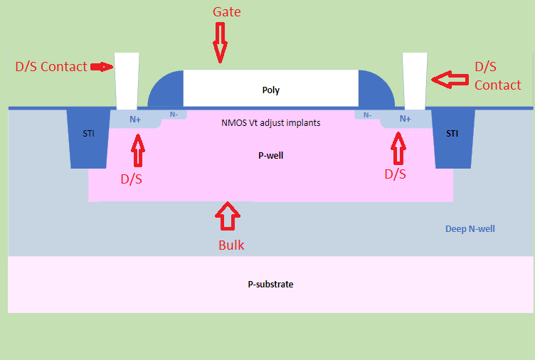

    Cross section of an NFET.

The gate voltage acts as control input.
The value of the gate controls the current between drain and source.

Let's take a look at nMOS transistor.
The body is connected to the ground so the p–n junctions of the source and drain to body are reverse-biased.

If the gate is also grounded, then no current flows. Therefore, we say the transistor is OFF.

If the gate voltage increases, then the the capacitor charges.
This creates electrons at bottom plate of the Si–SiO2 interface.
If the voltage is raised enough, the electrons outnumber the holes
and a thin region under the gate called the channel turns into an n-type semiconductor.
Hence, a conducting path of electron carriers is formed from
source to drain and current can flow. We say the transistor is ON.

The voltage where the electrons number is equal to the holes is called Vthreshold.

.. todo:: Add picture visualizing this

.. todo:: Add PMOS explainaion

Analog design flow
--------------------------------------------------------------------------------
Intro
^^^^^^^^^^^^^^^
.. todo:: Add introduction

Installing tools
^^^^^^^^^^^^^^^
Let's install ``hpretl/iic-osic-tools`` which contains XSCHEM, NGSPICE, Netgen. KLayout will be ran from OpenLane docker image.

.. code-block:: shell

    https://github.com/hpretl/iic-osic-tools.git
    cd iic-osic-tools/

    ./start_x.sh

This tool uses Docker image with prebuilt binaries. The ``./start_x.sh`` runs an Docker instance in a new window.
Make sure you have at least 12GB.

By default ``$HOME/eda/designs`` can be found inside the container path ``/foss/designs``.

To open the xschem run following:

.. code-block:: shell

    xschem

It will open the xschem window:

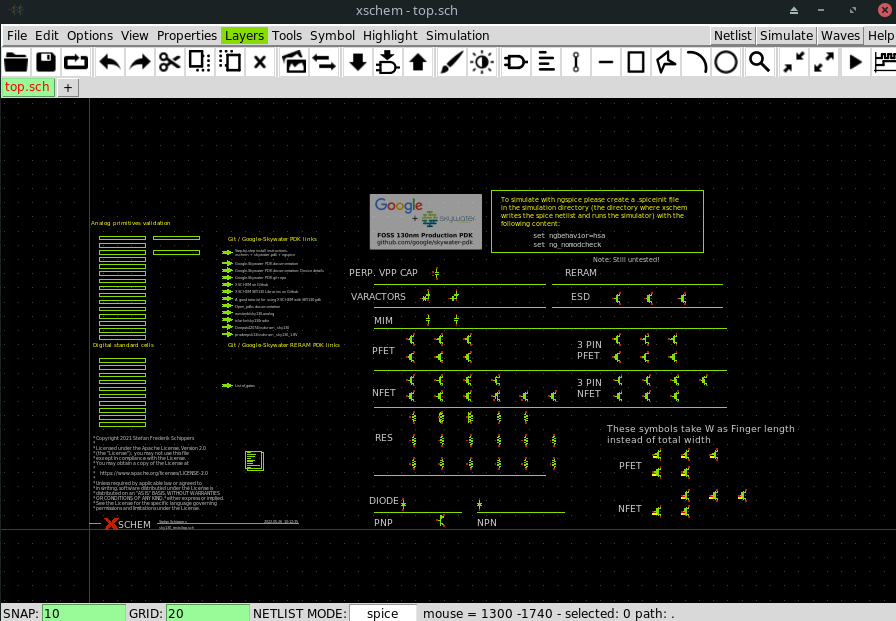

Schematic
^^^^^^^^^^^^^^^^^^^^^^^^^^^^^^^

In this step start building the simple schematic for a NAND. For this purpose use ``File -> New Schematic``

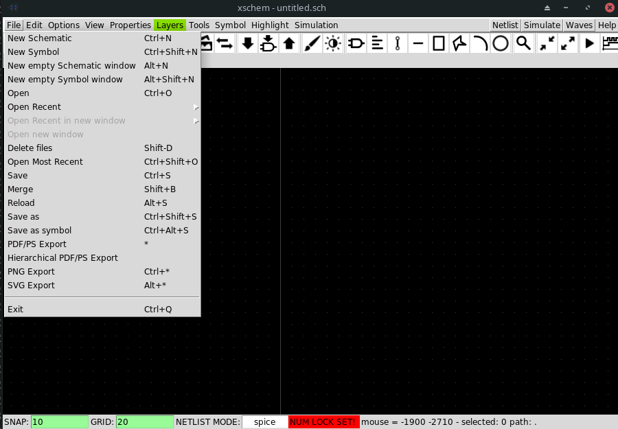

Next, draw the NAND unit. For this purpose, create transistors.
Click on the ``Tools -> Insert Symbol`` to create new componets.

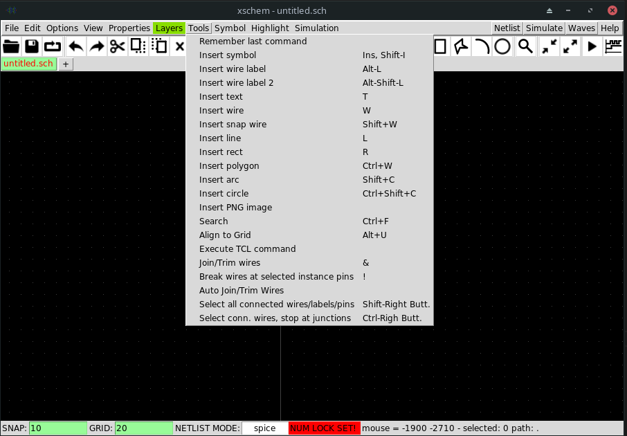

In the opened window there three sections: Selection of the library, selection of the cell in the library and control bar at the bottom:

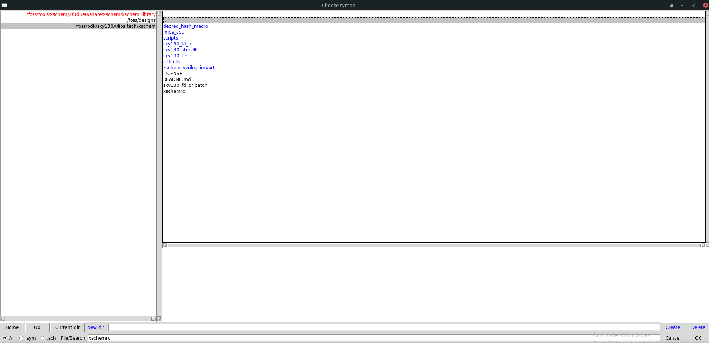

Pressing Home button brings you to the list of libraries.
Left bar is used to select the library or it shows the current directory.
In the screenshot you can see three libraries: XSCHEM standard library, our workspace library and sky130A xschem library.

From sky130A xschem library open the ``sky130_fd_pr`` folder. The name stands for: sky130 foundry primitive cells.
From there pick ``nfet_01v8``.
Be careful. This is the most common mistake, you need to create the ``nfet_01v8``, not any other transistor.
Then click on the workspace to actually create the instance.

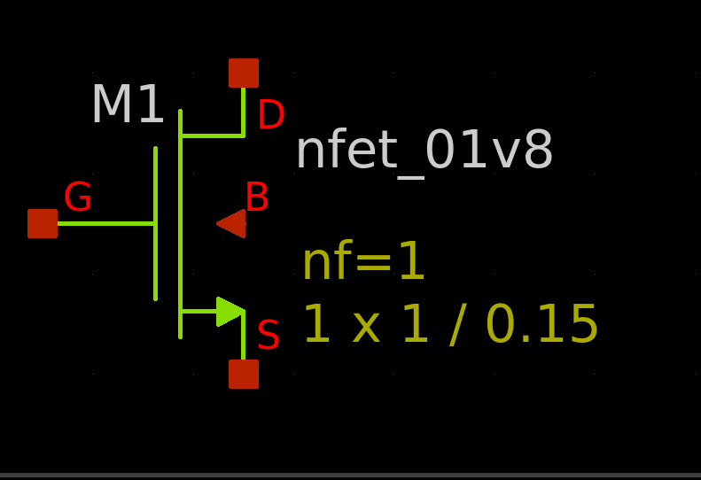

Repeat the same step to create another ``nfet_01v8`` and two ``pfet_01v8``.
Or use click to select the transistor, then use Ctrl + C and Ctrl + V to copy the instance.

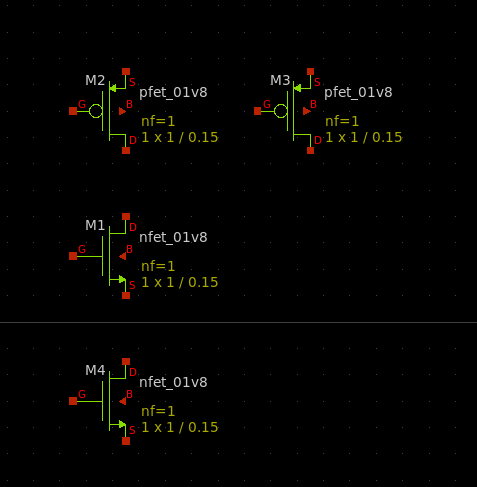

How do we know what transistors to use?
According to `sky130_fd_sc_hd documentation provided here <https://skywater-pdk.readthedocs.io/en/main/contents/libraries/foundry-provided.html>`_
it is clear that the library we are targeting uses this transistors.

Transistor choice in the library is always deliberate:
For example:
* High Vthreshold transistors will use less power, but will be slower and bigger => sky130_fd_sc_lp
* Low Vthreshold transistors will be faster, but more power consuming and will take more area => sky130_fd_sc_hs
* High Density grid will provide better area utilization at the cost of speed => sky130_fd_sc_hd
* Low leakage library will have reduced static leakage, at the cost of area and power  => sky130_fd_sc_hdll

If we want, we can use different type of transistors at a certain cost.
Since the layers to implement these transistors might have stricter spacing requirements,
the cells with different type of transistor than rest of the library will utilize bigger area.

The process of integrated circuit design is always about picking and choosing the tradeoffs.
One of the most common ones are: Cost, Power and Speed.

.. todo:: Add XSCHEM drawing the NAND half
.. todo:: Add XSCHEM building the Testbench half
.. todo:: Add XSCHEM netlisting half
.. todo:: Add XSCHEM simulation half
.. todo:: Add XSCHEM making sure the saved files reference right symbols half

.. todo:: Add opening the KLayout quarter
.. todo:: Add copying the cell
.. todo:: Add removing everything but the power rails and NWELL/PSDM/NSDM
.. todo:: Add drawing new shapes.

.. todo:: Common question about sky130A vs sky130B