Analog component design practice
--------------------------------------------------------------------------------
Introduction
^^^^^^^^^^^^^^^

.. warning:: This guide is created to teach the entry level knowledge about the custom macro blocks and standard cell library.
  Layouts, schematics and other outputs of the guide are not production ready.
  It makes a lot of assumptions, does not account for many effects and is not in any shape or form suitable for production.

This guide covers design process of analog components for sky130.
While this guide is different for most technlogies and tools it gives plenty of practical experience.

As part of this guide NAND cell will be designed.
The NAND cell covered in this guide is not intended to be used in real life applications.
It is recommended to read theoretical chapter located here first.

.. todo:: Add link to theoretical

Step 1. Installing tools
^^^^^^^^^^^^^^^
Let's install ``hpretl/iic-osic-tools`` Docker image which contains XSCHEM, NGSPICE, Netgen, KLayout.

.. code-block:: shell

    https://github.com/hpretl/iic-osic-tools.git
    cd iic-osic-tools/

    ./start_x.sh

This tool uses Docker image with prebuilt binaries. The ``./start_x.sh`` runs an Docker instance in a new window.
Make sure you have at least 12GB.

By default ``$HOME/eda/designs`` can be found inside the container path ``/foss/designs``.

To open the xschem run following:

.. code-block:: shell

    xschem

It will open the xschem window:

.. image:: ../_static/analog_flow/xschem_window.png

Step 2. Schematic
^^^^^^^^^^^^^^^^^^^^^^^^^^^^^^^

In this step start building the simple schematic for a NAND. For this purpose use ``File -> New Schematic``

.. image:: ../_static/analog_flow/new_schematic.png

Next, draw the NAND unit. For this purpose, create transistors.
Click on the ``Tools -> Insert Symbol`` to create new componets.

.. image::  ../_static/analog_flow/tools_insert.png

In the opened window there three sections: Selection of the library, selection of the cell in the library and control bar at the bottom:

.. image::  ../_static/analog_flow/choose_symbol_window.png

Pressing Home button brings you to the list of libraries.
Left bar is used to select the library or it shows the current directory.
In the screenshot you can see three libraries: XSCHEM standard library, our workspace library and sky130A xschem library.

From sky130A xschem library open the ``sky130_fd_pr`` folder. The name stands for: sky130 foundry primitive cells.
From there pick ``nfet_01v8``.
Be careful. This is the most common mistake, you need to create the ``nfet_01v8``, not any other transistor.
Then click on the workspace to actually create the instance.

.. figure:: ../_static/analog_flow/nfet_01v8.png

Repeat the same step to create another ``nfet_01v8`` and two ``pfet_01v8``.
Or use click to select the transistor, then use Ctrl + C and Ctrl + V to copy the instance.

.. figure:: ../_static/analog_flow/4_transistors_schematic.png

Transistor types
"""""""""""""""""""""""""""""""""""""""
How do we know what transistors to use?
According to `sky130_fd_sc_hd documentation provided here <https://skywater-pdk.readthedocs.io/en/main/contents/libraries/foundry-provided.html>`_
it is clear that the library we are targeting uses this transistors.

Transistor choice in the library is always deliberate:
For example:

* High Vthreshold transistors will use less power, but will be slower and bigger => sky130_fd_sc_lp
* Low Vthreshold transistors will be faster, but more power consuming and will take more area => sky130_fd_sc_hs
* High Density grid will provide better area utilization at the cost of speed => sky130_fd_sc_hd
* Low leakage library will have reduced static leakage, at the cost of area and power  => sky130_fd_sc_hdll

If we want, we can use different type of transistors at a certain cost.
Since the layers to implement these transistors might have stricter spacing requirements,
the cells with different type of transistor than rest of the library will utilize bigger area.

The process of integrated circuit design is always about picking and choosing the tradeoffs.
One of the most common ones are: Cost, Power and Speed.

Ports
"""""""""""""""""""""""""""""""""""""""

Create four Input/Output pins ``Tools -> Insert symbol -> xschem_devices -> iopin.sym``.

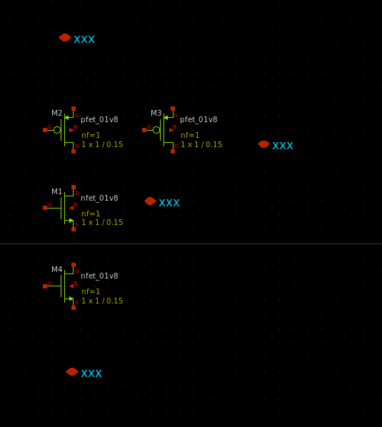

Repeat the same to create two input ports ``Tools -> Insert symbol -> xschem_devices -> ipin.sym``.

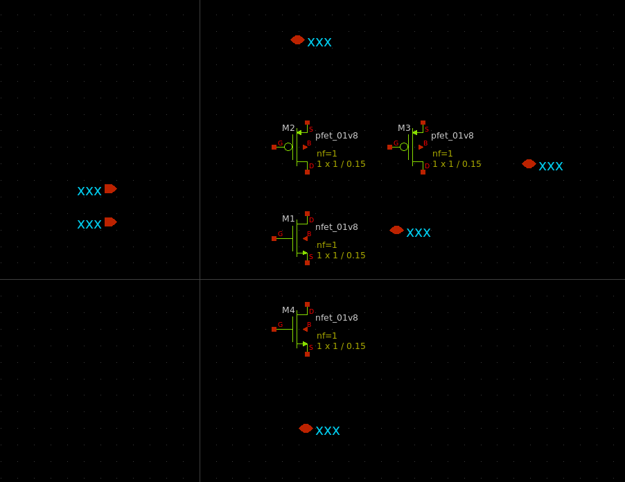

Create the output port: ``Tools -> Insert symbol -> xschem_devices -> opin.sym``.

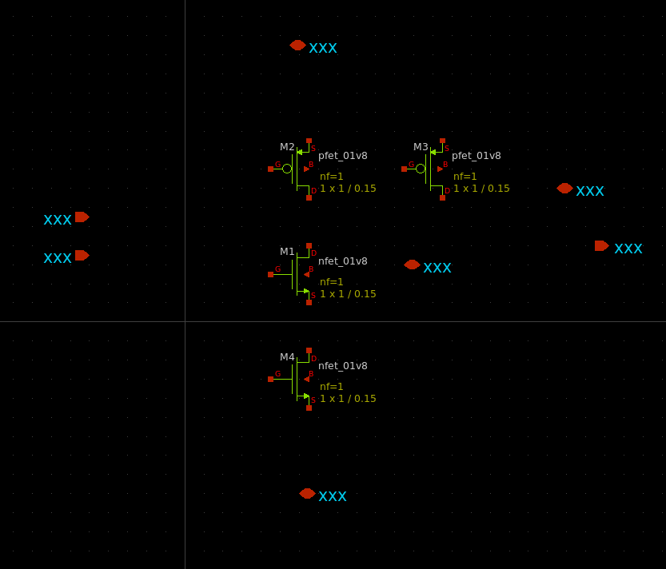

Name the ports. Follow the same pattern as the sky130_fd_sc_hd:

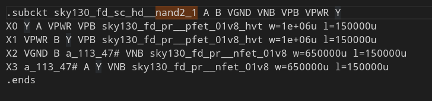

Therefore:
   Inputs for Data: A, B  

   Outputs for Data: Y  

   I/O Power: VPWR  

   I/O Ground: VGND  

   I/O PMOS bulk: VPB  

   I/O NMOS bulk: VNB  

``Right click -> edit attributes`` on them to edit the label. Or you can select using ``left click`` and then press ``Q``.

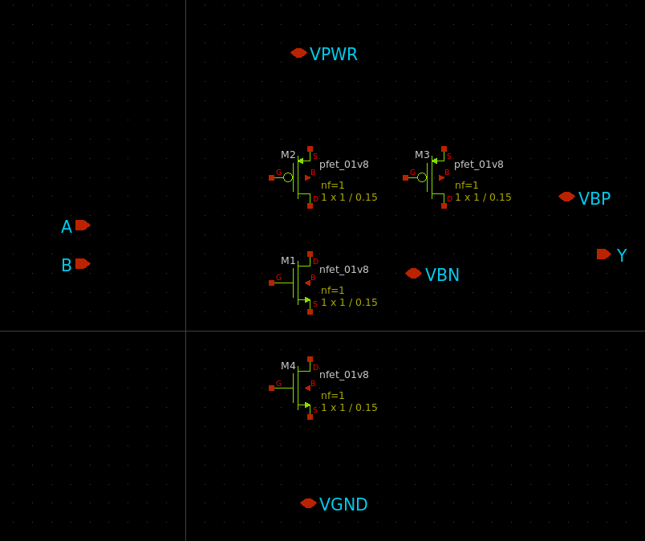

Logical question arises: Why are the VPWR and VPB separate pins if they are typically connected to the same power?
See :ref:`floorplan_taps_dcaps_fillers_sites` for answers.

Connections
"""""""""""""""""""""""""""""""""""""""

Next step is the connections.
Point to the terminals of the transistors then press W to start drawing the wire under the mouse.
After, click on the next terminal of the second transistor. Repeat for all of the connections.
Use ``devices/lab_pin.sym`` to assign nets to the connections.

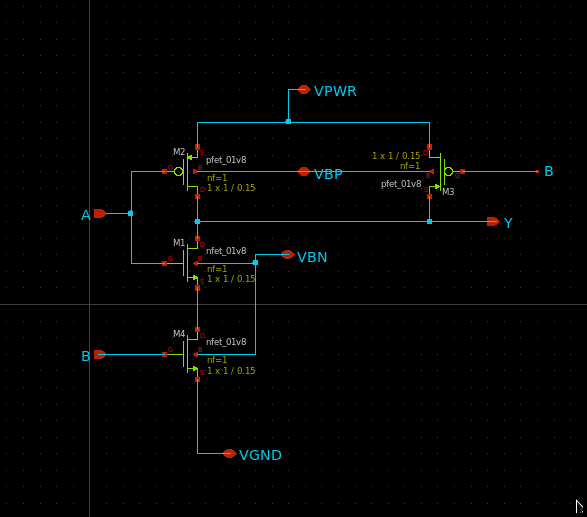

Finally, configure the transistors width (parameter ``w=``) and length (parameter ``l=``). More ``width`` means more current when transistor is on.
The sky130_fd_sc_hd defines the maximum width value per transistor: 0.65um for NMOS and 1um for PMOS.
However, by connecting multiple transistors in parallel the current can be increased similar to increasing the width.
These values are not picked randomly. More on this can be found here.

.. todo:: Add link to more information

For NMOS use 0.65um and for PMOS use 1um, like this:

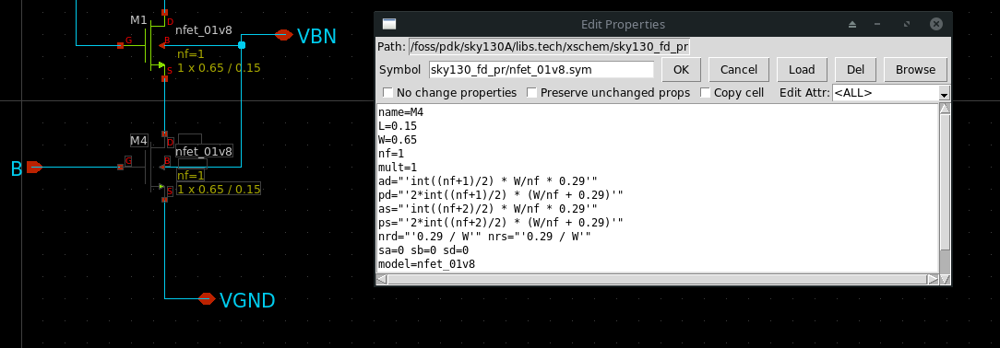
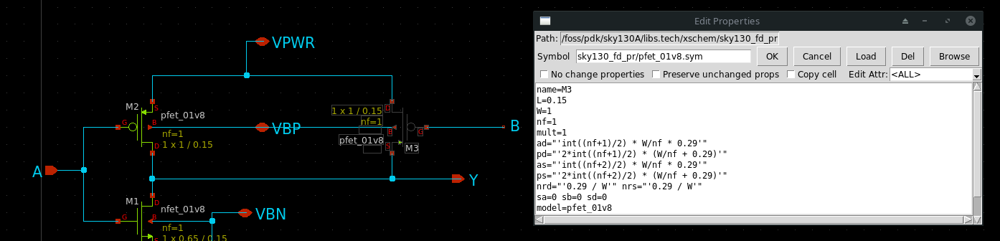

Save the schematic as ``my_nand.sch``.

.. todo:: Upload and link the schematic

Step 3. Symbol
^^^^^^^^^^^^^^^^^^^^^^^^^^^^^^^
Click on ``Symbol -> Make symbol from schematic``. This will create ``my_nand.sym`` in the same folder as the schematic.
Default save location is ``~/eda/designs`` which is mounted in Docker image as ``/foss/designs``.

Click on ``File -> Open`` and select the ``my_nand.sym`` to see the generated symbol.

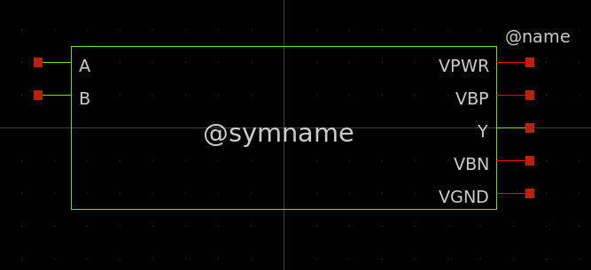

.. todo:: Upload and link the symbol

Step 4. Testbench
^^^^^^^^^^^^^^^^^^^^^^^^^^^^^^^
Make testbench to verify the functionality of the cell and collect information about characteristics of the component.

Create new schematic using ``File -> New schematic``.

Components
"""""""""""""""""""""""""""""""""""""""

First, create instance of ``/foss/eda/my_nand.sym``.

Second, create voltage source ``devices/vsource.sym`` for powering the ``my_nand`` instance. 

Third, create two voltage sources ``devices/vsource.sym`` for simulating the inputs of the nand cell.

Then, create capacitor ``devices/capa.sym`` to simulate the effect of gates connected at the output of the cell.

Finally, create ground instance ``devices/gnd.sym``.

.. figure:: ../_static/analog_flow/my_nand_tb_components.png

Connections
"""""""""""""""""""""""""""""""""""""""
Connect everything as shown in the figure.

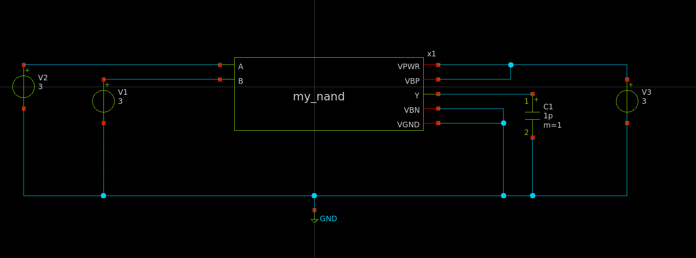

Configure the components and the simulation
"""""""""""""""""""""""""""""""""""""""
Configure the components.
Right click on the capacitor and select ``edit attributes``. Set capacitor value to ``16f`` (FemtoFarad).

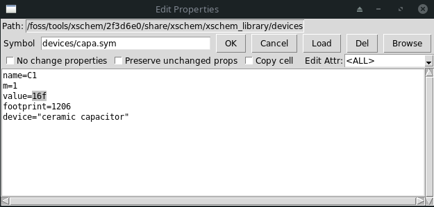

Create parameters that contain VPWR voltage value. For this purpose create instance of ``devices/code_shown.sym`` and fill  ``value`` field with following:

.. code-block::

  .param vpwr_value=1.65

It will look like this:

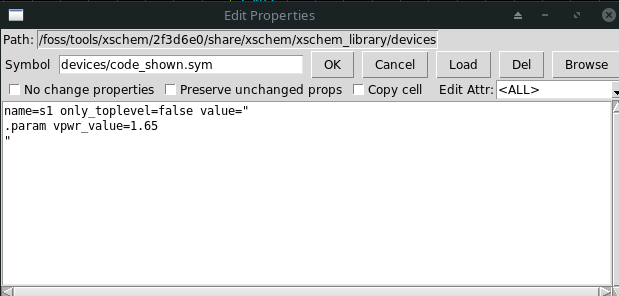

Set name and value of the voltage source for powering the circuit. Name should be ``Vpwr`` and the value should be ``vpwr_value``:

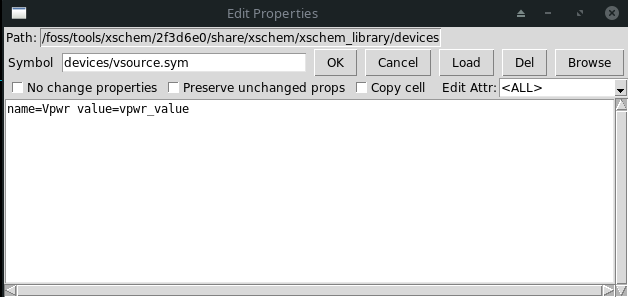

From sky130A xschem library open the ``sky130_fd_pr`` folder then pick ``corner.sym``. Then change ``corner`` attribute to ``ss``.
It will add a ``.lib`` line that points to the sky130 library. 

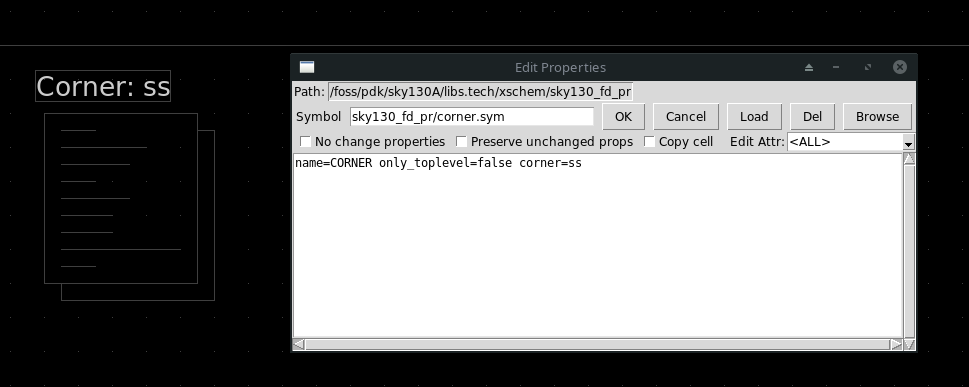

If you do not include this component you will get an error about transistor models missing:

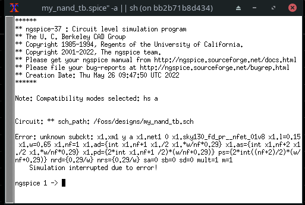

Create new instance of ``devices/code_shown.sym`` from xschem library and fill following value:

.. code-block::

  .temp 125

  .control
  tran 0.1n 60n
  write
  .endc

``.temp`` will tell the simulator about the simulation mode.
Content in between ``.control`` and ``.endc`` will tell the simulator to run ``tran`` sition simulation with ``0.1n`` (0.1 nanoseconds) step
until reaching ``60n`` (or 60 nanoseconds). Then to write the output raw file. It will look like this:

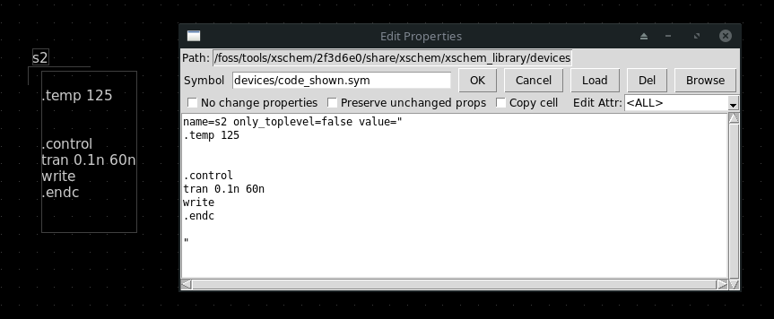

This guide covers only the case for one corner-voltage-temperature.
However, the simulations need to be done for a couple of cases. More information can be found here.

.. todo:: Add link about more information

Next, configure the input voltage values. Documentation regarding the syntax can be found in the `NGSPICE documentation <https://ngspice.sourceforge.io/docs.html>`_.

Here is the list of PULSE parameters: PULSE ( V1 V2 TD TR TF PW PER PHASE ).

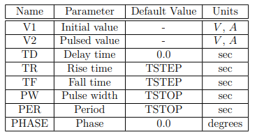

  Taken from NGSPICE documentation. Read the docs, this is provided as a reference for the reader.

Visualization of the pulse.

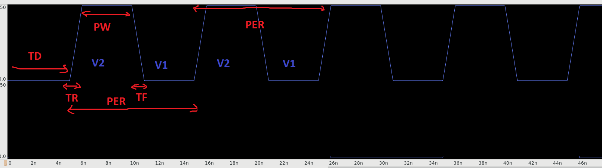

  Visualization of the pulse: PULSE(0 1.65 5ns 1ns 1ns 4ns 10ns)

Create labels using symbol ``devices/lab_wire.sym``. This is useful to be able to identify the nets in the waveview.

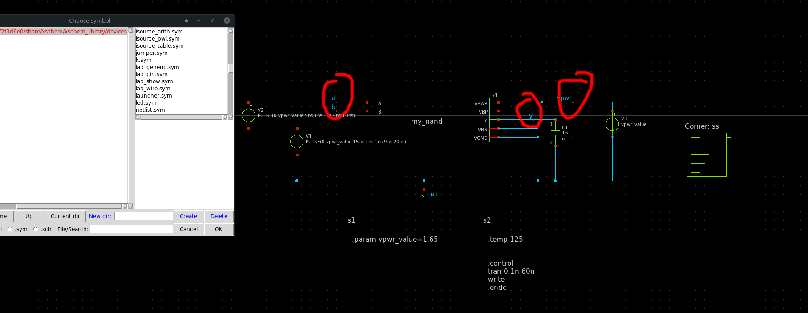

Select ``use simulation dir under current schematic dir`` from the ``Simulation`` drop down and make simulations outputs go to ``/foss/eda/simulations`` instead of temporary folder.
Then click ``set netlist dir`` and select ``/foss/eda`` so the generated netlist will be available outside the Docker instance.

.. figure:: ../_static/analog_flow/simulation_netlist_dir.png

Simulation and waveforms
"""""""""""""""""""""""""""""""""""""""

Press ``netlist`` and then ``simulate`` on the top right of the xschem window. You will get following window:

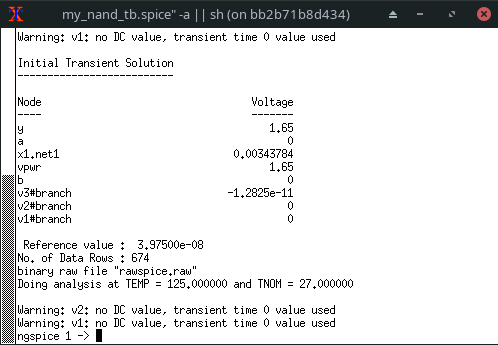

After simulation is done click on ``waves`` button on top right. This will open a window of GAW.

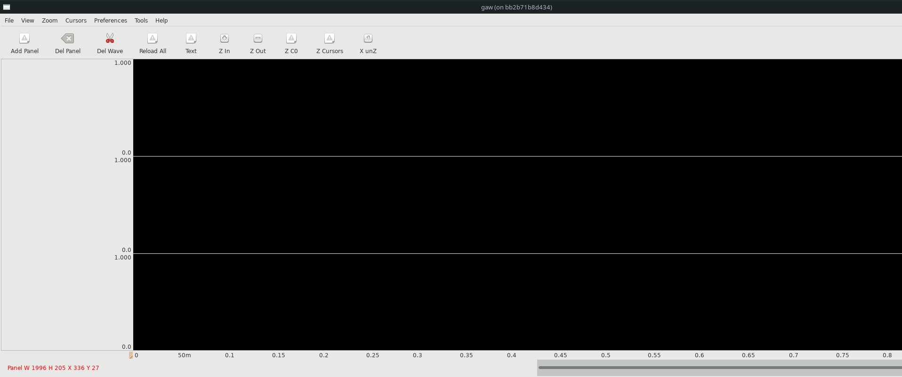

Then use ``File -> Open...`` and select the ``rawspice.raw``. It will open a pop-up menu with all of the waveforms.

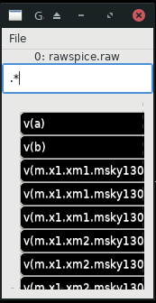

Drag and drop waveviews named ``v(a)``, ``v(b)``, ``v(y)`` from the pop-up menu
into the black areas where typically the waveforms are located.

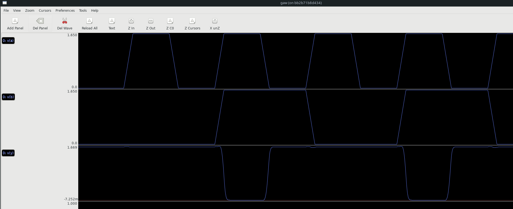

If you drag it to incorrect location you will get message similar to below:

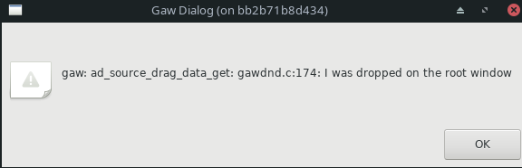

Measurements
"""""""""""""""""""""""""""""""""""""""
When collecting characteristics it is common to automate measurements of different parameters.
For this purpose SPICE proposes ``.measure`` command.
More information about this command can be found in `NGSPICE documentation <https://ngspice.sourceforge.io/docs.html>`_.

Create a new instance of ``devices/code_shown.sym``. Then add following code in the value field:

.. code-block::

  .meas tran rise_time TRIG v(y) VAL=vpwr_value*0.1 RISE=LAST TARG v(y) VAL=vpwr_value*0.9 RISE=last

The measurement above measures the time between trigger (trig) and second trigger (targ).
Trigger is set for condition when ``v(y) == vpwr_value*0.1`` on the first rising edge
and the second trigger is set to ``v(y) == vpwr_value*0.9`` on the first rising edge.

The ``rise_time`` is about ``450ps`` as can be seen in the measurement results:

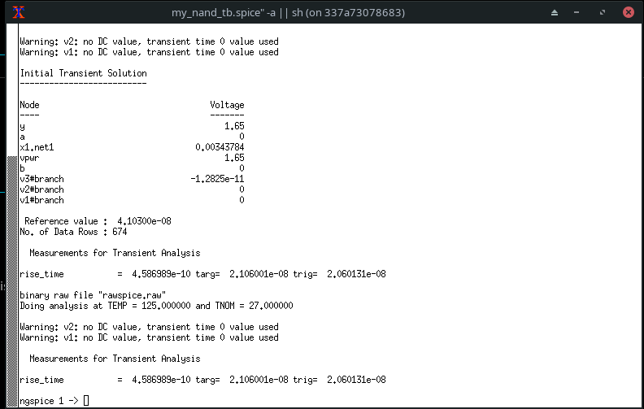

For visualization purposes only, verify the measurements according to the waveview:

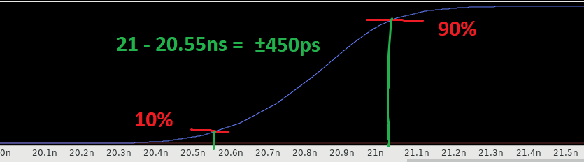

Characterization needs to account for different transition cases depending on input transitions.
This is caused by the fact that some transistors are connected in parallel.
Transistors in parallel can conduct at the same time.
As a result, the resistance is much lower compared to the case when only one transistor conducts.
Therefore when measuring the transition time the resulting transition can be much faster.
Characterization process needs to take into the account this property. This falls outside the scope of this guide.

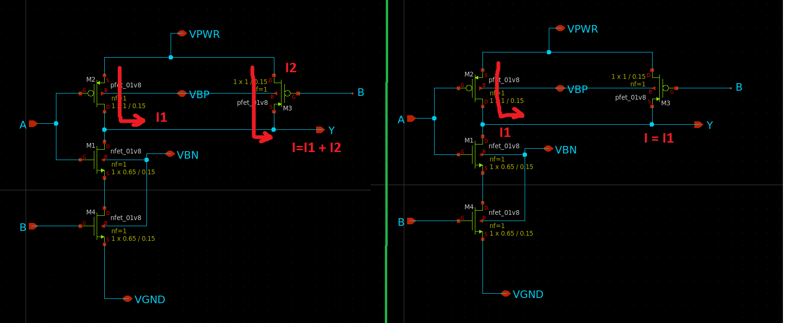

The schematic, symbol and testbench can be found in ``docs/_static/analog_flow_files``

Troubleshooting
"""""""""""""""""""""""""""""""""""""""
.. todo:: Add troubleshooting PDK issues
.. todo:: Add troubleshooting Symbol path issues

.. todo:: Add opening the KLayout quarter
.. todo:: Add copying the cell
.. todo:: Add removing everything but the power rails and NWELL/PSDM/NSDM
.. todo:: Add drawing new shapes.
.. todo:: Add the final result

.. todo:: Common question about sky130A vs sky130B

.. todo:: PEX

load <cellname>
flatten my_flat_cell
load my_flat_cell
extract do local
extract all
ext2sim labels on
ext2sim
extresist tolerance 10
extresist
ext2spice lvs
ext2spice cthresh 0
ext2spice extresist on
ext2spice