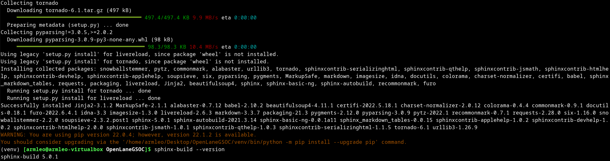
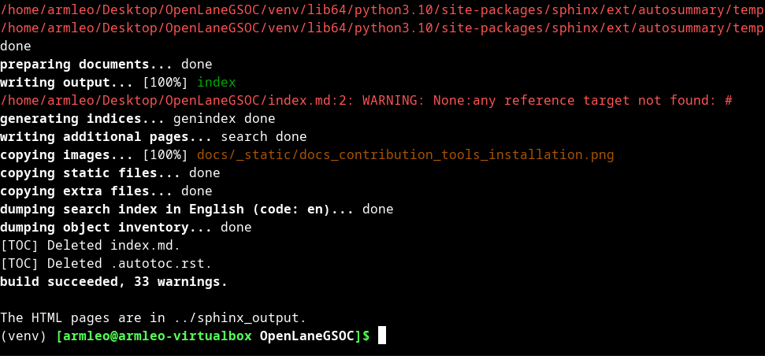

Documentation Contributors guide
================================================================================

.. note:: This page is for documentaiton contributors. For developers see `CONTRIBUTING.md <../../CONTRIBUTING.html>`_

Installation of sphinx for documentation
--------------------------------------------------------------------------------

.. note:: ``venv`` for sphinx documentation is not the same ``venv`` used for development of OpenLane. Avoid mixing them.

In order to contribute to documentation you can install the sphinx and build the documentation.

.. code-block:: console

    # assuming you are inside OpenLane folder and the parent direcoty of OpenLane can be used to store the venv directory.
    
    # create venv enviornment
    python -m venv ../venv

    # activate venv
    source ../venv/bin/activate

    # Install required modules
    python -m pip install -r docs/requirements.txt 

You can check the installation and see that sphinx was installed.

After installation, everytime you want to build the documentation proceed to enter the venv and run ``sphinx-build`` following commands: 

.. code-block:: console

    # assuming you are inside OpenLane folder

    # activate venv
    source ../venv/bin/activate

    # Run sphinx
    sphinx-build . ../sphinx_output

Then you can view the generated html files using Firefox or other browser. To open this document in browser:

.. code-block:: console

    firefox ../sphinx_output/docs/source/contributing_to_docs.html

Making screenshots
--------------------------------------------------------------------------------
The screenshots in documentation should use following prompt:

.. code-block:: console

    export PS1="\W> "

You can add it to your ``.bashrc`` or just run it before you run the command to then take the screenshot.

How to contribute
--------------------------------------------------------------------------------

* New documentation should be written in reStructuredText not Markdown.
* Take a look at existing RST documentation to get glimps of it's syntax.
* Use ``of`` instead of ``'``, for example: ``Docker's Installation`` → ``after the installation of the Docker``.
* Instead of ``don't`` and ``can't`` use full forms: ``do not`` and ``cannot``

Keep trademarks and terms consistent
--------------------------------------------------------------------------------
In order to improve the readability of the documentation we recommend to use the names of the projects properly. Some examples you can see below:

.. code-block::

    OpenLANE → OpenLane
    OpenRoad → OpenROAD
    Mac OS X → macOS
    MAGIC → Magic

Use OpenROAD documentation preferences:

.. code-block::

    co-ordinates → coordinates
    pad ring → padring
    pad cell → padcell
    key value pair → key-value pair
    micrometre → micron (or, micrometer)

Headers structure
--------------------------------------------------------------------------------

In Markdown avoid using same header type both for the title of the document and it's content. It looks awful in the table of content.

Use headers to make structure of the documentation better. For underline and overlines use 80 symbol. Here is the header priorities. Top is the highest priority.

.. code-block::

    # with overline
    * with overline
    =
    -
    ^
    "

What's overline?

.. code-block::

    ################## <- Overline
    OVERLINED TITLE
    ##################

Troubleshooting
--------------------------------------------------------------------------------

Pip module related errors
^^^^^^^^^^^^^^^^^^^^^^^^^^^^^^^^^^^^^^^^^^^^^^^^^^^^^^^^^^^^^^^^^^^^^^^^^^^^^^^^
If you did not source ``../venv/bin/activate`` when running ``sphinx-build`` then you will get error similar to the one below.

.. code-block:: console

    Running Sphinx v5.0.1

    Configuration error:
    There is a programmable error in your configuration file:

    Traceback (most recent call last):
    File "/home/armleo/.local/lib/python3.10/site-packages/sphinx/config.py", line 343, in eval_config_file
        exec(code, namespace)
    File "/home/armleo/Desktop/OpenLaneGSOC/conf.py", line 24, in <module>
        from recommonmark.parser import CommonMarkParser
    ModuleNotFoundError: No module named 'recommonmark'

In order to resolve this, repeat the steps above for enabling venv.

Sphinx build complains about title underline being too short
^^^^^^^^^^^^^^^^^^^^^^^^^^^^^^^^^^^^^^^^^^^^^^^^^^^^^^^^^^^^^^^^^^^^^^^^^^^^^^^^

When running ``sphinx-build`` you may get following warning:

.. code-block:: console

    /home/armleo/Desktop/OpenLaneGSOC/docs/source/installation.rst:3: WARNING: Title underline too short.

    Installation of OpenLane
    ########

Try to use 80 symbol long header underlines. This makes replacing them easier and keeps the documentation code consistent.
