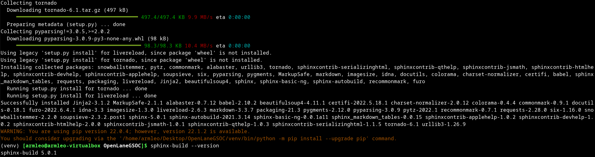
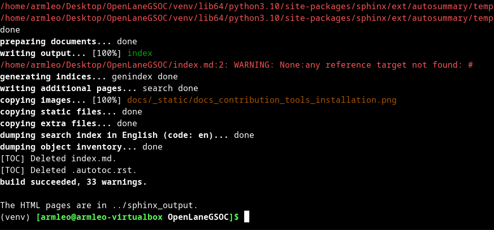

Installation of sphinx for documentation
------------

In order to contribute to documentation you can install the sphinx and build the documentation.

.. code-block:: console

    # assuming you are inside OpenLane folder

    python -m venv ven
    source venv/bin/activate

    python -m pip install -r docs/requirements.txt 

You can check the installation and see that sphinx was installed.

After installation everytime you can enter the venv and build the documentation. 

.. code-block:: console

    source venv/bin/activate
    sphinx-build . ../sphinx_output

Then you can view the generated html files using Firefox or other browser. To open this document in browser:

.. code-block:: console

    firefox ../sphinx_output/docs/source/contributing_to_docs.html

Using asciinema
------------

Asciinema is used to record terminal's output. The output is played using asciinema player embedded into Sphinx.

First we set the terminal prompt to '> '; Add following line at the end of your $HOME/.bashrc

.. code-block:: console

    export PS1="> "

Then we need to start the recording using following commands:

.. code-block:: console

    asciinema rec version_check.cast

After you are done with the commands press Ctrl + D to stop the recording. It will create the .cast file with the recordded playback.

In order to include the local recording place the .cast file in the docs/_static/ folder and then include following in your .rst file:

.. code-block:: console

    .. asciinema:: ../_static/version_check.cast

Note that the .. asciinema is supposed to have trailing and following newlines in order to be parsed. It will  create a nice embedded player that will play the file.

.. asciinema:: ../_static/version_check.cast
