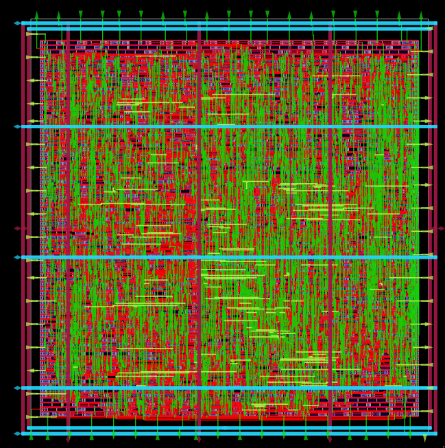
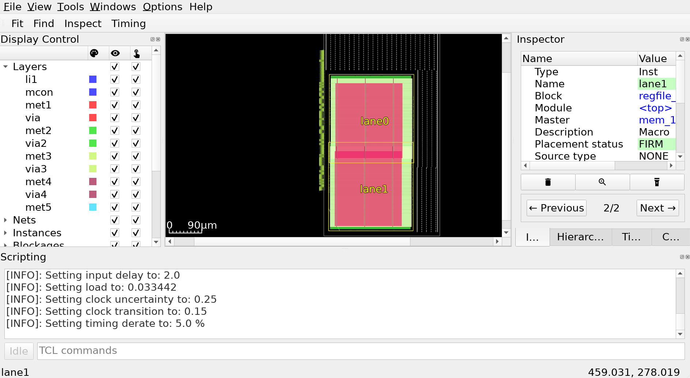
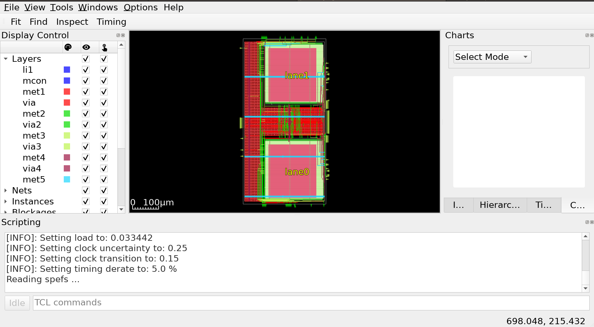
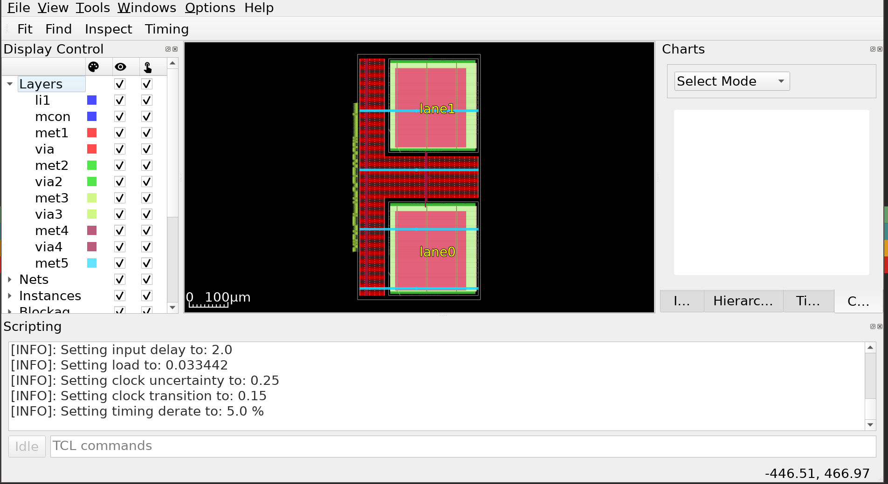
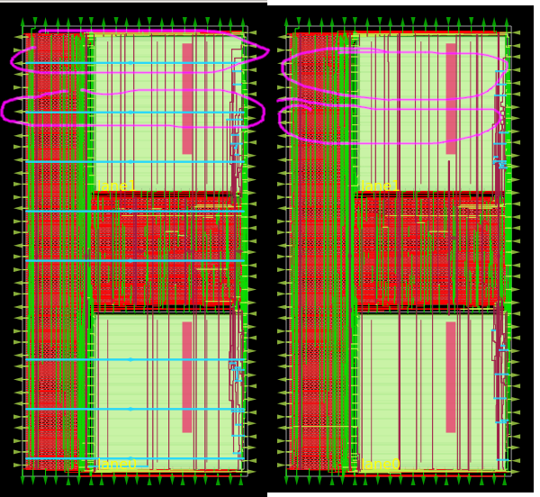

.. todo:: Rename the steps

Digital Design Flow
--------------------------------------------------------------------------------
This example covers creation of simple memory macro. This guide uses generated layout files for it,
then use the generated memory to make a top level chip register file.

Create the memory macro design
^^^^^^^^^^^^^^^^^^^^^^^^^^^^^^^^^^^^^^^^^^^^^^^^^^^^^^^^^^^^^^^^^^^^^^^^^^^^^^^^

Let's create the design. The following command will create a directory ``design/mem_1r1w/`` and one file ``config.json`` that will be mostly empty.

.. code-block:: console

    ./flow.tcl -design mem_1r1w -init_design_config -add_to_designs

One of the common mistakes people make is copying existing designs,
like ``designs/inverter`` and then they face issues with their configuration.
Always create new designs using ``-init_design_config``.
It will ensure that your configuration is the absolute minimum.

Example of the common issues people face:
They copy ``inverter`` design, rename it. Then run the flow and the router crashes with ``error 10``.
This is caused by enabled "basic placement",
which works only for designs with a couple of dozen standard cells, not hundreds.
So when you change the basic inverter with a design containing many cells
router will not be able to route your design, therefore crashing with cryptic message.

Create the RTL files
^^^^^^^^^^^^^^^^^^^^^^^^^^^^^^^^^^^^^^^^^^^^^^^^^^^^^^^^^^^^^^^^^^^^^^^^^^^^^^^^

Then we need to create/copy the RTL files. The recommended location for files is ``design/mem_1r1w/src/``. Let's put a simple counter in there.

Create ``design/mem_1r1w/src/mem_1r1w.v`` file and put following content:

.. code-block:: verilog

    module mem_1r1w (clk, read_addr, read, read_data, write_addr, write, write_data);
        parameter DEPTH_LOG2 = 4;
        localparam ELEMENTS = 2**DEPTH_LOG2;
        parameter WIDTH = 32;

        input wire clk;

        input wire [DEPTH_LOG2-1:0] read_addr;
        input wire read;
        output reg [WIDTH-1:0] read_data;

        input wire [DEPTH_LOG2-1:0] write_addr;
        input wire write;
        input wire  [WIDTH-1:0] write_data;

    reg [WIDTH-1:0] storage [ELEMENTS-1:0];

    always @(posedge clk) begin
        if(write) begin
            storage[write_addr] <= write_data;
        end
        if(read)
            read_data <= storage[read_addr];
    end

    endmodule

.. note::
    Originally we used a very small macro block as an example,
    however there is known issue: Small macro blocks do not fit proper power grid,
    therefore you need to avoid making small macro blocks. For this, set the ``FP_SIZING`` to ``absolute`` and configure ``DIE_AREA`` to be bigger than ``200um x 200um`` for sky130.

Configure mem_1r1w
^^^^^^^^^^^^^^^^^^^^^^^^^^^^^^^^^^^^^^^^^^^^^^^^^^^^^^^^^^^^^^^^^^^^^^^^^^^^^^^^

Modify the ``config.json`` to include following:

.. code-block::json

    {
        "DESIGN_NAME": "mem_1r1w",
        "VERILOG_FILES": "dir::src/*.v",
        "CLOCK_PORT": "clk",
        "CLOCK_PERIOD": 10.0,
        "DESIGN_IS_CORE": false,
        "FP_PDN_CORE_RING": false,
        "RT_MAX_LAYER": "met4"
    }
 
``DESIGN_IS_CORE`` controls the metal levels used for power routing, set it to ``false`` to use only lower levels.

``FP_PDN_CORE_RING`` is set to ``false`` to disable a power ring around the macro block.

``RT_MAX_LAYER`` set to ``met4`` to limit metal layers allowed for routing.

More information on `configuration can be found here <configuration>`_. 

    A macro with a PDN ring around. ``"FP_PDN_CORE_RING": true``

Run the flow on the macro block
^^^^^^^^^^^^^^^^^^^^^^^^^^^^^^^^^^^^^^^^^^^^^^^^^^^^^^^^^^^^^^^^^^^^^^^^^^^^^^^^

.. code-block:: console

    ./flow.tcl -design mem_1r1w -tag full_guide -overwrite

Analyzing the flow generated files
^^^^^^^^^^^^^^^^^^^^^^^^^^^^^^^^^^^^^^^^^^^^^^^^^^^^^^^^^^^^^^^^^^^^^^^^^^^^^^^^

You can open interactive view using following commands:

.. code-block:: console

    ./flow.tcl -design mem_1r1w -tag full_guide -interactive
    package require  openlane
    or_gui

.. figure:: ../_static/digital_flow/mem_1r1w_def.png

Create chip level
^^^^^^^^^^^^^^^^^^^^^^^^^^^^^^^^^^^^^^^^^^^^^^^^^^^^^^^^^^^^^^^^^^^^^^^^^^^^^^^^

Create a new design named ``regfile_2r1w``. This design will use the ``mem_1r1w``.

.. code-block:: console

    ./flow.tcl -design regfile_2r1w -init_design_config -add_to_designs

Integrate the macros
^^^^^^^^^^^^^^^^^^^^^^^^^^^^^^^^^^^^^^^^^^^^^^^^^^^^^^^^^^^^^^^^^^^^^^^^^^^^^^^^

Verilog blackbox is used by the synthesis tool. Create the verilog blackbox:

.. todo:: Add the verilog blackbox

Then add ``VERILOG_FILES_BLACKBOX``, ``EXTRA_LEFS`` and ``EXTRA_GDS_FILES`` to the ``config.json`` in the ``regfile_2r1w``:

.. code-block:: json

    {
        "DESIGN_NAME": "regfile_2r1w",
        "VERILOG_FILES": "dir::src/*.v",
        "CLOCK_PORT": "clk",
        "CLOCK_PERIOD": 10.0,
        "DESIGN_IS_CORE": true,
        
        "EXTRA_LEFS":      "/openlane/designs/mem_1r1w/runs/full_guide/results/final/lef/mem_1r1w.lef",
        "EXTRA_GDS_FILES": "/openlane/designs/mem_1r1w/runs/full_guide/results/final/gds/mem_1r1w.gds",
        "VERILOG_FILES_BLACKBOX": "dir::bb/*.v"
    }

This will add the LEF abstract representation of the macro block. This abstraction file contains only layers required by tools.
In contrast, GDS contains all of the layers and is used to generate the final GDS file.
Missmatch between these files are not allowed. It is users responsibility to ensure that they match.

The PDN straps will be routed in opposite directions.
In locations where the two routing cross each other,
VIAs connecting the layers are added. When ``DESIGN_IS_CORE`` is set to ``true`` then higher layers (met5 in sky130) is used.
If it is set to ``false`` then VIAs will be missing and you will get LVS issues.

Run the flow
^^^^^^^^^^^^^^^^^^^^^^^^^^^^^^^^^^^^^^^^^^^^^^^^^^^^^^^^^^^^^^^^^^^^^^^^^^^^^^^^

Run the flow. It is expected for the flow to fail. In next step, explaination is provided.

.. code-block:: console

    ./flow.tcl -design regfile_2r1w -tag full_guide_broken_aspect_ratio -overwrite

First issue
^^^^^^^^^^^^^^^^^^^^^^^^^^^^^^^^^^^^^^^^^^^^^^^^^^^^^^^^^^^^^^^^^^^^^^^^^^^^^^^^

Flow is expected to fail.

.. code-block:: console

    [ERROR]: during executing openroad script /openlane/scripts/openroad/replace.tcl
    [ERROR]: Exit code: 1
    [ERROR]: full log: designs/regfile_2r1w/runs/full_guide/logs/placement/9-global.log
    [ERROR]: Last 10 lines:
    [INFO GPL-0015] CoreAreaUxUy: 489440 495040
    [INFO GPL-0016] CoreArea: 234294707200
    [INFO GPL-0017] NonPlaceInstsArea: 124707104000
    [INFO GPL-0018] PlaceInstsArea: 117229672450
    [INFO GPL-0019] Util(%): 106.97
    [INFO GPL-0020] StdInstsArea: 454185600
    [INFO GPL-0021] MacroInstsArea: 116775486850
    [ERROR GPL-0301] Utilization exceeds 100%.
    Error: replace.tcl, 91 GPL-0301
    child process exited abnormally

To debug this issue, open an OpenROAD GUI:

.. code-block:: console

    ./flow.tcl -design regfile_2r1w -interactive -tag full_guide_broken_aspect_ratio
    package require  openlane
    or_gui

As can be observed in the image, placement of the mem_1r1w instances failed.
It was unable to place the macro blocks inside the ``DIE_AREA``.
While the area is enough, there is no combination of placement for this cells that fits. All of the possible placements of these cells overlap.

Change the ``FP_ASPECT_RATIO`` value to ``2``.
This will make the flooplan a rectange instead of square and the rectangle will be double in height compared to width.

``config.json`` should look like this:

.. code-block:: json

    {
        "DESIGN_NAME": "regfile_2r1w",
        "VERILOG_FILES": "dir::src/*.v",
        "CLOCK_PORT": "clk",
        "CLOCK_PERIOD": 10.0,
        "DESIGN_IS_CORE": true,
        
        "FP_ASPECT_RATIO": 2,
        "EXTRA_LEFS":      "/openlane/designs/mem_1r1w/runs/full_guide/results/final/lef/mem_1r1w.lef",
        "EXTRA_GDS_FILES": "/openlane/designs/mem_1r1w/runs/full_guide/results/final/gds/mem_1r1w.gds",
        "VERILOG_FILES_BLACKBOX": "dir::bb/*.v"
    }

There is no need to change the default PDN configuration.
It is going to create power straps on met5 and connect the macro
that has power straps on met4 using vias.

Run the flow again
^^^^^^^^^^^^^^^^^^^^^^^^^^^^^^^^^^^^^^^^^^^^^^^^^^^^^^^^^^^^^^^^^^^^^^^^^^^^^^^^

Run the flow again. This time it should no longer fail.

.. code-block:: console

    ./flow.tcl -design regfile_2r1w -tag full_guide -overwrite

Analyzing the results
^^^^^^^^^^^^^^^^^^^^^^^^^^^^^^^^^^^^^^^^^^^^^^^^^^^^^^^^^^^^^^^^^^^^^^^^^^^^^^^^

.. note:: ``set_def`` currently overwrites the DEF file instead of temporary changing it.
    This guide will be updated with another command that does not overwrite the DEF.

Open OpenROAD GUI to view the results of the flow.

.. code-block:: console

    ./flow.tcl -design regfile_2r1w -interactive -tag full_guide

    # in interactive session:
    package require openlane
    set_def designs/regfile_2r1w/runs/full_guide/results/final/def/regfile_2r1w.def
    or_gui
    # Empty newline to force above line to execute

    OpenROAD gui with loaded final DEF file

If you want to load different DEF file use ``set_def`` command. For example:

.. code-block:: console

    ./flow.tcl -design regfile_2r1w -interactive -tag full_guide
    package require openlane
    set_def designs/regfile_2r1w/runs/full_guide/results/floorplan/regfile_2r1w.def
    or_gui

Each run has following structure:

.. code-block::

    ├── logs OR reports OR results OR tmp
    │   ├── cts
    │   ├── eco
    │   ├── floorplan
    │   ├── placement
    │   ├── routing
    │   ├── signoff
    │   └── synthesis
    ├── runtime.yaml
    └── warnings.log

There is 4 directories ``logs`` ``reports`` ``results`` and ``tmp``.
In each of these directories there is multiple directories. Directories are named according to the stage they belong to.

Directory ``results`` contains the results (outputs) of each step. For example content of the ``results/cts``:

.. code-block::

    designs/regfile_2r1w/runs/full_guide/results/cts
    ├── regfile_2r1w.def
    ├── regfile_2r1w.resized.v
    ├── regfile_2r1w.sdc
    └── regfile_2r1w.v

DEF files can be loaded usings steps provided above.

Finally output of OpenLane can be found in ``designs/regfile_2r1w/runs/full_guide/results/final``:

.. code-block::

    designs/regfile_2r1w/runs/full_guide/results/final
    ├── def
    │   └── regfile_2r1w.def
    ├── gds
    │   └── regfile_2r1w.gds
    ├── lef
    │   └── regfile_2r1w.lef
    ├── mag
    │   └── regfile_2r1w.mag
    ├── maglef
    │   └── regfile_2r1w.mag
    ├── sdc
    │   └── regfile_2r1w.sdc
    ├── sdf
    │   └── regfile_2r1w.sdf
    ├── spef
    │   └── regfile_2r1w.spef
    ├── spi
    │   └── lvs
    │       └── regfile_2r1w.spice
    └── verilog
        └── gl
            └── regfile_2r1w.v

Directory ``logs`` contains log files of each step. Steps are numerated. For example content of the ``logs/``: 

.. code-block::

    designs/regfile_2r1w/runs/full_guide/logs
    ├── cts
    │   ├── 14-cts.log
    │   ├── 15-write_verilog.log
    │   ├── 16-resizer.log
    │   └── 17-write_verilog.log
    ├── eco
    ├── floorplan
    │   ├── 3-initial_fp.log
    │   ├── 4-io.log
    │   ├── 7-tap.log
    │   └── 8-pdn.log
    ├── placement
    │   ├── 10-resizer.log
    │   ├── 11-write_verilog.log
    │   ├── 12-remove_buffers_from_ports.log
    │   ├── 13-detailed.log
    │   ├── 5-global.log
    │   ├── 6-basic_mp.log
    │   └── 9-global.log
    ├── routing
    │   ├── 18-resizer.log
    │   ├── 19-write_verilog.log
    │   ├── 20-diode_legalization.log
    │   ├── 21-global.log
    │   ├── 22-fill.log
    │   ├── 23-write_verilog_global.log
    │   ├── 24-detailed.log
    │   └── 25-write_verilog_detailed.log
    ├── signoff
    │   ├── 26-parasitics_extraction.min.log
    │   ├── 27-parasitics_multi_corner_sta.min.log
    │   ├── 28-parasitics_extraction.max.log
    │   ├── 29-parasitics_multi_corner_sta.max.log
    │   ├── 30-parasitics_extraction.nom.log
    │   ├── 31-parasitics_sta.log
    │   ├── 32-parasitics_multi_corner_sta.log
    │   ├── 33-irdrop.log
    │   ├── 34-gdsii.log
    │   ├── 34-gds_ptrs.log
    │   ├── 34-lef.log
    │   ├── 34-maglef.log
    │   ├── 35-gdsii-klayout.log
    │   ├── 36-xor.log
    │   ├── 37-spice.log
    │   ├── 38-write_powered_def.log
    │   ├── 40-lef.log
    │   ├── 40-regfile_2r1w.lef.json
    │   ├── 40-regfile_2r1w.lef.log
    │   ├── 40-regfile_2r1w.lvs.lef.log
    │   ├── 41-drc.log
    │   └── 42-antenna.log
    └── synthesis
        ├── 1-synthesis.log
        └── 2-sta.log

Directory ``reports`` contains all of the reports from corresponding stage. For example content of the ``reports/synthesis``

.. code-block::

    designs/regfile_2r1w/runs/full_guide/reports/
    ├── cts
    │   ├── 14-cts_sta.clock_skew.rpt
    │   ├── 14-cts_sta.max.rpt
    │   ├── 14-cts_sta.min.rpt
    │   ├── 14-cts_sta.rpt
    │   ├── 14-cts_sta.tns.rpt
    │   ├── 14-cts_sta.wns.rpt
    │   ├── 16-cts_rsz_sta.area.rpt
    │   ├── 16-cts_rsz_sta.clock_skew.rpt
    │   ├── 16-cts_rsz_sta.max.rpt
    │   ├── 16-cts_rsz_sta.min.rpt
    │   ├── 16-cts_rsz_sta.power.rpt
    │   ├── 16-cts_rsz_sta.rpt
    │   ├── 16-cts_rsz_sta.slew.rpt
    │   ├── 16-cts_rsz_sta.tns.rpt
    │   ├── 16-cts_rsz_sta.wns.rpt
    │   └── 16-cts_rsz_sta.worst_slack.rpt
    ├── eco
    ├── floorplan
    │   ├── 3-initial_fp_core_area.rpt
    │   └── 3-initial_fp_die_area.rpt
    ├── manufacturability.rpt
    ├── metrics.csv
    ├── placement
    │   ├── 10-pl_rsz_sta.area.rpt
    │   ├── 10-pl_rsz_sta.clock_skew.rpt
    │   ├── 10-pl_rsz_sta.max.rpt
    │   ├── 10-pl_rsz_sta.min.rpt
    │   ├── 10-pl_rsz_sta.power.rpt
    │   ├── 10-pl_rsz_sta.rpt
    │   ├── 10-pl_rsz_sta.slew.rpt
    │   ├── 10-pl_rsz_sta.tns.rpt
    │   ├── 10-pl_rsz_sta.wns.rpt
    │   ├── 10-pl_rsz_sta.worst_slack.rpt
    │   ├── 9-gpl_sta.clock_skew.rpt
    │   ├── 9-gpl_sta.max.rpt
    │   ├── 9-gpl_sta.min.rpt
    │   ├── 9-gpl_sta.rpt
    │   ├── 9-gpl_sta.tns.rpt
    │   └── 9-gpl_sta.wns.rpt
    ├── routing
    │   ├── 18-rt_rsz_sta.area.rpt
    │   ├── 18-rt_rsz_sta.clock_skew.rpt
    │   ├── 18-rt_rsz_sta.max.rpt
    │   ├── 18-rt_rsz_sta.min.rpt
    │   ├── 18-rt_rsz_sta.power.rpt
    │   ├── 18-rt_rsz_sta.rpt
    │   ├── 18-rt_rsz_sta.slew.rpt
    │   ├── 18-rt_rsz_sta.tns.rpt
    │   ├── 18-rt_rsz_sta.wns.rpt
    │   ├── 18-rt_rsz_sta.worst_slack.rpt
    │   ├── 21-grt_sta.clock_skew.rpt
    │   ├── 21-grt_sta.max.rpt
    │   ├── 21-grt_sta.min.rpt
    │   ├── 21-grt_sta.rpt
    │   ├── 21-grt_sta.tns.rpt
    │   ├── 21-grt_sta.wns.rpt
    │   ├── drt.drc
    │   └── drt.klayout.xml
    ├── signoff
    │   ├── 31-rcx_sta.area.rpt
    │   ├── 31-rcx_sta.clock_skew.rpt
    │   ├── 31-rcx_sta.max.rpt
    │   ├── 31-rcx_sta.min.rpt
    │   ├── 31-rcx_sta.power.rpt
    │   ├── 31-rcx_sta.rpt
    │   ├── 31-rcx_sta.slew.rpt
    │   ├── 31-rcx_sta.tns.rpt
    │   ├── 31-rcx_sta.wns.rpt
    │   ├── 31-rcx_sta.worst_slack.rpt
    │   ├── 32-rcx_mca_sta.area.rpt
    │   ├── 32-rcx_mca_sta.clock_skew.rpt
    │   ├── 32-rcx_mca_sta.max.rpt
    │   ├── 32-rcx_mca_sta.min.rpt
    │   ├── 32-rcx_mca_sta.power.rpt
    │   ├── 32-rcx_mca_sta.rpt
    │   ├── 32-rcx_mca_sta.slew.rpt
    │   ├── 32-rcx_mca_sta.tns.rpt
    │   ├── 32-rcx_mca_sta.wns.rpt
    │   ├── 32-rcx_mca_sta.worst_slack.rpt
    │   ├── 33-irdrop.rpt
    │   ├── 36-xor.rpt
    │   ├── 42-antenna_violators.rpt
    │   ├── drc.klayout.xml
    │   ├── drc.rdb
    │   ├── drc.rpt
    │   ├── drc.tcl
    │   ├── drc.tr
    │   ├── regfile_2r1w.xor.gds
    │   └── regfile_2r1w.xor.xml
    └── synthesis
        ├── 1-synthesis.AREA_0.chk.rpt
        ├── 1-synthesis.AREA_0.stat.rpt
        ├── 1-synthesis_dff.stat
        ├── 1-synthesis_pre.stat
        ├── 2-syn_sta.area.rpt
        ├── 2-syn_sta.clock_skew.rpt
        ├── 2-syn_sta.max.rpt
        ├── 2-syn_sta.min.rpt
        ├── 2-syn_sta.power.rpt
        ├── 2-syn_sta.rpt
        ├── 2-syn_sta.slew.rpt
        ├── 2-syn_sta.tns.rpt
        ├── 2-syn_sta.wns.rpt
        └── 2-syn_sta.worst_slack.rpt

It is recommended to check the reports for power, timings, etc.
This allows to get better understanding of the underlying flow.

Finally, open the final layout.

.. code-block:: console

   klayout -e -nn $PDK_ROOT/sky130A/libs.tech/klayout/tech/sky130A.lyt \
      -l $PDK_ROOT/sky130A/libs.tech/klayout/tech/sky130A.lyp \
      ./designs/regfile_2r1w/runs/full_guide/results/final/gds/regfile_2r1w.gds

.. figure:: ../_static/digital_flow/final_gds.png

Exploring your designs
^^^^^^^^^^^^^^^^^^^^^^^^^^^^^^^^^^^^^^^^^^^^^^^^^^^^^^^^^^^^^^^^^^^^^^^^^^^^^^^^

Take a look at some reports.
Content of ``designs/mem_1r1w_00/runs/full_guide/reports/signoff/30-rcx_mca_sta.worst_slack.rpt``:

.. code-block::

    ===========================================================================
    report_worst_slack -max (Setup)
    ============================================================================
    worst slack 4.66

    ===========================================================================
    report_worst_slack -min (Hold)
    ============================================================================
    worst slack 0.03
        
Detailed setup (max) timing path reports. Content of ``designs/mem_1r1w/runs/full_guide/reports/signoff/30-rcx_mca_sta.max.rpt``:

.. code-block::

        ===========================================================================
        report_checks -path_delay max (Setup)
        ============================================================================

        ======================= Slowest Corner ===================================

        Startpoint: write_addr[1] (input port clocked by clk)
        Endpoint: _3436_ (rising edge-triggered flip-flop clocked by clk)
        Path Group: clk
        Path Type: max
        Corner: ss

        Fanout     Cap    Slew   Delay    Time   Description
        -----------------------------------------------------------------------------
                                0.00    0.00   clock clk (rise edge)
                                0.00    0.00   clock network delay (propagated)
                                2.00    2.00 v input external delay
                        0.02    0.01    2.01 v write_addr[1] (in)
        1    0.00                           write_addr[1] (net)
                        0.02    0.00    2.01 v input8/A (sky130_fd_sc_hd__dlymetal6s2s_1)
                        0.18    0.37    2.38 v input8/X (sky130_fd_sc_hd__dlymetal6s2s_1)
        4    0.02                           net8 (net)
                        0.18    0.00    2.38 v _2019_/A (sky130_fd_sc_hd__or3b_2)
                        0.23    1.29    3.67 v _2019_/X (sky130_fd_sc_hd__or3b_2)
        2    0.01                           _0833_ (net)
                        0.23    0.00    3.67 v _2020_/A (sky130_fd_sc_hd__inv_2)
                        0.09    0.17    3.84 ^ _2020_/Y (sky130_fd_sc_hd__inv_2)
        3    0.01                           _0834_ (net)
                        0.09    0.00    3.84 ^ _2432_/C (sky130_fd_sc_hd__and3_2)
                        0.24    0.56    4.39 ^ _2432_/X (sky130_fd_sc_hd__and3_2)
        5    0.03                           _1054_ (net)
                        0.24    0.00    4.39 ^ _2433_/A (sky130_fd_sc_hd__buf_4)
                        0.26    0.44    4.84 ^ _2433_/X (sky130_fd_sc_hd__buf_4)
        10    0.06                           _1055_ (net)
                        0.26    0.01    4.85 ^ _2450_/S (sky130_fd_sc_hd__mux2_1)
                        0.11    0.81    5.66 v _2450_/X (sky130_fd_sc_hd__mux2_1)
        1    0.00                           _1064_ (net)
                        0.11    0.00    5.66 v _2451_/A (sky130_fd_sc_hd__clkbuf_1)
                        0.05    0.18    5.84 v _2451_/X (sky130_fd_sc_hd__clkbuf_1)
        1    0.00                           _0424_ (net)
                        0.05    0.00    5.84 v _3436_/D (sky130_fd_sc_hd__dfxtp_1)
                                        5.84   data arrival time

                                10.00   10.00   clock clk (rise edge)
                                0.00   10.00   clock source latency
                        0.18    0.12   10.12 ^ clk (in)
        1    0.02                           clk (net)
                        0.18    0.00   10.12 ^ clkbuf_0_clk/A (sky130_fd_sc_hd__clkbuf_16)
                        0.12    0.31   10.43 ^ clkbuf_0_clk/X (sky130_fd_sc_hd__clkbuf_16)
        4    0.06                           clknet_0_clk (net)
                        0.12    0.00   10.43 ^ clkbuf_2_3__f_clk/A (sky130_fd_sc_hd__clkbuf_16)
                        0.18    0.33   10.76 ^ clkbuf_2_3__f_clk/X (sky130_fd_sc_hd__clkbuf_16)
        10    0.11                           clknet_2_3__leaf_clk (net)
                        0.18    0.00   10.76 ^ clkbuf_leaf_17_clk/A (sky130_fd_sc_hd__clkbuf_16)
                        0.08    0.27   11.03 ^ clkbuf_leaf_17_clk/X (sky130_fd_sc_hd__clkbuf_16)
        11    0.03                           clknet_leaf_17_clk (net)
                        0.08    0.00   11.03 ^ _3436_/CLK (sky130_fd_sc_hd__dfxtp_1)
                                -0.25   10.78   clock uncertainty
                                0.00   10.78   clock reconvergence pessimism
                                -0.26   10.52   library setup time
                                        10.52   data required time
        -----------------------------------------------------------------------------
                                        10.52   data required time
                                        -5.84   data arrival time
        -----------------------------------------------------------------------------
                                        4.68   slack (MET)

Debugging LVS issues due to PDN issues
^^^^^^^^^^^^^^^^^^^^^^^^^^^^^^^^^^^^^^^^^^^^^^^^^^^^^^^^^^^^^^^^^^^^^^^^^^^^^^^^

Copy the original ``regfile_2r1w`` as ``regfile_2r1w_design_not_core``. Change ``DESIGN_IS_CORE`` to ``false``.

.. code-block::

    ./flow.tcl -design regfile_2r1w_design_not_core -tag full_guide -overwrite

Following error is expected:

.. code-block::

    [STEP 39]
    [INFO]: Running Magic Spice Export from LEF (log: designs/regfile_2r1w_design_not_core/runs/full_guide/logs/signoff/39-spice.log)...
    [STEP 40]
    [INFO]: Writing Powered Verilog (log: ../dev/null)...
    [STEP 41]
    [INFO]: Writing Verilog...
    [STEP 42]
    [INFO]: Running LEF LVS...
    [ERROR]: There are LVS errors in the design: See 'designs/regfile_2r1w_design_not_core/runs/full_guide/logs/signoff/42-regfile_2r1w.lvs.lef.log' for details.
    [INFO]: Saving current set of views in 'designs/regfile_2r1w_design_not_core/runs/full_guide/results/final'...
    [INFO]: Generating final set of reports...
    [INFO]: Created manufacturability report at 'designs/regfile_2r1w_design_not_core/runs/full_guide/reports/manufacturability.rpt'.
    [INFO]: Created metrics report at 'designs/regfile_2r1w_design_not_core/runs/full_guide/reports/metrics.csv'.
    [INFO]: Saving runtime environment...
    [ERROR]: Flow failed.

        while executing
    "flow_fail"
        (procedure "quit_on_lvs_error" line 12)
        invoked from within
    "quit_on_lvs_error -log $count_lvs_log"
        (procedure "run_lvs" line 79)
        invoked from within
    "run_lvs"
        (procedure "run_lvs_step" line 10)
        invoked from within
    "[lindex $step_exe 0] [lindex $step_exe 1] "
        (procedure "run_non_interactive_mode" line 52)
        invoked from within
    "run_non_interactive_mode {*}$argv"
        invoked from within
    "if { [info exists flags_map(-interactive)] || [info exists flags_map(-it)] } {
        if { [info exists arg_values(-file)] } {
            run_file [file nor..."
        (file "./flow.tcl" line 401)

Check the log ``designs/regfile_2r1w_design_not_core/runs/full_guide/logs/signoff/42-regfile_2r1w.lvs.lef.log``.

.. code-block::

    LVS reports:
        net count difference = 4
        device count difference = 0
        unmatched nets = 11
        unmatched devices = 22
        unmatched pins = 0
        property failures = 0

    Total errors = 37

The router will fail if it is unable to route the signals.
Therefore the issue is in PDN stage.
Use ``or_gui`` to help debug this issue.

.. code-block::

    ./flow.tcl -design regfile_2r1w_design_not_core -interactive -tag full_guide
    package require openlane
    set_def designs/regfile_2r1w_design_not_core/runs/full_guide/results/final/def/regfile_2r1w.def
    or_gui

    Left picture is for working case. Right picture is the case with PDN issues

As can be seen the PDN is missing the power straps in layer ``met5``.
This is expected as it was disabled by setting ``DESIGN_IS_CORE`` to ``false`` above.
Of course, reverting the change fixes this issue.

