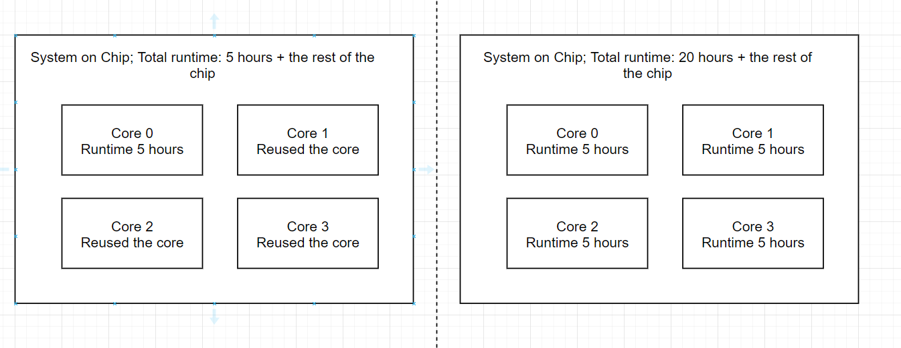

Digital Design Flow Theory
--------------------------------------------------------------------------------

Digital Design Flow Practice
--------------------------------------------------------------------------------

Step 1. Create the memory macro design
^^^^^^^^^^^^^^^^^^^^^^^^^^^^^^^^^^^^^^^^^^^^^^^^^^^^^^^^^^^^^^^^^^^^^^^^^^^^^^^^

Let's create the design. The following command will create a directory ``design/mem_1r1w/`` and one file ``config.tcl`` that will be mostly empty.

.. code-block:: console

    ./flow.tcl -design mem_1r1w -init_design_config

One of the common mistakes people make is copying existing designs,
like ``designs/inverter`` and then they face issues with their configuration.
Always create new designs using ``-init_design_config``.
It will ensure that your configuration is the absolute minimum.

Example of the common issues people face:
They copy ``inverter`` design, rename it. Then run the flow and the router crashes with ``error 10``.
This is caused by enabled "basic placement",
which works only for designs with a couple of dozen standard cells, not hundreds.
So when you change the basic inverter with a design containing many cells
router will not be able to route your design, therefore crashing with cryptic message.

Step 2. Create the RTL files
^^^^^^^^^^^^^^^^^^^^^^^^^^^^^^^^^^^^^^^^^^^^^^^^^^^^^^^^^^^^^^^^^^^^^^^^^^^^^^^^

Then we need to create/copy the RTL files. The recommended location for files is ``design/mem_1r1w/src/``. Let's put a simple counter in there.

Create ``design/mem_1r1w/src/mem_1r1w.v`` file and put following content:

.. code-block:: verilog

    module mem_1r1w (clk, read_addr, read, read_data, write_addr, write, write_data);
        parameter DEPTH_LOG2 = 4;
        localparam ELEMENTS = 2**DEPTH_LOG2;
        parameter WIDTH = 32;

        input wire clk;

        input wire [DEPTH_LOG2-1:0] read_addr;
        input wire read;
        output reg [WIDTH-1:0] read_data;

        input wire [DEPTH_LOG2-1:0] write_addr;
        input wire write;
        input wire  [WIDTH-1:0] write_data;

    reg [WIDTH-1:0] storage [ELEMENTS-1:0];

    always @(posedge clk) begin
        if(write) begin
            storage[write_addr] <= write_data;
        end
        if(read)
            read_data <= storage[read_addr];
    end

    endmodule

.. note::
    Originally we used a very small macro block as an example,
    however there is known issue: Small macro blocks do not fit proper power grid,
    therefore you need to avoid making small macro blocks. Alternatively, set the ``FP_SIZING`` to ``absolute`` and configure ``DIE_AREA`` to be bigger than ``200um x 200um`` for sky130.

In your designs it might be beneficial to have macro level and chip level.
This separation allows you to reuse already generated macro blocks multiple times.

In contrast, by running OpenLane first on single core module
then reusing the generated GDS means that the timing might not be as good,
but the runtime will be much faster.
The runtime is much faster since you are running one placement and route for only one core and then reusing it in the top level.

For example, the multi core processor.
If you just run OpenLane with multiple cores and only chip level,
all of the cores will be placed and routed together, resulting in significant runtime.

Add following lines:

.. code-block:: tcl

    set ::env(DESIGN_IS_CORE) 0
    set ::env(FP_PDN_CORE_RING) 0
    set ::env(RT_MAX_LAYER) "met4"

.. todo:: explain why

Step 3. Run the flow on the macro block
^^^^^^^^^^^^^^^^^^^^^^^^^^^^^^^^^^^^^^^^^^^^^^^^^^^^^^^^^^^^^^^^^^^^^^^^^^^^^^^^

.. code-block:: console

    ./flow.tcl -design mem_1r1w -tag full_guide -overwrite

Step 4. Analyzing the flow generated files
^^^^^^^^^^^^^^^^^^^^^^^^^^^^^^^^^^^^^^^^^^^^^^^^^^^^^^^^^^^^^^^^^^^^^^^^^^^^^^^^

Step 5. Create blackboxes
^^^^^^^^^^^^^^^^^^^^^^^^^^^^^^^^^^^^^^^^^^^^^^^^^^^^^^^^^^^^^^^^^^^^^^^^^^^^^^^^

Step 6. Integrate the macros
^^^^^^^^^^^^^^^^^^^^^^^^^^^^^^^^^^^^^^^^^^^^^^^^^^^^^^^^^^^^^^^^^^^^^^^^^^^^^^^^

set ::env(VERILOG_FILES_BLACKBOX) [glob $::env(DESIGN_DIR)/bb/*.v]
set ::env(EXTRA_LEFS) $::env(DESIGN_DIR)/../mem_1r1w/runs/full_guide/results/final/lef/mem_1r1w.lef
set ::env(EXTRA_GDS_FILES) $::env(DESIGN_DIR)/../mem_1r1w/runs/full_guide/results/final/gds/mem_1r1w.gds

Step 7. Run the flow
^^^^^^^^^^^^^^^^^^^^^^^^^^^^^^^^^^^^^^^^^^^^^^^^^^^^^^^^^^^^^^^^^^^^^^^^^^^^^^^^

Troubleshooting Figure out why it does not fit
^^^^^^^^^^^^^^^^^^^^^^^^^^^^^^^^^^^^^^^^^^^^^^^^^^^^^^^^^^^^^^^^^^^^^^^^^^^^^^^^

[ERROR]: during executing openroad script /openlane/scripts/openroad/replace.tcl
[ERROR]: Exit code: 1
[ERROR]: full log: designs/regfile_2r1w/runs/full_guide/logs/placement/9-global.log
[ERROR]: Last 10 lines:
[INFO GPL-0015] CoreAreaUxUy: 489440 495040
[INFO GPL-0016] CoreArea: 234294707200
[INFO GPL-0017] NonPlaceInstsArea: 124707104000
[INFO GPL-0018] PlaceInstsArea: 117229672450
[INFO GPL-0019] Util(%): 106.97
[INFO GPL-0020] StdInstsArea: 454185600
[INFO GPL-0021] MacroInstsArea: 116775486850
[ERROR GPL-0301] Utilization exceeds 100%.
Error: replace.tcl, 91 GPL-0301
child process exited abnormally

Solution: set ::env(FP_ASPECT_RATIO) 2

Troubleshooting:

[ERROR]: during executing openroad script /openlane/scripts/openroad/floorplan.tcl
[ERROR]: Exit code: 1
[ERROR]: full log: designs/regfile_2r1w/runs/full_guide/logs/floorplan/3-initial_fp.log
[ERROR]: Last 10 lines:
set_clock_uncertainty $::env(SYNTH_CLOCK_UNCERTAINITY) [get_clocks $::env(CLOCK_PORT)]
puts "\[INFO\]: Setting clock transition to: $::env(SYNTH_CLOCK_TRANSITION)"
[INFO]: Setting clock transition to: 0.15
set_clock_transition $::env(SYNTH_CLOCK_TRANSITION) [get_clocks $::env(CLOCK_PORT)]
puts "\[INFO\]: Setting timing derate to: [expr {$::env(SYNTH_TIMING_DERATE) * 10}] %"
[INFO]: Setting timing derate to: 0.5 %
set_timing_derate -early [expr {1-$::env(SYNTH_TIMING_DERATE)}]
set_timing_derate -late [expr {1+$::env(SYNTH_TIMING_DERATE)}]
Error: floorplan.tcl, 93 can't use empty string as operand of "-"
child process exited abnormally

Solution: Set DIE_AREA to correct value, see https://github.com/The-OpenROAD-Project/OpenLane/issues/1189

Exploring your designs
^^^^^^^^^^^^^^^^^^^^^^^^^^^^^^^^^^^^^^^^^^^^^^^^^^^^^^^^^^^^^^^^^^^^^^^^^^^^^^^^

