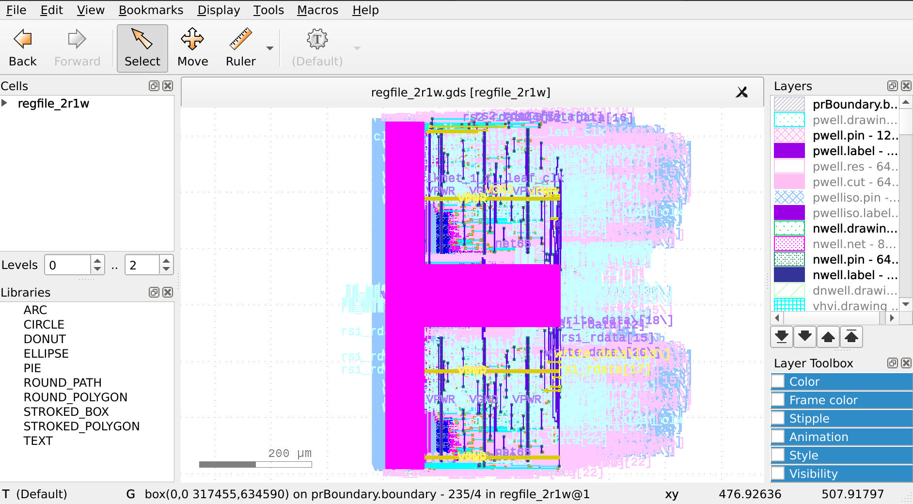

.. todo:: Rename the steps

Digital Design Flow
--------------------------------------------------------------------------------
This example covers creation of simple memory macro. This guide uses generated layout files for it,
then use the generated memory to make a top level chip register file.

Create the memory macro design
^^^^^^^^^^^^^^^^^^^^^^^^^^^^^^^^^^^^^^^^^^^^^^^^^^^^^^^^^^^^^^^^^^^^^^^^^^^^^^^^

Let's create the design. The following command will create a directory ``design/mem_1r1w/`` and one file ``config.json`` that will be mostly empty.

.. code-block:: console

    ./flow.tcl -design mem_1r1w -init_design_config -add_to_designs

One of the common mistakes people make is copying existing designs,
like ``designs/inverter`` and then they face issues with their configuration.
Always create new designs using ``-init_design_config``.
It will ensure that your configuration is the absolute minimum.

Example of the common issues people face:
They copy ``inverter`` design, rename it. Then run the flow and the router crashes with ``error 10``.
This is caused by enabled "basic placement",
which works only for designs with a couple of dozen standard cells, not hundreds.
So when you change the basic inverter with a design containing many cells
router will not be able to route your design, therefore crashing with cryptic message.

Create the RTL files
^^^^^^^^^^^^^^^^^^^^^^^^^^^^^^^^^^^^^^^^^^^^^^^^^^^^^^^^^^^^^^^^^^^^^^^^^^^^^^^^

Then we need to create/copy the RTL files. The recommended location for files is ``design/mem_1r1w/src/``. Let's put a simple counter in there.

Create ``design/mem_1r1w/src/mem_1r1w.v`` file and put following content:

.. code-block:: verilog

    module mem_1r1w (clk, read_addr, read, read_data, write_addr, write, write_data);
        parameter DEPTH_LOG2 = 4;
        localparam ELEMENTS = 2**DEPTH_LOG2;
        parameter WIDTH = 32;

        input wire clk;

        input wire [DEPTH_LOG2-1:0] read_addr;
        input wire read;
        output reg [WIDTH-1:0] read_data;

        input wire [DEPTH_LOG2-1:0] write_addr;
        input wire write;
        input wire  [WIDTH-1:0] write_data;

    reg [WIDTH-1:0] storage [ELEMENTS-1:0];

    always @(posedge clk) begin
        if(write) begin
            storage[write_addr] <= write_data;
        end
        if(read)
            read_data <= storage[read_addr];
    end

    endmodule

.. note::
    Originally we used a very small macro block as an example,
    however there is known issue: Small macro blocks do not fit proper power grid,
    therefore you need to avoid making small macro blocks. For this, set the ``FP_SIZING`` to ``absolute`` and configure ``DIE_AREA`` to be bigger than ``200um x 200um`` for sky130.

Configure mem_1r1w
^^^^^^^^^^^^^^^^^^^^^^^^^^^^^^^^^^^^^^^^^^^^^^^^^^^^^^^^^^^^^^^^^^^^^^^^^^^^^^^^

Modify the ``config.json`` to include following:

.. code-block::json

    {
        "DESIGN_NAME": "mem_1r1w",
        "VERILOG_FILES": "dir::src/*.v",
        "CLOCK_PORT": "clk",
        "CLOCK_PERIOD": 10.0,
        "DESIGN_IS_CORE": false,
        "FP_PDN_CORE_RING": false,
        "RT_MAX_LAYER": "met4"
    }
 
``DESIGN_IS_CORE`` controls the metal levels used for power routing, set it to ``false`` to use only lower levels.

``FP_PDN_CORE_RING`` is set to ``false`` to disable a power ring around the macro block.

``RT_MAX_LAYER`` set to ``met4`` to limit metal layers allowed for routing.

More information on `configuration can be found here <configuration>`_. 

.. todo:: explain why

.. todo:: PDN

Run the flow on the macro block
^^^^^^^^^^^^^^^^^^^^^^^^^^^^^^^^^^^^^^^^^^^^^^^^^^^^^^^^^^^^^^^^^^^^^^^^^^^^^^^^

.. code-block:: console

    ./flow.tcl -design mem_1r1w -tag full_guide -overwrite

Analyzing the flow generated files
^^^^^^^^^^^^^^^^^^^^^^^^^^^^^^^^^^^^^^^^^^^^^^^^^^^^^^^^^^^^^^^^^^^^^^^^^^^^^^^^

You can open interactive view using following commands:

.. code-block:: console

    ./flow.tcl -design mem_1r1w -tag full_guide -interactive
    package require  openlane
    or_gui

.. figure:: ../_static/digital_flow/mem_1r1w_def.png

Create chip level
^^^^^^^^^^^^^^^^^^^^^^^^^^^^^^^^^^^^^^^^^^^^^^^^^^^^^^^^^^^^^^^^^^^^^^^^^^^^^^^^

Create a new design named ``regfile_2r1w``. This design will use the ``mem_1r1w``.

.. code-block:: console

    ./flow.tcl -design regfile_2r1w -init_design_config -add_to_designs

Integrate the macros
^^^^^^^^^^^^^^^^^^^^^^^^^^^^^^^^^^^^^^^^^^^^^^^^^^^^^^^^^^^^^^^^^^^^^^^^^^^^^^^^

Verilog blackbox is used by the synthesis tool. Create the verilog blackbox:

.. todo:: Add the verilog blackbox

Then add ``VERILOG_FILES_BLACKBOX``, ``EXTRA_LEFS`` and ``EXTRA_GDS_FILES`` to the ``config.json`` in the ``regfile_2r1w``:

.. code-block:: json

    {
        "DESIGN_NAME": "regfile_2r1w",
        "VERILOG_FILES": "dir::src/*.v",
        "CLOCK_PORT": "clk",
        "CLOCK_PERIOD": 10.0,
        "DESIGN_IS_CORE": true,
        
        "EXTRA_LEFS":      "/openlane/designs/mem_1r1w/runs/full_guide/results/final/lef/mem_1r1w.lef",
        "EXTRA_GDS_FILES": "/openlane/designs/mem_1r1w/runs/full_guide/results/final/gds/mem_1r1w.gds",
        "VERILOG_FILES_BLACKBOX": "dir::bb/*.v"
    }

This will add the LEF abstract representation of the macro block. This abstraction file contains only layers required by tools.
In contrast, GDS contains all of the layers and is used to generate the final GDS file.
Missmatch between these files are not allowed. It is users responsibility to ensure that they match.

Run the flow
^^^^^^^^^^^^^^^^^^^^^^^^^^^^^^^^^^^^^^^^^^^^^^^^^^^^^^^^^^^^^^^^^^^^^^^^^^^^^^^^

Run the flow. It is expected for the flow to fail. In next step, explaination is provided.

.. code-block:: console

    ./flow.tcl -design regfile_2r1w -tag full_guide_broken_aspect_ratio -overwrite

First issue
^^^^^^^^^^^^^^^^^^^^^^^^^^^^^^^^^^^^^^^^^^^^^^^^^^^^^^^^^^^^^^^^^^^^^^^^^^^^^^^^

Flow is expected to fail.

.. code-block:: console

    [ERROR]: during executing openroad script /openlane/scripts/openroad/replace.tcl
    [ERROR]: Exit code: 1
    [ERROR]: full log: designs/regfile_2r1w/runs/full_guide/logs/placement/9-global.log
    [ERROR]: Last 10 lines:
    [INFO GPL-0015] CoreAreaUxUy: 489440 495040
    [INFO GPL-0016] CoreArea: 234294707200
    [INFO GPL-0017] NonPlaceInstsArea: 124707104000
    [INFO GPL-0018] PlaceInstsArea: 117229672450
    [INFO GPL-0019] Util(%): 106.97
    [INFO GPL-0020] StdInstsArea: 454185600
    [INFO GPL-0021] MacroInstsArea: 116775486850
    [ERROR GPL-0301] Utilization exceeds 100%.
    Error: replace.tcl, 91 GPL-0301
    child process exited abnormally

To debug this issue, open an OpenROAD GUI:

.. code-block:: console

    ./flow.tcl -design regfile_2r1w -interactive -tag full_guide_broken_aspect_ratio
    package require  openlane
    or_gui

.. figure:: ../_static/digital_flow/broken_aspect_ratio.png

As can be observed in the image, placement of the mem_1r1w instances failed.
It was unable to place the macro blocks inside the ``DIE_AREA``.
While the area is enough, there is no combination of placement for this cells that fits. All of the possible placements of these cells overlap.

Change the ``FP_ASPECT_RATIO`` value to ``2``.
This will make the flooplan a rectange instead of square and the rectangle will be double in height compared to width.

``config.json`` should look like this:

.. code-block:: json

    {
        "DESIGN_NAME": "regfile_2r1w",
        "VERILOG_FILES": "dir::src/*.v",
        "CLOCK_PORT": "clk",
        "CLOCK_PERIOD": 10.0,
        "DESIGN_IS_CORE": true,
        
        "FP_ASPECT_RATIO": 2,
        "EXTRA_LEFS":      "/openlane/designs/mem_1r1w/runs/full_guide/results/final/lef/mem_1r1w.lef",
        "EXTRA_GDS_FILES": "/openlane/designs/mem_1r1w/runs/full_guide/results/final/gds/mem_1r1w.gds",
        "VERILOG_FILES_BLACKBOX": "dir::bb/*.v"
    }

Run the flow again
^^^^^^^^^^^^^^^^^^^^^^^^^^^^^^^^^^^^^^^^^^^^^^^^^^^^^^^^^^^^^^^^^^^^^^^^^^^^^^^^

Run the flow again. This time it should no longer fail.

.. code-block:: console

    ./flow.tcl -design regfile_2r1w -tag full_guide -overwrite

Analyzing the results
^^^^^^^^^^^^^^^^^^^^^^^^^^^^^^^^^^^^^^^^^^^^^^^^^^^^^^^^^^^^^^^^^^^^^^^^^^^^^^^^

.. note:: ``set_def`` currently overwrites the DEF file instead of temporary changing it.
    This guide will be updated with another command that does not overwrite the DEF.

Open OpenROAD GUI to view the results of the flow.

.. code-block:: console

    ./flow.tcl -design regfile_2r1w -interactive -tag full_guide

    # in interactive session:
    package require openlane
    set_def designs/regfile_2r1w/runs/full_guide/results/final/def/regfile_2r1w.def
    or_gui
    # Empty newline to force above line to execute

    OpenROAD gui with loaded final DEF file

If you want to load different DEF file use ``set_def`` command. For example:

.. code-block:: console

    ./flow.tcl -design regfile_2r1w -interactive -tag full_guide
    package require openlane
    set_def designs/regfile_2r1w/runs/full_guide/results/floorplan/regfile_2r1w.def
    or_gui

Each run has following structure:

.. code-block::

    ├── logs OR reports OR results OR tmp
    │   ├── cts
    │   ├── eco
    │   ├── floorplan
    │   ├── placement
    │   ├── routing
    │   ├── signoff
    │   └── synthesis
    ├── runtime.yaml
    └── warnings.log

There is 4 directories ``logs`` ``reports`` ``results`` and ``tmp``.
In each of these directories there is multiple directories. Directories are named according to the stage they belong to.

Directory ``results`` contains the results (outputs) of each step. For example content of the ``results/cts``:

.. code-block::

    designs/regfile_2r1w/runs/full_guide/results/cts
    ├── regfile_2r1w.def
    ├── regfile_2r1w.resized.v
    ├── regfile_2r1w.sdc
    └── regfile_2r1w.v

DEF files can be loaded usings steps provided above.

Finally output of OpenLane can be found in ``designs/regfile_2r1w/runs/full_guide/results/final``:

.. code-block::

    designs/regfile_2r1w/runs/full_guide/results/final
    ├── def
    │   └── regfile_2r1w.def
    ├── gds
    │   └── regfile_2r1w.gds
    ├── lef
    │   └── regfile_2r1w.lef
    ├── mag
    │   └── regfile_2r1w.mag
    ├── maglef
    │   └── regfile_2r1w.mag
    ├── sdc
    │   └── regfile_2r1w.sdc
    ├── sdf
    │   └── regfile_2r1w.sdf
    ├── spef
    │   └── regfile_2r1w.spef
    ├── spi
    │   └── lvs
    │       └── regfile_2r1w.spice
    └── verilog
        └── gl
            └── regfile_2r1w.v

Directory ``logs`` contains log files of each step. Steps are numerated. For example content of the ``logs/floorplan``: 

.. code-block::

    designs/regfile_2r1w/runs/full_guide/logs/floorplan
    ├── 3-initial_fp.log
    ├── 4-io.log
    ├── 7-tap.log
    └── 8-pdn.log

Directory ``reports`` contains all of the reports from corresponding stage. For example content of the ``reports/synthesis``

.. code-block::

    designs/regfile_2r1w/runs/full_guide/reports/synthesis
    ├── 1-synthesis.AREA_0.chk.rpt
    ├── 1-synthesis.AREA_0.stat.rpt
    ├── 1-synthesis_dff.stat
    ├── 1-synthesis_pre.stat
    ├── 2-syn_sta.area.rpt
    ├── 2-syn_sta.clock_skew.rpt
    ├── 2-syn_sta.max.rpt
    ├── 2-syn_sta.min.rpt
    ├── 2-syn_sta.power.rpt
    ├── 2-syn_sta.rpt
    ├── 2-syn_sta.slew.rpt
    ├── 2-syn_sta.tns.rpt
    ├── 2-syn_sta.wns.rpt
    └── 2-syn_sta.worst_slack.rpt

It is recommended to check the reports for power, timings, etc.
This allows to get better understanding of the underlying flow.

Open the final GDS.

.. code-block:: console

   klayout -e -nn $PDK_ROOT/sky130A/libs.tech/klayout/tech/sky130A.lyt \
      -l $PDK_ROOT/sky130A/libs.tech/klayout/tech/sky130A.lyp \
      ./designs/regfile_2r1w/runs/full_guide/results/final/gds/regfile_2r1w.gds

Exploring your designs
^^^^^^^^^^^^^^^^^^^^^^^^^^^^^^^^^^^^^^^^^^^^^^^^^^^^^^^^^^^^^^^^^^^^^^^^^^^^^^^^

.. todo:: LVS, DRC, etc, debugging

.. todo:: Updated 

.. todo:: Exploring desings
.. todo:: PDN
