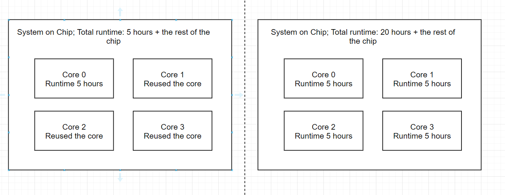

In your designs it might be beneficial to have macro level and chip level.
This separation allows you to reuse already generated macro blocks multiple times.

In contrast, by running OpenLane first on single core module
then reusing the generated GDS means that the timing might not be as good,
but the runtime will be much faster.
The runtime is much faster since you are running one placement and route for only one core and then reusing it in the top level.

For example, the multi core processor.
If you just run OpenLane with multiple cores and only chip level,
all of the cores will be placed and routed together, resulting in significant runtime.

.. _floorplan_taps_dcaps_fillers_sites:
Floorplan: taps/DCAPs/endcaps/fillers/sites
^^^^^^^^^^^^^^^^^^^^^^^^^^^^^^^^^^^^^^^^^^^^^^^^^^^^^^^^^^^^^^^^^^^^^^^^^^^^^^^^
.. todo:: Write this section

Sites
""""""
Floorplanning stage defines the locations that can be used to place stanard cells.
This locations are called sites.
Sites also define the minimal grid and therefore have impact of the chip area and standard cell structure.

TAPs
""""""
In the SCLs the connection between the VPWR and PMOS bulk is done using so called taps.
There is two variants of tap connections:

* Taps are integrated into the cell
* Taps are separate cells and are insterted by the OpenLane

In OpenLane variable ``FP_WELLTAP_CELL`` controls the selection of tap cells and FP_TAPCELL_DIST controls distance.
If ``FP_WELLTAP_CELL`` parameter does not exist then no tap cells are created otherwise the cells are inserted.

For example, ``sky130_fd_sc_hvl`` uses integrated tap connections, meanwhile ``sky130_fd_sc_hd`` uses separate tap cells.

.. figure:: ../_static/digital_flow/tap_cell.png

    sky130_fd_sc_hd tap cell.

.. todo:: Add pictures regarding taps

Taps in separate cells are most commonly used. This choice is caused by this methods pros:

* Area of the single cell is lower, since the tap-to-contact distance can be utilized to fit more VIAs to the diffusions. Therefore, the cells have lower the parasitic resistance of the cell.
* The bulk can be connected to different voltage to **lower** Vthreshold for **faster delays**.
* The bulk can be connected to different voltage to **increase** Vthreshold for **reduced power consumption**.

Fillers and DCAPs
""""""""""""""""""""""""""""""
Chip area is not always densely placed with cells.
This is because it's really hard to do routing if the density reaches high values like 100%.
Fillers and DCAPs usually contain the metal power rails and other layers that are required to ensure the substrate connection.
Regardless if the site contains a cell or not, it should have the power rails and substrate connection, therefore the free sites will be filled with "Fillers".

In integrated circuits the power rails have finite resistance.
Due to this resistance when significant current passes through the power rail voltage drop is created.
Voltage on the standard cell library decreases causing slower delays on the cells.
On mature technologies like sky130 IR drop is not a significant issue,
however for bleeding edge technologies IR drop becomes critical.

For this reason DCAP cells are used.
These cells are MOS capacitors (a) that accumulate energy when the circuit is idle
and release it when significant current is required (d).
Therefore, current spikes will be reduced and the IR drop will be lower.

Both voltage drop on power and ground bounce have similar effects on the standard cell and from the cells viewpoint are the same.
The voltage from the cells viewpoint is called compression voltage.

Interesting fact: Original DCAP cells of the sky130 did not pass the density maximum check on layer li1 if the chip is filled with them.
To workaround this custom version of the cell has been made by Efabless.

Boundry cells "ENDCAPs"
""""""""""""""""""""""""""""""
.. todo:: Fill this section

Spare cells
""""""""""""""""""""""""""""""
.. todo:: SPARE cells

.. todo:: Cover Antenna and TIE cells

.. todo:: Cover common mistake with the macro names in macro hooks and macro.cfg

.. todo:: Add link to corner/temperature/etc

.. todo:: Antennas

Standard Cell Libraries (SCLs)
^^^^^^^^^^^^^^^

As part of PDK foundries provide SCLs. Standard Cell Library contains a set of cells that can be used to build practically any digital circuit.

It contains following files and information:

* Documentation
* Integration guide for one or more tool
* SCL configuration files for one or more tool
* Abstract representation: the cells containing only layers required for placement and routing. Typically in LEF format.
* Timing Library containing the timing information, typically in .LIB format
* Layout of the cells.
* SPICE netlist.

SCLs documentation
""""""""""""""""""""""""""""""

Documentation contains everything the developer needs to know about the SCL.
This information includes anything related to the cells:

* the naming convention
* functionality
* working conditions
* integration guide for different tools
* implementation details,
* number of cells of each type
* target density
* cell site height/width
* cell grid
* planned NMOS and PMOS heights
* NMOS and PMOS types used

For example you can find `documentation for SCLs provided by Skywater for sky130 here <https://skywater-pdk.readthedocs.io/en/main/contents/libraries/foundry-provided.html>`_.

A snipet from the High-Density SCL for sky130:

.. figure:: ../_static/digital_flow/sky130_fd_sc_hd_docs.png

SCL config files
""""""""""""""""""""""""""""""
Standard cell library needs configuration files, like ``dont_use`` lists and many more.
The configuration of OpenLane for sky130 is located in ``pdks/sky130B/libs.tech/openlane/sky130_fd_sc_hd/``.
Here is some of the files:

.. code-block::

  OpenLane variables configuration:
    ├── config.tcl
  Mapping files for yosys:
    ├── csa_map.v
    ├── fa_map.v
    ├── latch_map.v
    ├── mux2_map.v
    ├── mux4_map.v
    ├── rca_map.v
    ├── tribuff_map.v
  Dont use/dont synth lists:
    ├── no_synth.cells
    ├── drc_exclude.cells - dont use cell list
  Tracks related information:
    └── tracks.info

.. todo:: LEF abstract
.. todo:: Timing information
.. todo:: Layout of the cells
.. todo:: Spice netlist
.. todo:: Add link to Tech LEF section
