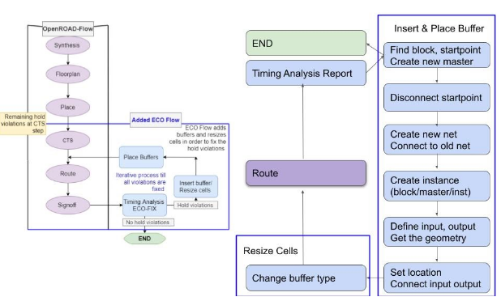
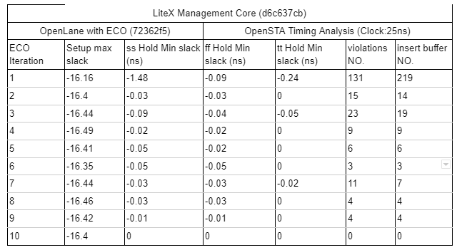

# The ECO Flow (Alpha)
The ECO flow starts from checking the report generated in the route step. A python script is used to check the report, insert buffers, and do the resize. Inside the ECO loop, the python script, cts and route step are called sequentially.  The reports are generated each time, and the loop stops until no hold time violations are found. See overview diagram below:



# Flow to Insert Buffer
1. Run the OL flow 
2. Hold violations will be present in the log files 
3. Run gen_insert_buffer.py, using regex to get the `pinname`
4. Generate the command `insert_buffer {pin_name master_name net_name inst_name}`
5. Generate the command `size_cell {inst_name new_master_name}` to adjust the path delay. (`sky130_fd_sc_hd__dlygate4sd3_1` is the master with the longest delay, larger number at the end means shorter delay)
6. Rerun the STA and route step
7. Repeat 1-6 till all hold violations are solved.
Given a routing report, we first parse the reports into several sections. Each section contains one path. Then, regular expressions are used to detect if the path is `VIOLATED`. If the path has hold time violations, we save the slack and corresponding startpoint into a vector.  The type of the buffer is `sky130_fd_sc_hd__dlygate4sd3_1`, so the number of the buffer to be inserted should be the minimum slack divided by FO1 delay. Finally, we dump all the `insert_buffer `commands into a tcl file.

# Insert Buffer Command
1. Find the violation’s startpoint
2. Create the buffer and nets
3. Disconnect the original nets (slightly different for reg-to-reg and pin-to-reg cases)
4. Place the buffer
5. Connect new nets (slightly different for reg-to-reg and pin-to-reg cases)
We realize all the operations with OpenDB commands. When we insert the buffer, we move the old net together with the startpoint, - the net name should be the same with the pin name and cannot be changed. In OpenDB. `connect` and `disconnect` functions are `class static` for `reg` cases and regular member methods for pin cases. For `reg ` cases, we also need to specify which port (input or output) to disconnect the line from.

# Testcase Results
We tested the latest OpenLane with ECO on the LiteX Management Core [rc-8 ](https://github.com/efabless/caravel_mgmt_soc_litex/releases/tag/rc-8) release. All the timing reports are generated by OpenSTA. 

For the 1st iteration, the design has 131 hold violations with a -1.48 worst case slack. Our ECO inserts 219 buffers into the block, which greatly reduces the number of violations. After 10 iterations, all the violations are solved and setup time is not influenced during this process.
The following table shows the timing results of the ECO flow for each ECO iteration:





# How to enable the ECO flow
If the user would like to enable this step, they would have to set the ECO_ENABLE environment variable to 1 as follows:

```tcl
    set ::env(ECO_ENABLE) {1}
```

Or they can invoke OpenLane with the option `-override_env ECO_ENABLE=1`.


