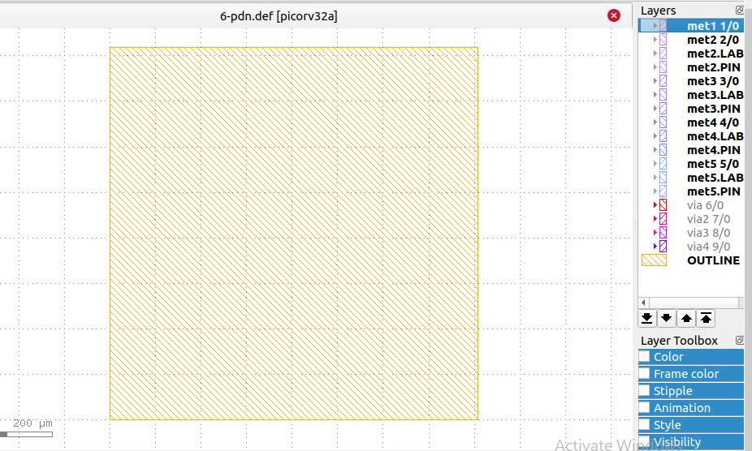
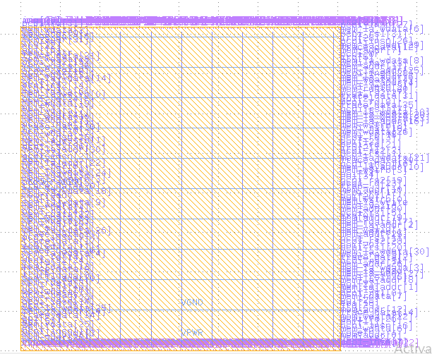
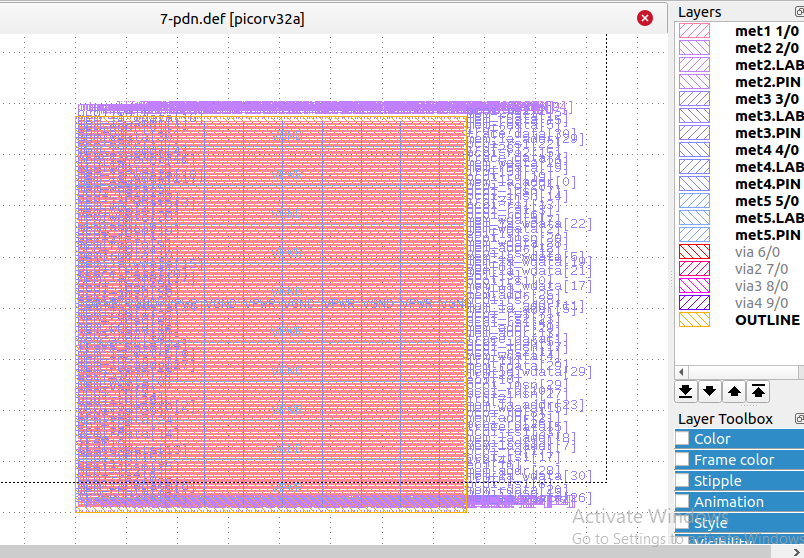

Flow Tutorial
=============

Introduction
------------

This document includes tutorials for running an entire OpenROAD-based
flow from RTL to GDSII.This tutorials includes GUI visualisation , EDA
tools,Design Explorations, and Different Design Experiments.
Additionally, a brief description of each step in the flow is provided,
facilitating the user’s comprehension and ease of usage.

PDK Support
-----------

The major component of physical design is PDK (Process Design Kit). The
OpenROAD application is PDK independent. However it is tested and
validated with specific PDKs in the context of various flow controllers.

The OpenROAD supports both public and private PDKs including:

Open Source PDK
---------------

-  Skywater 130 nm
-  Nangate45
-  ASAP7 - Predictive FinFET 7nm

OpenLane with SkyWater Sky130-PDK
---------------------------------

The SkyWater Open Source PDK is a collaboration between Google and
SkyWater Technology Foundry to provide a fully open source Process
Design Kit and related resources, which can be used to create
manufacturable designs at SkyWater’s facility.

The SkyWater Open Source PDK documentation can be found at
`SkyWater <https://skywater-pdk.rtfd.io>`__

Open Source Tools:
------------------

The OpenRoad Openlane is a automated RTL to GDSII flow build around open
source tool. The flow perform the auto place and route of an ASIC design
-in 24 hours with no human in the loop. Tool used in OpenLane are listed
below:

1.  **Synthesis**

    -  ``yosys`` - Performs RTL synthesis
    -  ``abc`` - Performs technology mapping
    -  ``OpenSTA`` - Performs static timing analysis on the resulting
       netlist to generate timing reports

2.  **Floor planning**

    -  ``init_fp`` - Defines the core area for the macro as well as the
       rows (used for placement) and the tracks (used for routing)
    -  ``ioplacer`` - Places the macro input and output ports
    -  ``pdn`` - Generates the power distribution network
    -  ``tap cell`` - Inserts well tap in the floor plan

3.  **Placement**

    -  ``RePLace`` - Performs global placement
    -  ``Resizer`` - Performs optional optimizations on the design
    -  ``OpenDP`` - Performs detailed placement to legalize the globally
       placed components

4.  **Clock Tree Synthesis**

    -  ``TritonCTS`` - Synthesizes the clock distribution network (the
       clock tree)

5.  **Routing**

    -  ``FastRoute`` - Performs global routing to generate a guide file
       for the detailed router
    -  ``CU-GR`` - Another option for performing global routing.
    -  ``TritonRoute`` - Performs detailed routing
    -  ``SPEF-Extractor`` - Performs SPEF extraction

6.  **GDSII Generation**

    -  ``Magic`` - Streams out the final GDSII layout file from the
       routed def
    -  ``Klayout`` - Streams out the final GDSII layout file from the
       routed def as a back-up

7.  **Checks**

    -  ``Magic``- Performs DRC Checks & Antenna Checks
    -  ``Klayout`` - Performs DRC Checks
    -  ``Netgen`` - Performs LVS Checks 

Platform Configuration
----------------------

View the platform configuration file setup for default variable for sky130hd.

.. code-block:: shell

   ./design/picorv32a/sky130A_sky130_fd_sc_hd_config.tcl 

The libraries cell information can found `here <https://antmicro-skywater-pdk-docs.readthedocs.io/en/test-submodules-in-rtd/contents/libraries.html>`_.

Design Configuration
--------------------

View the design configuration file of picorv32a:

.. code-block:: shell

   cd OpenLane/design/picorv32a/config.tcl

View the design configuration file `here <https://github.com/nimra471/OpenLane/tree/master/designs/picorv32a/config.tcl>`_.

**Important**

The following design_specific Configuration are required to specify main design input such as platform, top-level design and timing constraints.

The required variables for design configuration is `here <OpenLane_Variable.html>`_.

Design Input Verilog
--------------------

The input Verilog files are located at this path:

.. code-block:: shell

   cd OpenLane/designs/picorv32a/src/picorv32a.

Running The Automatic RTL-to-GDS Flow
-------------------------------------
This section describe the complete RTL-to-GDS flow of the design. In this tutorial, user will learn both automated and interactive way to run the flow.

Design Goals:
-------------

**Area**

.. code-block:: shell

   core utilization=35

**Timing**

.. code-block:: shell

   CLOCK_PERIOD= "10" (in ns)

Synthesis
---------

After running the design, the generated synthesis netlist located at the path:

.. code-block:: shell

   cd OpenLane/design/picorv32a/runs/result/synthesis/picorv32a.v

All the timing, power and area report are located at the path:

.. code-block:: shell

   cd OpenLane/design/picorv32a/runs/report/synthesis/picorv32a.v

.. code-block:: shell

   === picorv32a ===

   Number of wires:              14770
   Number of wire bits:          17781
   Number of public wires:         162
   Number of public wire bits:    1972
   Number of memories:               0
   Number of memory bits:            0
   Number of processes:              0
   Number of cells:              16785
     $_ANDNOT_                    4044
     $_AND_                       1384
     $_DFFE_PP_                    957
     $_DFF_P_                      227
     $_MUX_                       1883
     $_NAND_                       761
     $_NOR_                        588
     $_NOT_                        917
     $_ORNOT_                      209
     $_OR_                        2312
     $_SDFFCE_PN0P_                 36
     $_SDFFCE_PP0P_                  9
     $_SDFFCE_PP1P_                  1
     $_SDFFE_PN0P_                 192
     $_SDFFE_PN1N_                   4
     $_SDFFE_PN1P_                  32
     $_SDFFE_PP0P_                   1
     $_SDFFE_PP1P_                   3
     $_SDFF_PN0_                   133

Explore different Synthesis Strategies for timing and area optimization using variable ``set ::env(SYNTH_STRATEGY)``.

Floorplanning
-------------

The placement of io pins io_placer:

The generation of power grid:

Placement
---------

