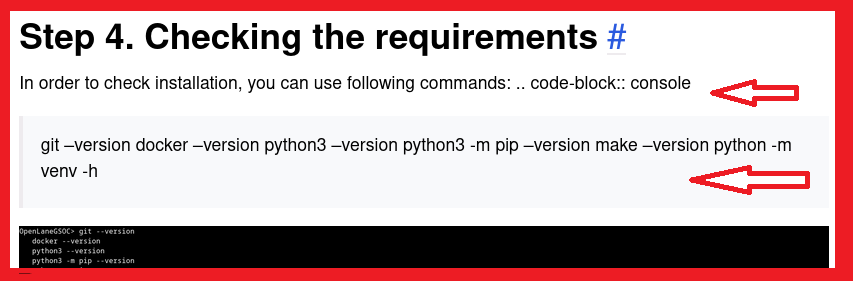
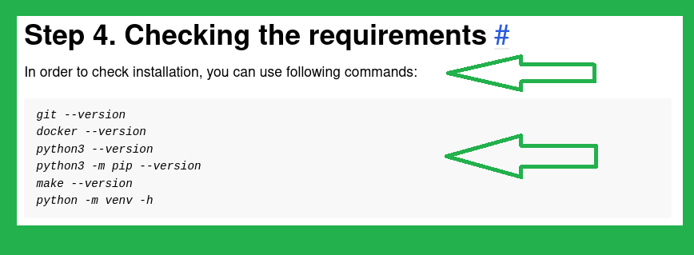
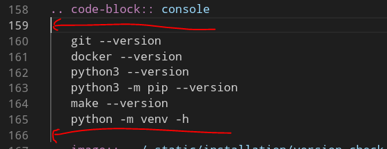

Contributing Docs
================================================================================

.. note:: This page is for documentation contributors. For prospecting code contributors, please see `Code Contributions <../../CONTRIBUTING.html>`_

Introduction
--------------------------------------------------------------------------------
Documentation plays an important role in OpenLane.
Good documentation should cover as much information as possible,
while staying readable, up-to-date and clean.
This page covers installation of required tools
and outlines simple principles to be followed when writing documentation.

.. note:: To simply fix typos, you do not need to install anything. Pull requests can be created from the relevant ReadTheDocs page, using GitHub's editor.

For more complex documentation, it is recommended to follow these steps:

1. Read this guide
2. Either create a new page in ``docs/source/``. Then you need to add your page to the Table of Contents in ``index.rst``
3. ... or open an existing one in the same folder.
4. Follow these guidelines:
    * Begin with the general structure of the documentation. This step ensures continuity with the rest of the documentation and allows the writer to better organize their thoughts.
    * Use reStructuredText and existing plugins to write the documentation.
    * Create as much visual documentation as possible. More is better.
    * Pictures, figures, tables significantly improve the quality of documentation and make the documentation available for beginners.
    * Add links to references, guide and pointers to other available documentation or books.
5. Use :ref:`building_docs_locally` to preview and visualize the documentation.
6. Copy the text from preview into an editor that highlights the mistakes and fix them.
7. Rebuild documentation and repeat.
8. Once satisfied, commit the changes to your repository using git.
9. Create a pull request to the main repository, so the maintainers can review your changes.
10. Maintainers may request some tweaks (or do the tweaks themselves.) Execute them and then push the changes again.
11. Once changes are approved they will be merged and then you can delete your branch or repository.

.. _building_docs_locally:

Building documentation locally
--------------------------------------------------------------------------------

Assuming you have OpenLane installed, a Python virtual environment will be created in ``<OPENLANE_ROOT>/venv``. You can the  

.. code-block:: console

    # Assuming you are inside the OpenLane folder
    ## If you didn't 'make openlane' already…
    make venv 

    # Install required modules
    make -C docs/ install

After installation, every time you want to build the documentation proceed to enter the venv and run ``sphinx-build`` following commands: 

.. code-block:: console

    cd OpenLane/
    # assuming you are inside OpenLane folder
    make -C docs/ html

View the generated html files using your favorite web browser. Open this document in browser:

.. code-block:: console

    # Assuming same folder as OpenLane
    cd OpenLane/

    # macOS
    open docs/_build/html/docs/source/contributing_to_docs.html

    # Most GNU/Linux Distributions
    xdg-open docs/_build/html/docs/source/contributing_to_docs.html

Documentation `regarding reStructuredText can be found here: <https://sublime-and-sphinx-guide.readthedocs.io/en/latest/index.html>`_. 

Documentation organization
--------------------------------------------------------------------------------
All of the documentation is concetrated in ``docs/``.
Static files for a certain document are stored in ``docs/_static`` in its respective directory: for example, screenshots for this guide are located in ``docs/_static/docs_contrbution``,
while the screenshots for the installation guide are located in ``docs/_static/installation``.

Directory ``docs/source/`` contains all of the page's content.
You can add pages by creating the corresponding file in that folder.
Then you need to add your page to the Table of Contents in ``index.rst``.
Or if you want it to be in category, then modify the Table of Contents of said category.
If you want to create new category than take a look at the source code of existing category.

Writing Style and Consistency
--------------------------------------------------------------------------------

* New documentation should be written in [MyST Markdown](https://myst-parser.readthedocs.io/en/latest/), a flavor of Markdown with some RST extensions.
* Use ``of`` instead of ``'``, for example: ``Docker's Installation`` → ``after the installation of Docker``.
* Avoid contractions: Substitute ``don't`` and ``can't`` for ``do not`` and ``cannot``
* The first command of the page should have `cd` in it to specify where you are running and all following commands assume the continuation of the session and don't need the cd command.
* Avoid using same header type both for the title of the document and its content. It looks awful in the table of content.
  * To that end, only use ``#`` once at the beginning of the document.

Terms Consistency
^^^^^^^^^^^^^^^^^^^^^^^^^^^^^^^^^^^^^^^^^^^^^^^^^^^^^^^^^^^^^^^^^^^^^^^^^^^^^^^^

In order to improve the readability of the documentation, please use and capitalize names and trademarks properly. Some examples you can see below:

.. code-block::

    OpenLANE → OpenLane
    OpenRoad → OpenROAD
    Mac OS X → macOS
    MAGIC → Magic
    Skywater130 → sky130
    Klayout → KLayout
    Pip -> pip 

* For technical terms, use the following terms preferred by OpenROAD documentation for consistency:

.. code-block::

    co-ordinates → coordinates
    pad ring → padring
    pad cell → padcell
    key value pair → key-value pair
    micrometre → micron (or, micrometer)

.. note:: Also, when documenting micrometer-based variables, use the actual unicode character "μ", not "u", to avoid potential confusion. It's Alt+230 on Windows, Alt+M on macOS and on Linux, press the Compose Key then type ``mu``.

Taking screenshots
^^^^^^^^^^^^^^^^^^^^^^^^^^^^^^^^^^^^^^^^^^^^^^^^^^^^^^^^^^^^^^^^^^^^^^^^^^^^^^^^
The screenshots in documentation should use following prompt:

.. code-block:: console

    export PS1="\W> "

You can add it to your ``.bashrc`` or just run it before you run the command.

.. note:: Please note that taking screenshots for terminal output is not recommended. You may want to use a ``code-block`` object.

RST Headers
^^^^^^^^^^^^^^^^^^^^^^^^^^^^^^^^^^^^^^^^^^^^^^^^^^^^^^^^^^^^^^^^^^^^^^^^^^^^^^^^
Use headers to make structure of the documentation better. For underline and overlines use 80 symbols. Here are the header priorities. Top is the highest priority.

.. code-block::

    # with overline
    * with overline
    =
    -
    ^
    "

Wait, what's an overline?

.. code-block::

    ################## <- Overline
    OVERLINED TITLE
    ##################

Troubleshooting
--------------------------------------------------------------------------------

Your ``code-block`` s do not look like they are supposed to
^^^^^^^^^^^^^^^^^^^^^^^^^^^^^^^^^^^^^^^^^^^^^^^^^^^^^^^^^^^^^^^^^^^^^^^^^^^^^^^^

.. important::
    Intendation, whitespaces, newlines of the reStructuredText are really important. They all have meaning in .rst files, so take a look at the already existing code to help you figure out the issues.

How it looks:

How it is supposed to look:

This is because ``code-blocks`` need to have empty lines around code sections, like shown in the picture below:

``pip`` module related errors
^^^^^^^^^^^^^^^^^^^^^^^^^^^^^^^^^^^^^^^^^^^^^^^^^^^^^^^^^^^^^^^^^^^^^^^^^^^^^^^^
If you're running ``sphinx-build`` manually and did not source ``../venv/bin/activate`` before running ``sphinx-build`` then you may run into an error similar to the one below.

.. code-block:: console

    Running Sphinx v5.0.1

    Configuration error:
    There is a programmable error in your configuration file:

    Traceback (most recent call last):
    File "/home/armleo/.local/lib/python3.10/site-packages/sphinx/config.py", line 343, in eval_config_file
        exec(code, namespace)
    File "/home/armleo/Desktop/OpenLaneGSOC/conf.py", line 24, in <module>
        from recommonmark.parser import CommonMarkParser
    ModuleNotFoundError: No module named 'recommonmark'

In order to resolve this, repeat the steps above for enabling venv.

Sphinx build complains about title underline being too short
^^^^^^^^^^^^^^^^^^^^^^^^^^^^^^^^^^^^^^^^^^^^^^^^^^^^^^^^^^^^^^^^^^^^^^^^^^^^^^^^

When running ``sphinx-build`` you may get following warning:

.. code-block:: console

    /home/armleo/Desktop/OpenLaneGSOC/docs/source/installation.rst:3: WARNING: Title underline too short.

    Installation of OpenLane
    ########

Try to use 80 symbol long header underlines. This makes replacing them easier and keeps the documentation consistent.
