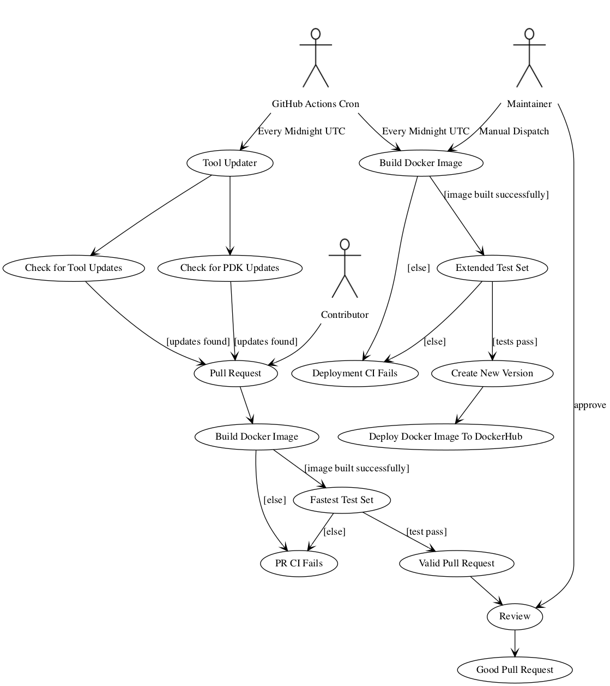

# Continuous Integration
OpenLane's CI runs on GitHub Actions.

There are two primary flows: the pull request flow and the deployment flow.

The deployment flow occurs on a daily basis. The PR flow happens whenever someone creates a new Pull Request. PRs can be created by contributors or by an automated tool updater that runs on a schedule.

* A maintainer cannot review their own code, but they can merge it after a review by another maintainer.

## Required Secrets/Variables
Repository secrets are used to protect certain credentials, while variables are repository-dependent parameters for the CI.

### Common
| Variable      | Description                                                   |
|---------------|---------------------------------------------------------------|
| `MAIN_BRANCH`  | The main branch for OpenLane. Format: `main`|`master`|`etc` |

| Secret      | Description                                                   |
|---------------|---------------------------------------------------------------|
| `MY_TOKEN`  | A GitHub token for a bot account that: 1. owns the fork for the tool update. 2. has write access to the volare repo to push newly-built PDKs to. |

### CI
| Variable      | Description                                                   |
|---------------|
| `VOLARE_OWNER`/`VOLARE_REPO` | (optional) A volare repo to cache builds in. In our case, `VOLARE_OWNER` would be `efabless` and `VOLARE_REPO` would be `volare`. |
| `DOCKER_IMAGE` | The name of the resulting Docker image (minus the tag). In our case, we use `efabless/openlane`. |
| `TOOL_DOCKER_IMAGE` | The name of the resulting Docker images for tools (minus the tag). In our case, we use `efabless/openlane-tools`. |

| Secret      | Description                                                   |
|---------------|---------------------------------------------------------------|
| `DOCKERHUB_USER`  | A username for a user that has push access to the organization that owns `DOCKER_IMAGE` on Docker Hub. In our case, that's an Efabless Employee with push access. |
| `DOCKERHUB_PASSWORD`  | The password/token for the given username that has push access to the organization that owns `DOCKER_IMAGE` on Docker Hub. |

### Tool Updater

| Variable      | Description                                                   |
|---------------|---------------------------------------------------------------|
| `FORK_NAME` | A fork to push branches for tool updates to. Format `bot-account/OpenLane`  |
| `BOT_AUTHOR_LINE`  | A git author line for the bot account, i.e. `Firstname Lastname <email@example.com>`. |