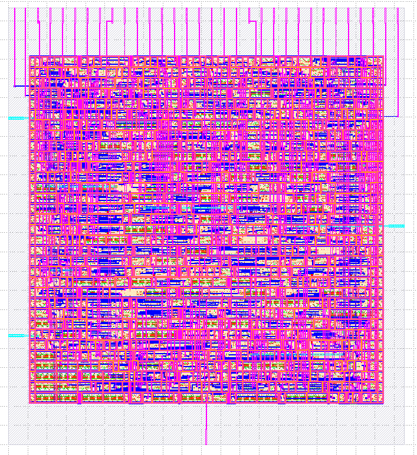

Installation
================================================================================
OpenLane uses `Docker <https://en.wikipedia.org/wiki/Docker_(software)>`_ images that contain binaries, libraries and packages all ready-to-use.
All of the flow tools are encapsulated inside the container image.

Open source projects typically have to address the challenge of various user environments,
operating systems, virtual machines, cloud-based distribution etc.
Docker images alleviate this problem.

Installation steps
--------------------------------------------------------------------------------

Step 1. Installation of Required Packages
^^^^^^^^^^^^^^^^^^^^^^^^^^^^^^^^^^^^^^^^^^^^^^^^^^^^^^^^^^^^^^^^^^^^^^^^^^^^^^^^

For OpenLane you need a couple of tools installed:

   - Linux (or the `Windows Subsystem for Linux <https://docs.microsoft.com/en-us/windows/wsl/install>`_) or macOS
   - Docker 19.03.12+
   - Git 2.35+
   - Python 3.6+  
      - pip  
      - venv
   - GNU Make

After installing all of the above, proceed to :ref:`step2`.

Installing Dependencies under Ubuntu
""""""""""""""""""""""""""""""""""""""""""""""""""""""""""""""""""""""""""""""""

Only Ubuntu 20.04 and above are supported. Most complex utilities are included in the Docker image, so the installation list is quite slim:

.. code-block:: bash

   sudo apt install -y build-essential python3 python3-venv python3-pip git

Next, you'll need install Docker. Follow the as steps provided below may be out of date.

.. warning:: The following steps may become out of date. You may want to follow the official Docker documentation `here <https://docs.docker.com/engine/install/ubuntu/>`_.

.. code-block:: console

   # Remove old installations
   sudo apt-get remove docker docker-engine docker.io containerd runc
   # Installation of requirements
   sudo apt-get update
   sudo apt-get install \
      ca-certificates \
      curl \
      gnupg \
      lsb-release
   # Add the keyrings of docker
   sudo mkdir -p /etc/apt/keyrings
   curl -fsSL https://download.docker.com/linux/ubuntu/gpg | sudo gpg --dearmor -o /etc/apt/keyrings/docker.gpg
   # Add the package repository
   echo \
      "deb [arch=$(dpkg --print-architecture) signed-by=/etc/apt/keyrings/docker.gpg] https://download.docker.com/linux/ubuntu \
      $(lsb_release -cs) stable" | sudo tee /etc/apt/sources.list.d/docker.list > /dev/null
   # Update the package repository
   sudo apt-get update

   # Install Docker
   sudo apt-get install docker-ce docker-ce-cli containerd.io docker-compose-plugin

   # Check for installation
   sudo docker run hello-world

A successful installation of Docker would print out something like this:

.. code-block:: console

   After installation you will get Hello World of Docker:

   Hello from Docker!
   This message shows that your installation appears to be working correctly.

   To generate this message, Docker took the following steps:
   1. The Docker client contacted the Docker daemon.
   2. The Docker daemon pulled the "hello-world" image from the Docker Hub. (amd64)
   3. The Docker daemon created a new container from that image which runs the executable that produces the output you are currently reading.
   4. The Docker daemon streamed that output to the Docker client, which sent it to your terminal.

   To try something more ambitious, you can run an Ubuntu container with:
   $ docker run -it ubuntu bash

   Share images, automate workflows, and more with a free Docker ID:
   https://hub.docker.com/

   For more examples and ideas, visit:
   https://docs.docker.com/get-started/

Proceed to :ref:`step2`

Installation of required packages under macOS
""""""""""""""""""""""""""""""""""""""""""""""""""""""""""""""""""""""""""""""""

First install `Homebrew <https://brew.sh/>`_ then run script below to install the required packages:

.. code-block:: console

   brew install python make
   brew install --cask docker

When Docker is done installing, you'll need to launch the newly installed "Docker Desktop" app from Launchpad and follow instructions in the terminal.

.. _step2:

Step 2. Making Docker available without root
^^^^^^^^^^^^^^^^^^^^^^^^^^^^^^^^^^^^^^^^^^^^^^^^^^^^^^^^^^^^^^^^^^^^^^^^^^^^^^^^

.. warning:: The following steps may become out of date. You may want to follow the official Docker documentation `here <https://docs.docker.com/engine/install/linux-postinstall/>`_.

If you're using the Windows Subsystem for Linux or macOS you may skip this step, but if you're running native Linux, this is a **mandatory step** without which all OpenLane scripts would fail.

.. important::
    This is a MANDATORY step. Without this, most OpenLane scripts will be confused and error out with permission issues. This step caused a lot of confusion because a lot of users tend to assume just installing Docker is file. IF YOU ARE USING LINUX, DO NOT SKIP!

.. code-block:: console

   sudo groupadd docker
   sudo usermod -aG docker $USER
   sudo reboot # REBOOT!

You **must restart your operating system** for the group permissions to apply.

You can verify that the group has been added as follows:

.. code-block:: console

   id | grep -c docker

If you see an output of ``1``, you've added yourself to the ``docker`` group successfully.

.. _step3:

Step 3. Checking the Docker Installation
^^^^^^^^^^^^^^^^^^^^^^^^^^^^^^^^^^^^^^^^^^^^^^^^^^^^^^^^^^^^^^^^^^^^^^^^^^^^^^^^

If every thing has been set up correctly, you can run the Docker ``hello-world`` image without root. To test, it use following command:

.. code-block:: shell

   docker run hello-world

You will get a happy little "Hello, world!" message, once again, but this time without root.

.. code-block::

   Hello from Docker!
   This message shows that your installation appears to be working correctly.

   To generate this message, Docker took the following steps:
   1. The Docker client contacted the Docker daemon.
   2. The Docker daemon pulled the "hello-world" image from the Docker Hub.
      (amd64)
   3. The Docker daemon created a new container from that image which runs the
      executable that produces the output you are currently reading.
   4. The Docker daemon streamed that output to the Docker client, which sent it
      to your terminal.

   To try something more ambitious, you can run an Ubuntu container with:
   $ docker run -it ubuntu bash

   Share images, automate workflows, and more with a free Docker ID:
   https://hub.docker.com/

   For more examples and ideas, visit:
   https://docs.docker.com/get-started/

Troubleshooting Step 3
""""""""""""""""""""""""""""""""""""""""""""""""""""""""""""""""""""""""""""""""

If you get Docker permission error when running any Docker images:

.. code-block:: console

   OpenLane> docker run hello-world
   docker: Got permission denied while trying to connect to the Docker daemon socket at unix:///var/run/docker.sock: Post "http://%2Fvar%2Frun%2Fdocker.sock/v1.24/containers/create": dial unix /var/run/docker.sock: connect: permission denied.
   See 'docker run --help'.
   OpenLane> 

Then you skipped a step or two. You forgot to follow :ref:`step2` or `restart your Operating System`.

Step 4. Checking Installation Requirements
^^^^^^^^^^^^^^^^^^^^^^^^^^^^^^^^^^^^^^^^^^^^^^^^^^^^^^^^^^^^^^^^^^^^^^^^^^^^^^^^

In order to check your installation, you can run the following commands:

.. code-block:: console

   git --version
   docker --version
   python3 --version
   python3 -m pip --version
   make --version
   python -m venv -h

Successful outputs look something like this:

.. code-block:: console

   $ git --version
   git version 2.36.1
   $ docker --version
   Docker version 20.10.16, build aa7e414fdc
   $ python3 --version
   Python 3.10.5
   $ python3 -m pip --version
   pip 21.0 from /usr/lib/python3.10/site-packages/pip (python 3.10)
   $ make --version
   GNU Make 4.3
   Copyright (C) 1988-2020 Free Software Foundation, Inc.
   License GPLv3+: GNU GPL version 3 or later <http://gnu.org/licenses/gpl.html>
   This is free software: you are free to change and redistribute it.
   There is NO WARRANTY, to the extent permitted by law.
   $ python3 -m venv -h
   Built for x86_64-pc-linux-gnu
   usage: venv [-h] [--system-site-packages] [--symlinks | --copies] [--clear]
               [--upgrade] [--without-pip] [--prompt PROMPT] [--upgrade-deps]
               ENV_DIR [ENV_DIR ...]

   Creates virtual Python environments in one or more target directories.

   positional arguments:
   ENV_DIR               A directory to create the environment in.

   options:
   -h, --help            show this help message and exit
   --system-site-packages
                           Give the virtual environment access to the system
                           site-packages dir.
   --symlinks            Try to use symlinks rather than copies, when symlinks
                           are not the default for the platform.
   --copies              Try to use copies rather than symlinks, even when
                           symlinks are the default for the platform.
   --clear               Delete the contents of the environment directory if it
                           already exists, before environment creation.
   --upgrade             Upgrade the environment directory to use this version
                           of Python, assuming Python has been upgraded in-place.
   --without-pip         Skips installing or upgrading pip in the virtual
                           environment (pip is bootstrapped by default)
   --prompt PROMPT       Provides an alternative prompt prefix for this
                           environment.
   --upgrade-deps        Upgrade core dependencies: pip setuptools to the
                           latest version in PyPI

   Once an environment has been created, you may wish to activate it, e.g. by
   sourcing an activate script in its bin directory.

Step 5. Download OpenLane
^^^^^^^^^^^^^^^^^^^^^^^^^^^^^^^^^^^^^^^^^^^^^^^^^^^^^^^^^^^^^^^^^^^^^^^^^^^^^^^^
Download OpenLane from GitHub:

.. code-block:: console

   git clone --depth 1 https://github.com/The-OpenROAD-Project/OpenLane.git
   cd OpenLane/

Successful download will look like this:

.. code-block:: console

   git clone --depth 1 https://github.com/The-OpenROAD-Project/OpenLane.git
   cd OpenLane/
   Cloning into 'OpenLane'...
   remote: Enumerating objects: 471, done.
   remote: Counting objects: 100% (471/471), done.
   remote: Compressing objects: 100% (393/393), done.
   remote: Total 471 (delta 66), reused 279 (delta 35), pack-reused 0
   Receiving objects: 100% (471/471), 2.78 MiB | 4.91 MiB/s, done.
   Resolving deltas: 100% (66/66), done.

Step 6. Download the Docker Image and Install sky130 PDK
^^^^^^^^^^^^^^^^^^^^^^^^^^^^^^^^^^^^^^^^^^^^^^^^^^^^^^^^^^^^^^^^^^^^^^^^^^^^^^^^
Download the Docker image of OpenLane and install sky130 PDK:

.. code-block:: console

   make

If you are planning to use other PDK, then you need to follow the PDK installation guide for that specific PDK.

Step 7. Validating your OpenLane Installation
^^^^^^^^^^^^^^^^^^^^^^^^^^^^^^^^^^^^^^^^^^^^^^^^^^^^^^^^^^^^^^^^^^^^^^^^^^^^^^^^

Test the installed PDK and OpenLane:

.. code-block:: console

   make test # This a ~5 minute test that verifies that the flow and the pdk were properly installed

Sucessful test looks like this:

.. code-block:: console

   Basic test passed

Step 8. Optional: Viewing Test Design Outputs
^^^^^^^^^^^^^^^^^^^^^^^^^^^^^^^^^^^^^^^^^^^^^^^^^^^^^^^^^^^^^^^^^^^^^^^^^^^^^^^^

On Linux, you can open the final layout of the test design using KLayout. This will open the window of KLayout in editing mode ``-e`` with the sky130A process.

.. code-block:: console

   # Enter a Docker session:
   make mount

   # Open the spm.gds using KLayout with sky130 PDK
   klayout -e -nn $PDK_ROOT/sky130A/libs.tech/klayout/sky130A.lyt \
      -l $PDK_ROOT/sky130A/libs.tech/klayout/sky130A.lyp \
      ./designs/spm/runs/openlane_test/results/final/gds/spm.gds

   # Leave the Docker
   exit

Updating OpenLane
--------------------------------------------------------------------------------

Run following commands to update the OpenLane:

.. code-block:: console

   cd OpenLane/
   git pull --depth 1 https://github.com/The-OpenROAD-Project/OpenLane.git master
   make
   make test # This is to test that the flow and the pdk were properly updated

It is very similar to installation, one difference is
that we pull the changes instead of creating a new workspace.
Git pull, by default, will not remove any files in your workspace.
