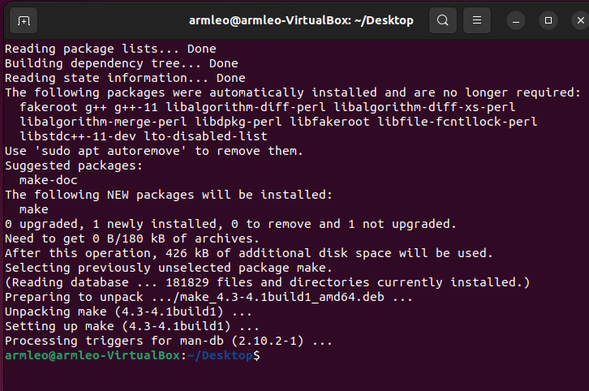
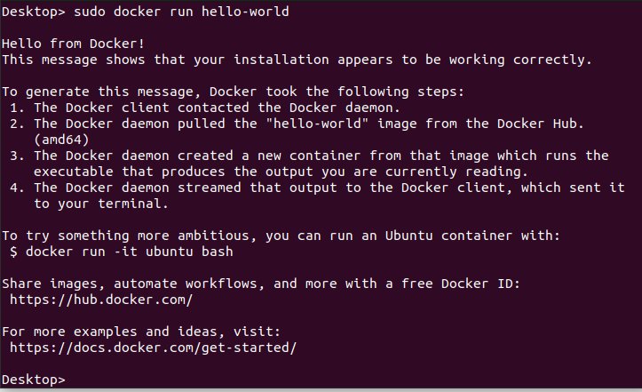
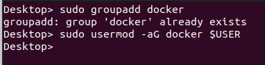
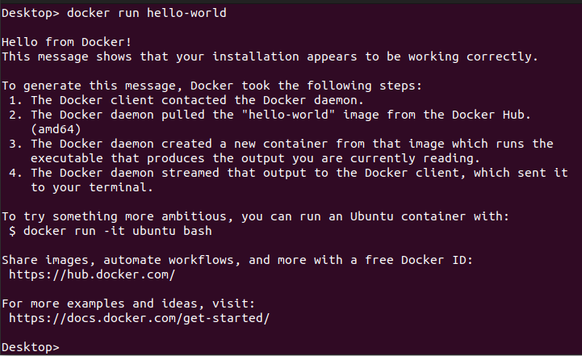
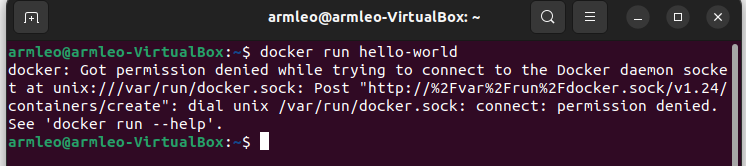
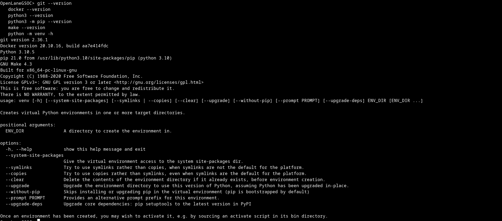
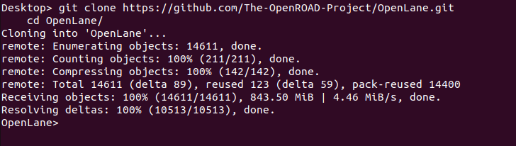
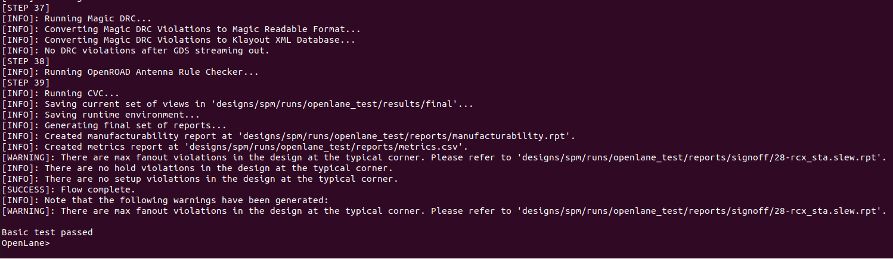

.. _installation_label:

TODO: the OpenLane should be OpenLane

Step 1a) Installation on other Operating Systems
----------

* Docker 19.03.12+
* Git 2.35+
* Python 3.6+  
   * pip  
   * venv
* GNU Make

After installing all of the above, you need to make Docker available without sudo command.

Step 1b) Installation of packages in Ubuntu 20.04 and above
----------
All of the required packages are included in the Docker image, so the installation list is slim.

.. code-block:: console

   sudo apt install -y build-essential python3 python3-venv python3-pip make git

Second you need to install Docker. Follow `instructions provided in Docker's documentation here <https://docs.docker.com/engine/install/ubuntu/>`_ as steps provided below might be outdated.

.. warning::
    The steps below might be simply outdated, OpenLane team encourages to follow the link to the official Docker documentatation

.. code-block::

   # Remove old installations
   sudo apt-get remove docker docker-engine docker.io containerd runc
   # Installation of requirements
   sudo apt-get update
   sudo apt-get install \
      ca-certificates \
      curl \
      gnupg \
      lsb-release
   # Add the keyrings of docker
   sudo mkdir -p /etc/apt/keyrings
   curl -fsSL https://download.docker.com/linux/ubuntu/gpg | sudo gpg --dearmor -o /etc/apt/keyrings/docker.gpg
   # Add the package repository
   echo \
      "deb [arch=$(dpkg --print-architecture) signed-by=/etc/apt/keyrings/docker.gpg] https://download.docker.com/linux/ubuntu \
      $(lsb_release -cs) stable" | sudo tee /etc/apt/sources.list.d/docker.list > /dev/null
   # Update the package repository
   sudo apt-get update

   # Install Docker
   sudo apt-get install docker-ce docker-ce-cli containerd.io docker-compose-plugin

   # Check for installation
   sudo docker run hello-world

After installation you will get Docker's Hello World:

Now follow step 2.

TODO: Add Fedora

Step 1c) Installation under Mac OS X
----------

First install `Homebrew <https://brew.sh/>`_ then ran script below to install the required packages:

.. code-block:: console

   brew install python make
   brew install --cask docker

TODO: Ask somebody with Mac OS X to make an animation for this
TODO: Ask somebody if the docker installed with brew does not require additional steps to make it avaialabe without root

Step 1d) Containerless/Local Installations
---------

.. warning::
   OpenLane encourages you to avoid using Containerless/Local installation method. As the version of the packages can affect the perfomance and reproducibility. Most of the documentation assumes that you are using Docker based flow, but if you choose to use containerless installation, then you are on your own.

Please see :ref:`local_installs_label`

TODO: Ask for help,  as the link does not work???

Step 2. Making Docker available without root
---------

.. warning::
    The steps below might be simply outdated, OpenLane team encourages to follow the link to the official Docker documentatation

.. warning::
    This is mandatory step. Without this most of OpenLane scripts will be confused and error out with permission issues. This step caused a lot of confusion because it needs to be done after the Docker's installation. DO NOT SKIP!

This is a **mandatory step**, without this all of OpenLane scripts will fail. Follow `instructions here <https://docs.docker.com/engine/install/linux-postinstall/>`_ or you can use a script below, but keep in mind that by the point you are reading this it might be outdated.

.. code-block::

   sudo groupadd docker
   sudo usermod -aG docker $USER
   # REBOOT!

Then you have to restart your operating system for the group permissions to apply. 

.. warning::
    REBOOT! This is mandatory step. Without rebooting the user groups will no apply. DO NOT SKIP!

Step 3. Checking the docker installation
------

After that you can run Docker Hello World without root. Let's try it out:

.. code-block::

   # After reboot
   docker run hello-world

You will get a little happy message of Hello world, once again, but this time without root.

Troubleshooting of Step 3.
------

If you get permission error then you skipped a step or two. Did you forget to reboot?

Step 4. Checking the requirements
---------

In order to check installation you can use following commands:

.. code-block:: console

   git --version
   docker --version
   python3 --version
   python3 -m pip --version
   make --version
   python -m venv -h

Step 5. Installing OpenLane
----------

Clone OpenLane repository and change directory into it. Then install the Skywater130 PDK and run flow on the test design.

.. code-block:: console

   git clone https://github.com/The-OpenROAD-Project/OpenLane.git
   cd OpenLane/
   make
   make test # This a ~5 minute test that verifies that the flow and the pdk were properly installed

After the above script downloads OpenLane and installs it, the ``make test`` command will test the installation of PDK and OpenLane

Updating OpenLane
==========
TODO: Add links to the update process and building PDK with other configurations

.. code-block:: console

   cd OpenLane/
   git checkout master
   git pull
   make 
   make test # This is to test that the flow and the pdk were properly updated

