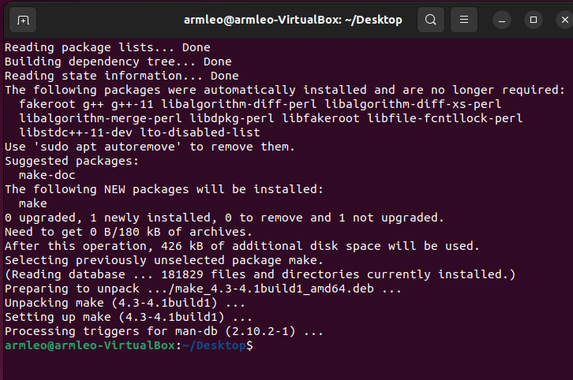
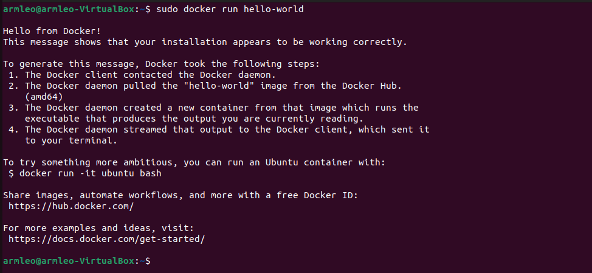
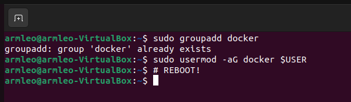
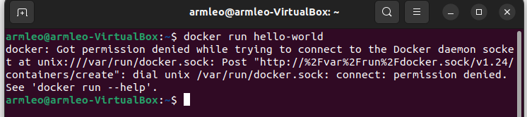
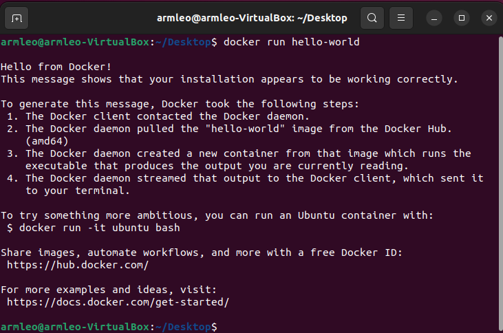

Step 1.1. Installation of packages in Ubuntu 20.04 and above
===========
All of the required packages are included in the Docker image, so the installation list is slim.

.. code-block:: console

   sudo apt install -y build-essential python3 python3-venv python3-pip make git

Second you need to install Docker. Follow `instructions provided in Docker's documentation here <https://docs.docker.com/engine/install/ubuntu/>`_ as steps provided below might be outdated.

.. code-block::

   # Remove old installations
   sudo apt-get remove docker docker-engine docker.io containerd runc
   # Installation of requirements
   sudo apt-get update
   sudo apt-get install \
      ca-certificates \
      curl \
      gnupg \
      lsb-release
   # Add the keyrings of docker
   sudo mkdir -p /etc/apt/keyrings
   curl -fsSL https://download.docker.com/linux/ubuntu/gpg | sudo gpg --dearmor -o /etc/apt/keyrings/docker.gpg
   # Add the package repository
   echo \
      "deb [arch=$(dpkg --print-architecture) signed-by=/etc/apt/keyrings/docker.gpg] https://download.docker.com/linux/ubuntu \
      $(lsb_release -cs) stable" | sudo tee /etc/apt/sources.list.d/docker.list > /dev/null
   # Update the package repository
   sudo apt-get update

   # Install Docker
   sudo apt-get install docker-ce docker-ce-cli containerd.io docker-compose-plugin

   # Check for installation
   sudo docker run hello-world

After installation you will get Docker's Hello World:

TODO: Replace the image with asciinema

Now follow step 2.

Step 1.2. Installation under Mac OS X
===========

First install `Homebrew <https://brew.sh/>`_ then ran script below to install the required packages:

.. code-block:: console

   brew install python make
   brew install --cask docker

TODO: Ask somebody with Mac OS X to make an animation for this
TODO: Ask somebody if the docker installed with brew does not require additional steps to make it avaialabe without root

Step 1.3. Installation on other Operating Systems
===========

* Docker 19.03.12+
* Git 2.35+
* Python 3.6+  
   * pip  
   * virtualenv
* GNU Make

After installing all of the above, you need to make Docker available without sudo command.

Step 2. Making Docker available without root
------------

This is a **mandatory step**, without this all of the OpenLane scripts will fail. Follow `instructions here <https://docs.docker.com/engine/install/linux-postinstall/>`_ or you can use a script below, but keep in mind that by the point you are reading this it might be outdated.

.. code-block::

   sudo groupadd docker
   sudo usermod -aG docker $USER

Then you have to restart your operating system for the group permissions to apply. 

TODO: Replace the image with asciinema

After that you can run Docker Hello World without root. Let's try it out:
.. code-block::

   # After reboot
   docker run hello-world

If you get permission error then you skipped a step or two. Did you forget to reboot?

TODO: Replace the image with asciinema

Otherwise you will get a little happy message of Hello world, once again, but this time without root.

TODO: Replace the image with asciinema

Step 3. Checking the requirements
------------

In order to check installation you can use following commands:

.. code-block:: console

   git --version
   docker --version
   python3 --version
   python3 -m pip --version
   make --version
   python -m venv -h

TODO: Rerecord the animation for added venv check
.. image:: https://asciinema.org/a/VWAJiy3ORyy1hVeTWMv6goElh.svg
   :target: https://asciinema.org/a/VWAJiy3ORyy1hVeTWMv6goElh
