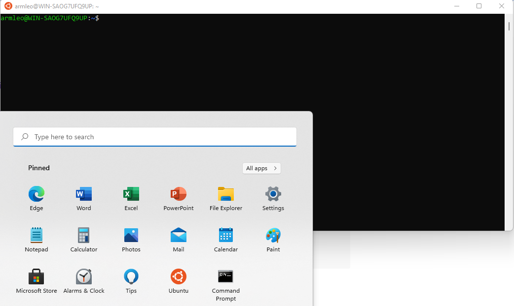

Installation on Windows
================================================================================
OpenLane in Windows uses WSL 2 and Docker Destop on Windows.
Recent version of Windows 10 or Windows 11 is required, for more information consult Microsoft's documentation.
It is the recommended installation method under Windows. Other variants like

1. Follow `official Microsoft documentation for WSL located here <https://docs.microsoft.com/en-us/windows/wsl/install>`_ to install the WSL 2. Make sure your OS version supports WSL 2.
2. Follow `official steps to Install Docker Desktop on Windows located here <https://docs.docker.com/desktop/install/windows-install/>`_.
3. Install Ubuntu using wsl ``wsl --install -d Ubuntu``
4. Press Start and open Ubuntu
5. Follow steps below

.. include:: wsl_ubuntu_packages.rst
.. include:: installation_common_section.rst