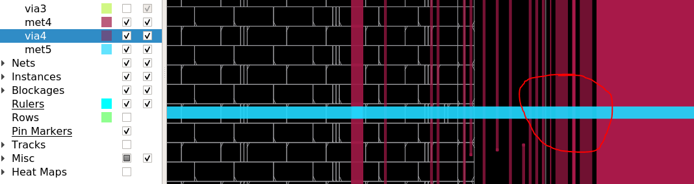
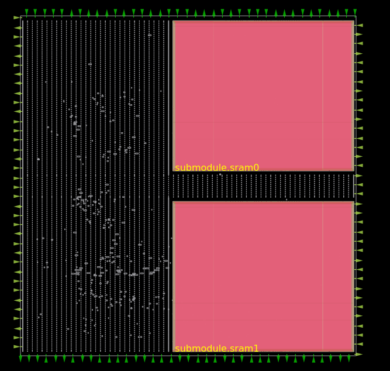
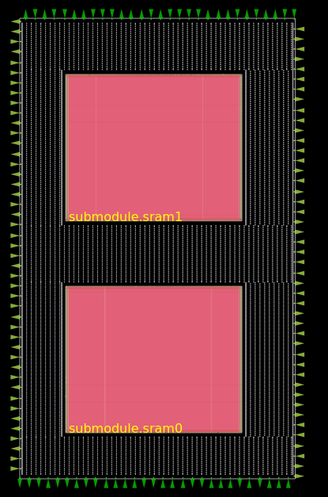
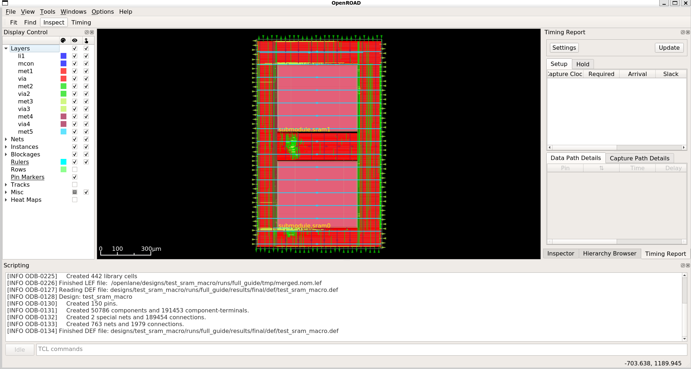

Tutorial: OpenRAM macro (sky130)
--------------------------------------------------------------------------------

Overview
^^^^^^^^^^^^^^^^^^^^^^^^^^^^^^^^^^^^^^^^^^^^^^^^^^^^^^^^^^^^^^^^^^^^^^^^^^^^^^^^
Using OpenRAM generated or other mixed signal or analog cells can be very confusing.
This guide covers RTL-to-GDS flow using OpenRAM cells.
This guides uses as many macro related features from OpenLane flow possible
in order to guide users in their journey towards full chip integration.

Create a new design
^^^^^^^^^^^^^^^^^^^^^^^^^^^^^^^^^^^^^^^^^^^^^^^^^^^^^^^^^^^^^^^^^^^^^^^^^^^^^^^^

Create a new design using following command:

.. code-block::

    ./flow.tcl -design test_sram_macro -init_design_config -add_to_designs

Create the Blackbox
^^^^^^^^^^^^^^^^^^^^^^^^^^^^^^^^^^^^^^^^^^^^^^^^^^^^^^^^^^^^^^^^^^^^^^^^^^^^^^^^

.. note::
    See `issue 1273 <https://github.com/The-OpenROAD-Project/OpenLane/issues/1273>`_ regarding the blackboxes.

Create blackbox declaration of ``sky130_sram_1kbyte_1rw1r_32x256_8``
in file ``designs/test_sram_macro/sky130_sram_1kbyte_1rw1r_32x256_8.bb.v``.

.. warning::

    It is users responsibility to avoid name collisions between the blackbox macro blocks.
    If two blackbox modules with the same module name, but different set of parameters exist,
    then it is possible to get RTL behavor missmatch without any warning. See `issue 1291 <https://github.com/The-OpenROAD-Project/OpenLane/issues/1291>`_.

Copy the relevant sections from ``pdks/sky130B/libs.ref/sky130_sram_macros/verilog/sky130_sram_1kbyte_1rw1r_32x256_8.v``.
Then add ``(*blackbox*)`` attribute. This is specified, to let the synthesis tool know that this module is a blackbox.
If the module is empty it is assumed to be blackbox anyway, but specifying the attribute makes it more clear.

.. literalinclude:: ../../designs/test_sram_macro/sky130_sram_1kbyte_1rw1r_32x256_8.bb.v
    :language: verilog

Finally, connect the blackbox declaration verilog file using ``VERILOG_FILES_BLACKBOX``.

.. code-block:: json

    "VERILOG_FILES_BLACKBOX": "dir::sky130_sram_1kbyte_1rw1r_32x256_8.bb.v",

.. warning::

    If you skip this configuration yo will get following error:

    .. code-block::

        ERROR: Module `\sky130_sram_1kbyte_1rw1r_32x256_8' referenced in module `\test_sram_macro_unwrapped' in cell `\sram1' is not part of the design.
        child process exited abnormally

Create the Verilog files
^^^^^^^^^^^^^^^^^^^^^^^^^^^^^^^^^^^^^^^^^^^^^^^^^^^^^^^^^^^^^^^^^^^^^^^^^^^^^^^^

Create or add Verilog files. In this case create file ``designs/test_sram_macro/src/test_sram_macro.v`` with following content:

.. literalinclude:: ../../designs/test_sram_macro/src/test_sram_macro.v
    :language: verilog

Connect the layout files and abstracts
^^^^^^^^^^^^^^^^^^^^^^^^^^^^^^^^^^^^^^^^^^^^^^^^^^^^^^^^^^^^^^^^^^^^^^^^^^^^^^^^

Connect LEF files using ``EXTRA_LEFS``.
In this case absolute path is used, if the PDK location is different then path needs to be changed.
This files contains lightweight abstract representation of the cell.
LEF contains only metal layers and layers that can connect between cells (met1, via2, nwell, pwell, etc).

.. todo:: Rephrase

Connect GDS files with the subcomponent.
The GDS from ``EXTRA_GDS_FILES`` that will be used to generate the final GDS file.
It is users responsibility to make sure that GDS matches LEF files.

.. code-block:: json

    "EXTRA_LEFS":      "/openlane/pdks/sky130B/libs.ref/sky130_sram_macros/lef/sky130_sram_1kbyte_1rw1r_32x256_8.lef",
    "EXTRA_GDS_FILES": "/openlane/pdks/sky130B/libs.ref/sky130_sram_macros/gds/sky130_sram_1kbyte_1rw1r_32x256_8.gds",
    

.. warning::

    If you ran the design without this configuration you will get following error:

    .. code-block::

        [INFO]: Running Initial Floorplanning (log: designs/test_sram_macro/runs/full_guide_nomacros/logs/floorplan/3-initial_fp.log)...
        [ERROR]: Floorplanning failed
        [ERROR]: module sky130_sram_1kbyte_1rw1r_32x256_8 not found in /openlane/designs/test_sram_macro/runs/full_guide_nomacros/tmp/merged.nom.lef
        [ERROR]: Check whether EXTRA_LEFS is set appropriately
        [INFO]: Saving current set of views in 'designs/test_sram_macro/runs/full_guide_nomacros/results/final'...
        [INFO]: Generating final set of reports...
        [INFO]: Created manufacturability report at 'designs/test_sram_macro/runs/full_guide_nomacros/reports/manufacturability.rpt'.
        [INFO]: Created metrics report at 'designs/test_sram_macro/runs/full_guide_nomacros/reports/metrics.csv'.
        [INFO]: Saving runtime environment...
        [ERROR]: Flow failed.

Power/Ground nets
^^^^^^^^^^^^^^^^^^^^^^^^^^^^^^^^^^^^^^^^^^^^^^^^^^^^^^^^^^^^^^^^^^^^^^^^^^^^^^^^

Create the power/ground nets.
First net in the list will be used for standard cell power connections.

.. code-block:: json

    "VDD_NETS": "vccd1",
    "GND_NETS": "vssd1",

If you need more power/ground nets add the nets to the list:

.. code-block:: json

    "VDD_NETS": "vccd1 vccd2",
    "GND_NETS": "vssd1 vssd2",

Power/Ground PDN connections
^^^^^^^^^^^^^^^^^^^^^^^^^^^^^^^^^^^^^^^^^^^^^^^^^^^^^^^^^^^^^^^^^^^^^^^^^^^^^^^^

Add the PDN connections between sram cells and the power/ground nets.

Syntax: ``<instance_name> <vdd_net> <gnd_net> <vdd_pin> <gnd_pin>``.

More information is available in `configuration variables documentation <configuration>`_.
Each macro hook is separated using comma, for example:

.. code-block:: json

    "FP_PDN_MACRO_HOOKS": "submodule.sram0 vccd1 vssd1 vccd1 vssd1, submodule.sram1 vccd1 vssd1 vccd1 vssd1",

The instance names need to be fetched from synthesis netlist.
For this purpose run the design until synthesis stage using following command:

.. code-block::

    ./flow.tcl -design test_sram_macro -tag synthesis_only -to synthesis -overwrite

Open following file ``designs/test_sram_macro/runs/synthesis_only/results/synthesis/test_sram_macro.v``.

.. code-block:: verilog

    /* Generated by Yosys 0.12+45 (git sha1 UNKNOWN, gcc 8.3.1 -fPIC -Os) */

    module test_sram_macro(rst_n, clk, cs, we, addr, write_allow, datain, dataout);
    wire _000_;
    wire _001_;
    wire _002_;
    ...
    sky130_sram_1kbyte_1rw1r_32x256_8 \submodule.sram0  (
        .addr0(addr),
        ...
        .wmask0(write_allow[3:0])
    );
    sky130_sram_1kbyte_1rw1r_32x256_8 \submodule.sram1  (
        .addr0(addr),
        ...
        .wmask0(write_allow[7:4])
    );

If the cell is referenced in the submodule then it has the prefix with the submodule name and escaped slash ``\``.
As can be seen there is two cells ``sky130_sram_1kbyte_1rw1r_32x256_8`` with instance names ``\submodule.sram0``, ``\submodule.sram1``.
Directly copy the instance names without the prefix escape symbol: ``submodule.sram0``, ``submodule.sram1``, avoid guessing it.

Then the ``FP_PDN_MACRO_HOOKS`` will look like this (note that there is no backslash in front of the name):

.. code-block:: json

    "FP_PDN_MACRO_HOOKS": "submodule.sram0 vccd1 vssd1 vccd1 vssd1, submodule.sram1 vccd1 vssd1 vccd1 vssd1",

``FP_PDN_MACRO_HOOKS`` forces connection between these pins and power/ground nets.
If these configuration is missing then power/ground will be missing between netlist and PDN, therefore creating an LVS issue.

Try removing the parameter and running:

.. code-block::

    ./flow.tcl -design test_sram_macro -tag full_guide_pdn_macrohooks -overwrite

As can be observed, this generates an LVS error, because in the RTL code the power pins are attached,
meanwhile in the layout there is no connection between the PDN and the SRAM cell power rings.

.. code-block::

    [INFO]: Running LEF LVS...
    [ERROR]: There are LVS errors in the design: See 'designs/test_sram_macro/runs/full_guide_pdn_macrohooks/logs/signoff/40-test_sram_macro.lvs.lef.log' for details.

Open an interactive session:

.. code-block::

    ./flow.tcl -design test_sram_macro -tag full_guide_pdn_macrohooks -interactive
    package require openlane
    set_def designs/test_sram_macro/runs/full_guide_pdn_macrohooks/results/final/def/test_sram_macro.def
    or_gui

    # empty new line to force the command to run

Notice that the PDN straps are not connected to SRAM's ring:

Floorplanning
^^^^^^^^^^^^^^^^^^^^^^^^^^^^^^^^^^^^^^^^^^^^^^^^^^^^^^^^^^^^^^^^^^^^^^^^^^^^^^^^

Run the flow until floorplanning stage:

.. code-block::

    ./flow.tcl -design test_sram_macro -tag floorplan -overwrite -to floorplan

You will get following output:

.. code-block::

    [STEP 3]
    [INFO]: Running Initial Floorplanning (log: designs/test_sram_macro/runs/floorplan/logs/floorplan/3-initial_fp.log)...
    [INFO]: Extracting core dimensions...
    [INFO]: Set CORE_WIDTH to 877.22, CORE_HEIGHT to 875.84.

To view the floorplan stage output, run the following command:

.. code-block::

    ./flow.tcl -design test_sram_macro -tag floorplan -interactive
    package require openlane
    set_def designs/test_sram_macro/runs/floorplan/results/floorplan/test_sram_macro.def
    or_gui

    # empty new line to force the command to run

It will look like this:

Looking at the floorplan, it would be better if the macros were centered, so the buffers can be placed near I/O.
In order to achieve this, keep the area almost the same,
but resize the DIE_AREA to a rectangle that allows 100um all around each macro for standard cells.
In the next step the location of macro blocks will be selected.

Set the following floorplan parameters:

.. code-block:: json

    "FP_SIZING": "absolute",
    "DIE_AREA": "0 0 750 1250",
    "PL_TARGET_DENSITY": 0.5,

``FP_SIZING`` is set to ``absolute`` and it will tell the floorplan to use ``DIE_AREA`` as final macro block's size.
The we set the ``DIE_AREA``. This value is carefully constructed.
If it is set to big value then you are going to have routing/placement/timing issues.
On the other hand setting the value too low will cause placement and routing congestion issues.

``PL_TARGET_DENSITY`` is set to 0.5 to reflect the target final density of 50%.

Macro cell placement
^^^^^^^^^^^^^^^^^^^^^^^^^^^^^^^^^^^^^^^^^^^^^^^^^^^^^^^^^^^^^^^^^^^^^^^^^^^^^^^^

The cells need to be placed inside the ``DIE_AREA``,
however the automatic placement does not account the I/O placement when selecting sram placement.

It is causing the SRAM component to be placed on the edge of the macro.
As a result the I/O power usage is going to be increased,
because there is a long net that goes over the subcomponents.

Instead choose the locations of these cells manually.
The size of the cells can be taken from the LEF file ``pdks/sky130B/libs.ref/sky130_sram_macros/lef/sky130_sram_1kbyte_1rw1r_32x256_8.lef``.
While it is not required to know the size of the cell,
it is useful for the purpose of to making sure that the subcomponents do not overlap.

For example:

.. code-block::

    UNITS
    DATABASE MICRONS 1000 ;
    END UNITS
    MACRO sky130_sram_1kbyte_1rw1r_32x256_8
    CLASS BLOCK ;
    SIZE 479.78 BY 397.5 ;
    SYMMETRY X Y R90 ;

To specify the cell placement create file ``designs/test_sram_macro/macro_placement.cfg``:

.. code-block::

    submodule.sram0 125 125 N
    submodule.sram1 125 700 S

The syntax is ``<instance name> <x> <y> <direction>``.
The instance name needs to be taken directly from synthesis netlist without escape symbol at the beggining.

Then modify the ``config.json`` to reference this file.

.. code-block:: json

    "MACRO_PLACEMENT_CFG": "dir::macro_placement.cfg",

.. code-block::

    ./flow.tcl -design test_sram_macro -tag floorplan_v2 -overwrite -to floorplan

To view the floorplan stage output, run the following command:

.. code-block::

    ./flow.tcl -design test_sram_macro -tag floorplan_v2 -interactive
    package require openlane
    set_def designs/test_sram_macro/runs/floorplan_v2/results/floorplan/test_sram_macro.def
    or_gui

    # empty new line to force the command to run

It will look like this:

Resolving issues
^^^^^^^^^^^^^^^^^^^^^^^^^^^^^^^^^^^^^^^^^^^^^^^^^^^^^^^^^^^^^^^^^^^^^^^^^^^^^^^^

Memory footprint
""""""""""""""""""""""""""""""""""""""""""""""""""""""""""""""""""""""""""""""""

While running the flow it may use significant amount of memory.
You can temporary disable KLayout XOR check to reduce the memory footprint, while experimenting.
But for the final GDS submission make sure that XOR check is enabled.

.. code-block:: json

    "RUN_KLAYOUT_XOR": false,

DRCs inside SRAM macros
""""""""""""""""""""""""""""""""""""""""""""""""""""""""""""""""""""""""""""""""

The sky130 uses optical proximity to reduce the size of the SRAM transistors.
The SRAM blocks in sky130 generated by OpenRAM use different DRC ruleset to accomodate for this size reduction.
Therefore when running the Magic VLSI it is expected to have many DRC violations.

The ``MAGIC_DRC_USE_GDS`` can be set to false, forcing the Magic VLSI to run DRC on DEF/LEF instead of GDS.
However, you will still get DRCs.

.. code-block:: json

    "MAGIC_DRC_USE_GDS": false

Instead, for this example we can just disable the DRC check.
However, this is very dangerous and needs to be approved by the foundry.

.. code-block:: json

    "RUN_MAGIC_DRC": false

JSON syntax error regarding the comma
""""""""""""""""""""""""""""""""""""""""""""""""""""""""""""""""""""""""""""""""

The last field of the object in JSON must not have any commas, otherwise you will have a syntax issue:

.. code-block::

    [INFO]: Using configuration in 'designs/test_sram_macro/config.json'...
    [ERROR]: Traceback (most recent call last):
    File "/openlane/scripts/config/to_tcl.py", line 351, in <module>
        cli()
    File "/usr/local/lib/python3.6/site-packages/click/core.py", line 1128, in __call__
        return self.main(*args, **kwargs)
    File "/usr/local/lib/python3.6/site-packages/click/core.py", line 1053, in main
        rv = self.invoke(ctx)
    File "/usr/local/lib/python3.6/site-packages/click/core.py", line 1659, in invoke
        return _process_result(sub_ctx.command.invoke(sub_ctx))
    File "/usr/local/lib/python3.6/site-packages/click/core.py", line 1395, in invoke
        return ctx.invoke(self.callback, **ctx.params)
    File "/usr/local/lib/python3.6/site-packages/click/core.py", line 754, in invoke
        return __callback(*args, **kwargs)
    File "/openlane/scripts/config/to_tcl.py", line 337, in config_json_to_tcl
        config_dict = json.loads(config_json_str)
    File "/usr/lib64/python3.6/json/__init__.py", line 354, in loads
        return _default_decoder.decode(s)
    File "/usr/lib64/python3.6/json/decoder.py", line 339, in decode
        obj, end = self.raw_decode(s, idx=_w(s, 0).end())
    File "/usr/lib64/python3.6/json/decoder.py", line 355, in raw_decode
        obj, end = self.scan_once(s, idx)
    json.decoder.JSONDecodeError: Expecting property name enclosed in double quotes: line 27 column 1 (char 901)

Right way:

.. code-block::

    {
        ...
        "RUN_MAGIC_DRC": false
    }

Wrong way:

.. code-block::

    {
        ...
        "RUN_MAGIC_DRC": false,
    }

Running the flow
^^^^^^^^^^^^^^^^^^^^^^^^^^^^^^^^^^^^^^^^^^^^^^^^^^^^^^^^^^^^^^^^^^^^^^^^^^^^^^^^

Final ``config.json`` looks like this:

.. literalinclude:: ../../designs/test_sram_macro/config.json
    :language: json

Finally, harden the macro block by running the following command:

.. code-block::

    ./flow.tcl -design test_sram_macro -tag full_guide -overwrite

To view the floorplan stage output, run the following command:

.. code-block::

    ./flow.tcl -design test_sram_macro -tag full_guide -interactive
    package require openlane
    set_def designs/test_sram_macro/runs/full_guide/results/final/def/test_sram_macro.def
    or_gui

    # empty new line to force the command to run

It will look like this:

Reports can be found in ``designs/test_sram_macro/runs/full_guide/reports``.

./flow.tcl -design test_sram_macro -tag full_guide_nobb -overwrite
